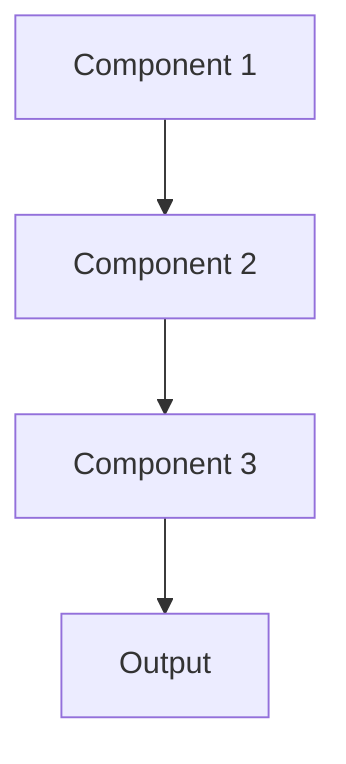

# Pipeline orchestration Pattern

## Overview

Workflow Orchestration coordinates complex ML pipelines with dependencies between data processing, training, evaluation, and deployment steps. For healthcare AI, this manages end-to-end workflows from EHR data extraction through model training to deployment, ensuring steps execute in correct order with proper error handling.

## When to Use

- **Complex pipelines**: Many interdependent steps (data extraction, preprocessing, training, validation, deployment)
- **Scheduled workflows**: Regular execution (nightly retraining, weekly data updates)
- **Resource management**: Need to allocate GPU, memory efficiently across steps
- **Error handling**: Retry logic, alerts, and recovery for failed steps
- **Team coordination**: Multiple people maintaining different pipeline components

## When Not to Use

- **Simple workflows**: Linear script handles everything
- **Ad-hoc execution**: Running steps manually as needed
- **Single step**: Only one operation to perform
- **Notebook-based**: Interactive analysis in Jupyter notebooks
- **No dependencies**: Steps can run independently without orchestration

## Architecture



## Implementation Examples

### Vertex AI (Google Cloud) Implementation

```python
# Implementation example using Vertex AI
```

### LangChain Implementation

```python
# Implementation example using LangChain
```

### Anthropic (Claude) Implementation

```python
# Implementation example using Anthropic
```

### Ollama Implementation

```python
# Implementation example using Ollama
```

## Performance Characteristics

### Latency
- [Latency characteristics]

### Throughput
- [Throughput characteristics]

### Resource Usage
- [Resource usage characteristics]

## Trade-offs

### Advantages
- [Advantage 1]
- [Advantage 2]

### Disadvantages
- [Disadvantage 1]
- [Disadvantage 2]

## Use Cases

### Healthcare Summarization
- [Healthcare use case 1]
- [Healthcare use case 2]

### General Use Cases
- [General use case 1]
- [General use case 2]

## Well-Architected Framework Alignment

### Operational Excellence
- [Operational excellence considerations]

### Security
- [Security considerations]

### Reliability
- [Reliability considerations]

### Cost Optimization
- [Cost optimization considerations]

### Performance
- [Performance considerations]

### Sustainability
- [Sustainability considerations]

## Deployment Considerations

### Zonal Deployment
- [Zonal deployment considerations]

### Regional Deployment
- [Regional deployment considerations]

### Multi-Regional Deployment
- [Multi-regional deployment considerations]

### Hybrid Deployment
- [Hybrid deployment considerations]

## Related Patterns
- [Related Pattern 1](./related-pattern-1.md)
- [Related Pattern 2](./related-pattern-2.md)

## References
- [Reference 1]
- [Reference 2]

## Version History
- **v1.0** (YYYY-MM-DD): Initial version

