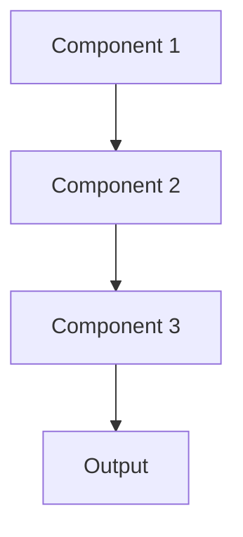

# Attention mechanism Pattern

## Overview

Attention Mechanism enables models to dynamically focus on relevant parts of input when generating outputs. In healthcare summarization, attention helps models identify and weight important clinical findings, diagnoses, or temporal patterns in patient records, improving both accuracy and interpretability by showing which parts of input influenced the summary.

## When to Use

- **Long documents**: Patient records with hundreds of notes where only some are relevant
- **Variable importance**: Different input parts have different relevance to the task
- **Interpretability**: Need to explain which inputs influenced model decisions
- **Context integration**: Combining information from multiple document sections
- **Sequence modeling**: Tasks involving temporal or sequential relationships

## When Not to Use

- **Short inputs**: Attention overhead not justified for small inputs
- **Uniform importance**: All input parts equally relevant
- **Computational constraints**: Attention adds significant compute (O(n²) for self-attention)
- **Fixed-size inputs**: CNNs or simpler architectures may suffice
- **Black-box acceptable**: Don't need to explain model focus

## Architecture



## Implementation Examples

### Vertex AI (Google Cloud) Implementation

```python
# Implementation example using Vertex AI
```

### LangChain Implementation

```python
# Implementation example using LangChain
```

### Anthropic (Claude) Implementation

```python
# Implementation example using Anthropic
```

### Ollama Implementation

```python
# Implementation example using Ollama
```

## Performance Characteristics

### Latency
- [Latency characteristics]

### Throughput
- [Throughput characteristics]

### Resource Usage
- [Resource usage characteristics]

## Trade-offs

### Advantages
- [Advantage 1]
- [Advantage 2]

### Disadvantages
- [Disadvantage 1]
- [Disadvantage 2]

## Use Cases

### Healthcare Summarization
- [Healthcare use case 1]
- [Healthcare use case 2]

### General Use Cases
- [General use case 1]
- [General use case 2]

## Well-Architected Framework Alignment

### Operational Excellence
- [Operational excellence considerations]

### Security
- [Security considerations]

### Reliability
- [Reliability considerations]

### Cost Optimization
- [Cost optimization considerations]

### Performance
- [Performance considerations]

### Sustainability
- [Sustainability considerations]

## Deployment Considerations

### Zonal Deployment
- [Zonal deployment considerations]

### Regional Deployment
- [Regional deployment considerations]

### Multi-Regional Deployment
- [Multi-regional deployment considerations]

### Hybrid Deployment
- [Hybrid deployment considerations]

## Related Patterns
- [Related Pattern 1](./related-pattern-1.md)
- [Related Pattern 2](./related-pattern-2.md)

## References
- [Reference 1]
- [Reference 2]

## Version History
- **v1.0** (YYYY-MM-DD): Initial version

