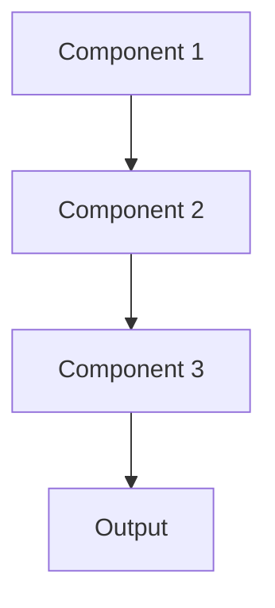

# Ensemble Pattern

## Overview

The Ensemble Pattern combines predictions from multiple models to improve overall accuracy and robustness. By aggregating diverse models' outputs through voting, averaging, or stacking, this pattern reduces individual model biases and variance. Common ensemble techniques include bagging (Bootstrap Aggregating), boosting, and stacking. In healthcare AI summarization, ensembles can combine specialized models for different document types or clinical domains.

## When to Use

- **High-stakes decisions**: When accuracy is critical (e.g., clinical decision support, patient safety alerts)
- **Diverse data sources**: Medical records with varied formats (FHIR, HL7, unstructured notes)
- **Complementary models**: Different models excel at different aspects (e.g., one for diagnosis extraction, another for treatment recommendations)
- **Reducing bias**: Mitigating individual model limitations through consensus
- **Improving robustness**: When single models show high variance or overfitting

## When Not to Use

- **Real-time constraints**: Ensembles multiply inference latency and computational costs
- **Limited resources**: Running multiple models requires 2-10x more compute and memory
- **Simple problems**: Single well-tuned model may suffice for straightforward summarization tasks
- **Interpretability required**: Ensemble decisions are harder to explain than single model outputs
- **Rapid iteration needed**: Maintaining and updating multiple models increases complexity

## Architecture



## Implementation Examples

### Vertex AI (Google Cloud) Implementation

```python
# Implementation example using Vertex AI
```

### LangChain Implementation

```python
# Implementation example using LangChain
```

### Anthropic (Claude) Implementation

```python
# Implementation example using Anthropic
```

### Ollama Implementation

```python
# Implementation example using Ollama
```

## Performance Characteristics

### Latency
- [Latency characteristics]

### Throughput
- [Throughput characteristics]

### Resource Usage
- [Resource usage characteristics]

## Trade-offs

### Advantages
- [Advantage 1]
- [Advantage 2]

### Disadvantages
- [Disadvantage 1]
- [Disadvantage 2]

## Use Cases

### Healthcare Summarization
- [Healthcare use case 1]
- [Healthcare use case 2]

### General Use Cases
- [General use case 1]
- [General use case 2]

## Well-Architected Framework Alignment

### Operational Excellence
- [Operational excellence considerations]

### Security
- [Security considerations]

### Reliability
- [Reliability considerations]

### Cost Optimization
- [Cost optimization considerations]

### Performance
- [Performance considerations]

### Sustainability
- [Sustainability considerations]

## Deployment Considerations

### Zonal Deployment
- [Zonal deployment considerations]

### Regional Deployment
- [Regional deployment considerations]

### Multi-Regional Deployment
- [Multi-regional deployment considerations]

### Hybrid Deployment
- [Hybrid deployment considerations]

## Related Patterns
- [Related Pattern 1](./related-pattern-1.md)
- [Related Pattern 2](./related-pattern-2.md)

## References
- [Reference 1]
- [Reference 2]

## Version History
- **v1.0** (YYYY-MM-DD): Initial version

