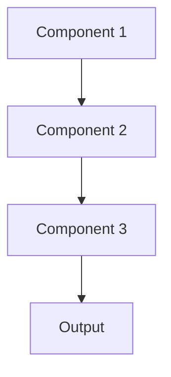

# Hierarchical model Pattern

## Overview

Hierarchical Model Pattern organizes models in layers where higher-level models aggregate and refine outputs from lower-level models. In medical summarization, this could involve document-level models feeding into patient-level models, which inform population-level insights, creating a hierarchy of abstraction and aggregation.

## When to Use

- **Multi-scale analysis**: Need to operate at different levels of abstraction (note → patient → cohort)
- **Progressive refinement**: Each level adds context and refinement to lower levels
- **Divide and conquer**: Complex problem naturally decomposes into hierarchical sub-problems
- **Scalability**: Process large volumes by hierarchical aggregation
- **Explainability**: Trace decisions through hierarchical levels

## When Not to Use

- **Flat structure**: Problem doesn't have natural hierarchical organization
- **Latency sensitive**: Multiple model layers increase inference time
- **Simple aggregation**: Basic averaging or voting suffices
- **Single-level output**: Only need results at one level of abstraction
- **Error propagation**: Mistakes at lower levels compound at higher levels

## Architecture



## Implementation Examples

### Vertex AI (Google Cloud) Implementation

```python
# Implementation example using Vertex AI
```

### LangChain Implementation

```python
# Implementation example using LangChain
```

### Anthropic (Claude) Implementation

```python
# Implementation example using Anthropic
```

### Ollama Implementation

```python
# Implementation example using Ollama
```

## Performance Characteristics

### Latency
- [Latency characteristics]

### Throughput
- [Throughput characteristics]

### Resource Usage
- [Resource usage characteristics]

## Trade-offs

### Advantages
- [Advantage 1]
- [Advantage 2]

### Disadvantages
- [Disadvantage 1]
- [Disadvantage 2]

## Use Cases

### Healthcare Summarization
- [Healthcare use case 1]
- [Healthcare use case 2]

### General Use Cases
- [General use case 1]
- [General use case 2]

## Well-Architected Framework Alignment

### Operational Excellence
- [Operational excellence considerations]

### Security
- [Security considerations]

### Reliability
- [Reliability considerations]

### Cost Optimization
- [Cost optimization considerations]

### Performance
- [Performance considerations]

### Sustainability
- [Sustainability considerations]

## Deployment Considerations

### Zonal Deployment
- [Zonal deployment considerations]

### Regional Deployment
- [Regional deployment considerations]

### Multi-Regional Deployment
- [Multi-regional deployment considerations]

### Hybrid Deployment
- [Hybrid deployment considerations]

## Related Patterns
- [Related Pattern 1](./related-pattern-1.md)
- [Related Pattern 2](./related-pattern-2.md)

## References
- [Reference 1]
- [Reference 2]

## Version History
- **v1.0** (YYYY-MM-DD): Initial version

