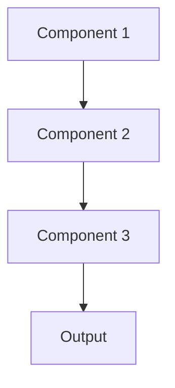

# Multi task learning Pattern

## Overview

Multi-Task Learning trains a single model to perform multiple related tasks simultaneously, sharing representations across tasks. In healthcare AI, this could mean a model that extracts diagnoses, medications, and procedures from clinical notes in one pass, improving efficiency and leveraging shared medical knowledge across tasks.

## When to Use

- **Related tasks**: Multiple tasks share common underlying structure (e.g., extracting different medical entities)
- **Limited data per task**: Tasks have small datasets individually but benefit from shared learning
- **Resource constraints**: Single model is more efficient than multiple specialized models
- **Improved generalization**: Shared representations can improve performance on all tasks
- **Consistent outputs**: Need synchronized predictions across related tasks

## When Not to Use

- **Unrelated tasks**: Tasks don't share meaningful structure or knowledge
- **Conflicting objectives**: Task requirements work against each other
- **Different scales**: Tasks operate on vastly different data scales or distributions
- **Specialized performance**: Need maximum accuracy on a single primary task
- **Independent deployment**: Tasks need to be deployed or updated separately

## Architecture



## Implementation Examples

### Vertex AI (Google Cloud) Implementation

```python
# Implementation example using Vertex AI
```

### LangChain Implementation

```python
# Implementation example using LangChain
```

### Anthropic (Claude) Implementation

```python
# Implementation example using Anthropic
```

### Ollama Implementation

```python
# Implementation example using Ollama
```

## Performance Characteristics

### Latency
- [Latency characteristics]

### Throughput
- [Throughput characteristics]

### Resource Usage
- [Resource usage characteristics]

## Trade-offs

### Advantages
- [Advantage 1]
- [Advantage 2]

### Disadvantages
- [Disadvantage 1]
- [Disadvantage 2]

## Use Cases

### Healthcare Summarization
- [Healthcare use case 1]
- [Healthcare use case 2]

### General Use Cases
- [General use case 1]
- [General use case 2]

## Well-Architected Framework Alignment

### Operational Excellence
- [Operational excellence considerations]

### Security
- [Security considerations]

### Reliability
- [Reliability considerations]

### Cost Optimization
- [Cost optimization considerations]

### Performance
- [Performance considerations]

### Sustainability
- [Sustainability considerations]

## Deployment Considerations

### Zonal Deployment
- [Zonal deployment considerations]

### Regional Deployment
- [Regional deployment considerations]

### Multi-Regional Deployment
- [Multi-regional deployment considerations]

### Hybrid Deployment
- [Hybrid deployment considerations]

## Related Patterns
- [Related Pattern 1](./related-pattern-1.md)
- [Related Pattern 2](./related-pattern-2.md)

## References
- [Reference 1]
- [Reference 2]

## Version History
- **v1.0** (YYYY-MM-DD): Initial version

