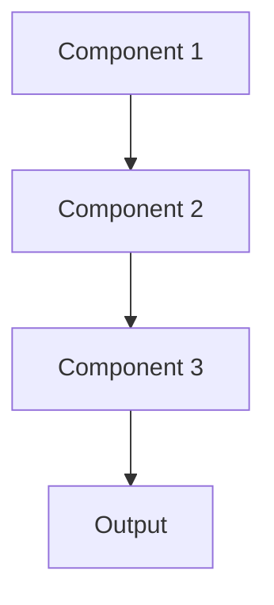

# Transformer architecture Pattern

## Overview

Transformer Architecture uses self-attention mechanisms to process sequences in parallel, enabling models to capture long-range dependencies efficiently. Modern LLMs (Claude, GPT-4, Gemini) are built on Transformer architecture, making this the foundation for healthcare AI summarization. Transformers excel at understanding context across entire documents and generating coherent summaries.

## When to Use

- **Language understanding**: Transformers power all modern LLMs for medical text processing
- **Long-range dependencies**: Connecting information across documents (e.g., linking diagnosis to treatment outcome)
- **Parallel processing**: Need fast training/inference on long sequences
- **State-of-the-art performance**: Transformers currently dominate NLP benchmarks
- **Pre-trained models**: Leverage foundation models like Claude, GPT-4, Gemini

## When Not to Use

- **Extremely long sequences**: Context windows have limits (though 200K-2M tokens now available)
- **Resource constraints**: Transformers require significant compute and memory
- **Simple tasks**: Traditional ML may suffice for basic classification
- **Real-time embedded**: Edge devices may not support large Transformer models
- **Cost sensitive**: Transformer inference can be expensive at scale

## Architecture



## Implementation Examples

### Vertex AI (Google Cloud) Implementation

```python
# Implementation example using Vertex AI
```

### LangChain Implementation

```python
# Implementation example using LangChain
```

### Anthropic (Claude) Implementation

```python
# Implementation example using Anthropic
```

### Ollama Implementation

```python
# Implementation example using Ollama
```

## Performance Characteristics

### Latency
- [Latency characteristics]

### Throughput
- [Throughput characteristics]

### Resource Usage
- [Resource usage characteristics]

## Trade-offs

### Advantages
- [Advantage 1]
- [Advantage 2]

### Disadvantages
- [Disadvantage 1]
- [Disadvantage 2]

## Use Cases

### Healthcare Summarization
- [Healthcare use case 1]
- [Healthcare use case 2]

### General Use Cases
- [General use case 1]
- [General use case 2]

## Well-Architected Framework Alignment

### Operational Excellence
- [Operational excellence considerations]

### Security
- [Security considerations]

### Reliability
- [Reliability considerations]

### Cost Optimization
- [Cost optimization considerations]

### Performance
- [Performance considerations]

### Sustainability
- [Sustainability considerations]

## Deployment Considerations

### Zonal Deployment
- [Zonal deployment considerations]

### Regional Deployment
- [Regional deployment considerations]

### Multi-Regional Deployment
- [Multi-regional deployment considerations]

### Hybrid Deployment
- [Hybrid deployment considerations]

## Related Patterns
- [Related Pattern 1](./related-pattern-1.md)
- [Related Pattern 2](./related-pattern-2.md)

## References
- [Reference 1]
- [Reference 2]

## Version History
- **v1.0** (YYYY-MM-DD): Initial version

