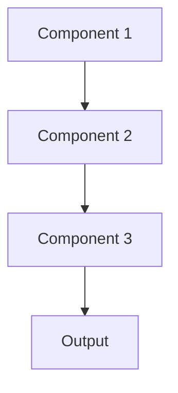

# Data quality monitoring Pattern

## Overview

Data Quality Monitoring continuously validates input data completeness, accuracy, consistency, and timeliness. For healthcare AI, this ensures clinical data meets quality standards before summarization, catching issues like missing diagnoses, invalid medication codes, or delayed lab result uploads that could degrade summary quality.

## When to Use

- **Multiple data sources**: Integrating EHR, labs, imaging with varying quality
- **Production pipelines**: Automated data flows need continuous validation
- **Upstream dependencies**: Data quality depends on external systems you don't control
- **Compliance requirements**: Healthcare regulations mandate data quality standards
- **Quality degradation**: Data quality known to vary over time

## When Not to Use

- **Single trusted source**: High-quality data from controlled source
- **Manual review**: Humans validate all data anyway
- **Static data**: Historical dataset that doesn't change
- **Research phase**: Exploratory analysis where perfect data quality not required
- **Simple data**: Data structure too simple to have quality issues

## Architecture



## Implementation Examples

### Vertex AI (Google Cloud) Implementation

```python
# Implementation example using Vertex AI
```

### LangChain Implementation

```python
# Implementation example using LangChain
```

### Anthropic (Claude) Implementation

```python
# Implementation example using Anthropic
```

### Ollama Implementation

```python
# Implementation example using Ollama
```

## Performance Characteristics

### Latency
- [Latency characteristics]

### Throughput
- [Throughput characteristics]

### Resource Usage
- [Resource usage characteristics]

## Trade-offs

### Advantages
- [Advantage 1]
- [Advantage 2]

### Disadvantages
- [Disadvantage 1]
- [Disadvantage 2]

## Use Cases

### Healthcare Summarization
- [Healthcare use case 1]
- [Healthcare use case 2]

### General Use Cases
- [General use case 1]
- [General use case 2]

## Well-Architected Framework Alignment

### Operational Excellence
- [Operational excellence considerations]

### Security
- [Security considerations]

### Reliability
- [Reliability considerations]

### Cost Optimization
- [Cost optimization considerations]

### Performance
- [Performance considerations]

### Sustainability
- [Sustainability considerations]

## Deployment Considerations

### Zonal Deployment
- [Zonal deployment considerations]

### Regional Deployment
- [Regional deployment considerations]

### Multi-Regional Deployment
- [Multi-regional deployment considerations]

### Hybrid Deployment
- [Hybrid deployment considerations]

## Related Patterns
- [Related Pattern 1](./related-pattern-1.md)
- [Related Pattern 2](./related-pattern-2.md)

## References
- [Reference 1]
- [Reference 2]

## Version History
- **v1.0** (YYYY-MM-DD): Initial version

