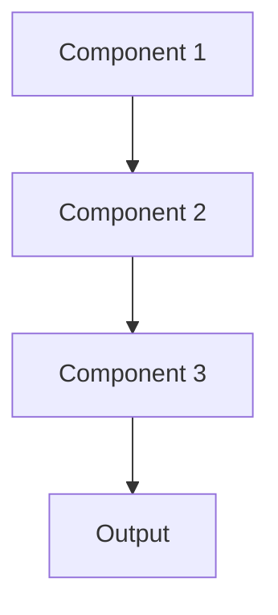

# Drift detection Pattern

## Overview

Drift Detection monitors how input data (data drift) or model predictions (concept drift) change over time relative to training distributions. For healthcare AI, this detects when patient populations change, new medical terminology emerges, or EHR systems modify data formats, signaling when model retraining is needed.

## When to Use

- **Evolving data**: Patient demographics, medical terminology, treatment protocols change
- **Long-lived models**: Models in production for months/years
- **Upstream changes**: EHR systems, data sources may change without notice
- **Performance monitoring**: Detect degradation before accuracy drops
- **Regulatory compliance**: Required to demonstrate ongoing model validity

## When Not to Use

- **Stable domain**: Input data distribution doesn't change
- **Short-lived models**: Model replaced frequently anyway
- **Continuous retraining**: Model retrained so often drift doesn't accumulate
- **No baseline**: Can't establish training distribution to compare against
- **Batch predictions**: All predictions reviewed; drift doesn't matter

## Architecture



## Implementation Examples

### Vertex AI (Google Cloud) Implementation

```python
# Implementation example using Vertex AI
```

### LangChain Implementation

```python
# Implementation example using LangChain
```

### Anthropic (Claude) Implementation

```python
# Implementation example using Anthropic
```

### Ollama Implementation

```python
# Implementation example using Ollama
```

## Performance Characteristics

### Latency
- [Latency characteristics]

### Throughput
- [Throughput characteristics]

### Resource Usage
- [Resource usage characteristics]

## Trade-offs

### Advantages
- [Advantage 1]
- [Advantage 2]

### Disadvantages
- [Disadvantage 1]
- [Disadvantage 2]

## Use Cases

### Healthcare Summarization
- [Healthcare use case 1]
- [Healthcare use case 2]

### General Use Cases
- [General use case 1]
- [General use case 2]

## Well-Architected Framework Alignment

### Operational Excellence
- [Operational excellence considerations]

### Security
- [Security considerations]

### Reliability
- [Reliability considerations]

### Cost Optimization
- [Cost optimization considerations]

### Performance
- [Performance considerations]

### Sustainability
- [Sustainability considerations]

## Deployment Considerations

### Zonal Deployment
- [Zonal deployment considerations]

### Regional Deployment
- [Regional deployment considerations]

### Multi-Regional Deployment
- [Multi-regional deployment considerations]

### Hybrid Deployment
- [Hybrid deployment considerations]

## Related Patterns
- [Related Pattern 1](./related-pattern-1.md)
- [Related Pattern 2](./related-pattern-2.md)

## References
- [Reference 1]
- [Reference 2]

## Version History
- **v1.0** (YYYY-MM-DD): Initial version

