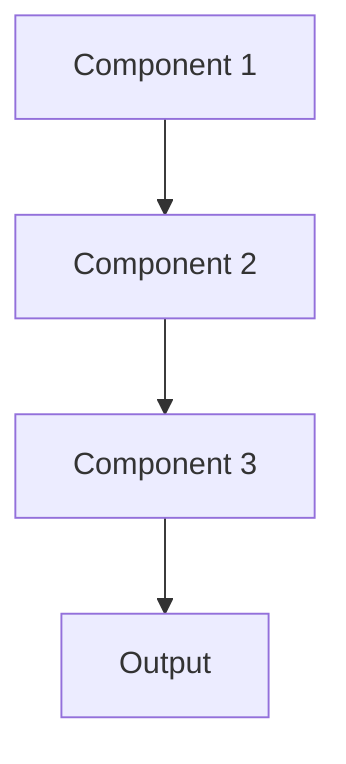

# Model performance tracking Pattern

## Overview

Model Performance Monitoring tracks ML-specific metrics like accuracy, precision, recall, and F1 score in production, comparing against baselines to detect degradation. For healthcare summarization, this monitors clinical accuracy of summaries, physician feedback ratings, and whether key medical concepts are being captured correctly.

## When to Use

- **Production models**: Models making real clinical predictions
- **Ground truth available**: Can collect labels for production data (physician feedback)
- **Performance critical**: Model accuracy directly impacts patient care
- **Regulatory compliance**: Must demonstrate ongoing model performance
- **Baseline established**: Have performance benchmarks to compare against

## When Not to Use

- **No ground truth**: Can't collect labels for production predictions
- **Offline evaluation sufficient**: Model performance stable; frequent monitoring unnecessary
- **Manual review**: All predictions reviewed by experts anyway
- **Research phase**: Experimental model not in production
- **Low stakes**: Model errors have minimal impact

## Architecture



## Implementation Examples

### Vertex AI (Google Cloud) Implementation

```python
# Implementation example using Vertex AI
```

### LangChain Implementation

```python
# Implementation example using LangChain
```

### Anthropic (Claude) Implementation

```python
# Implementation example using Anthropic
```

### Ollama Implementation

```python
# Implementation example using Ollama
```

## Performance Characteristics

### Latency
- [Latency characteristics]

### Throughput
- [Throughput characteristics]

### Resource Usage
- [Resource usage characteristics]

## Trade-offs

### Advantages
- [Advantage 1]
- [Advantage 2]

### Disadvantages
- [Disadvantage 1]
- [Disadvantage 2]

## Use Cases

### Healthcare Summarization
- [Healthcare use case 1]
- [Healthcare use case 2]

### General Use Cases
- [General use case 1]
- [General use case 2]

## Well-Architected Framework Alignment

### Operational Excellence
- [Operational excellence considerations]

### Security
- [Security considerations]

### Reliability
- [Reliability considerations]

### Cost Optimization
- [Cost optimization considerations]

### Performance
- [Performance considerations]

### Sustainability
- [Sustainability considerations]

## Deployment Considerations

### Zonal Deployment
- [Zonal deployment considerations]

### Regional Deployment
- [Regional deployment considerations]

### Multi-Regional Deployment
- [Multi-regional deployment considerations]

### Hybrid Deployment
- [Hybrid deployment considerations]

## Related Patterns
- [Related Pattern 1](./related-pattern-1.md)
- [Related Pattern 2](./related-pattern-2.md)

## References
- [Reference 1]
- [Reference 2]

## Version History
- **v1.0** (YYYY-MM-DD): Initial version

