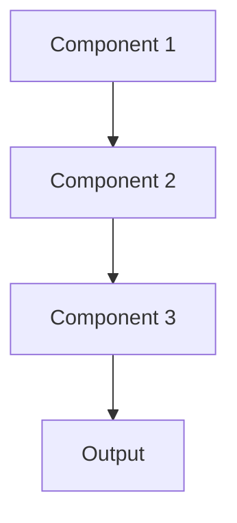

# Async processing Pattern

## Overview

Async Processing handles requests asynchronously, immediately returning a job ID and later providing results, allowing systems to process long-running summarization tasks without blocking. For healthcare, this enables overnight batch summarization of thousands of patient records or background processing of research cohort analyses.

## When to Use

- **Long-running tasks**: Summarization takes seconds to minutes per request
- **Non-blocking UIs**: Users continue working while results generate
- **Batch jobs**: Processing thousands of documents asynchronously
- **Resource pooling**: Queue requests to efficiently use limited resources
- **Variable latency**: Processing time varies widely between requests

## When Not to Use

- **Fast operations**: Requests complete in milliseconds; async overhead unnecessary
- **Synchronous UIs**: Users must wait for results before proceeding
- **Simple implementation**: Complexity of async not justified
- **Debugging difficulty**: Async makes testing and debugging harder
- **No queueing needed**: Resources abundant; no need to queue requests

## Architecture



## Implementation Examples

### Vertex AI (Google Cloud) Implementation

```python
# Implementation example using Vertex AI
```

### LangChain Implementation

```python
# Implementation example using LangChain
```

### Anthropic (Claude) Implementation

```python
# Implementation example using Anthropic
```

### Ollama Implementation

```python
# Implementation example using Ollama
```

## Performance Characteristics

### Latency
- [Latency characteristics]

### Throughput
- [Throughput characteristics]

### Resource Usage
- [Resource usage characteristics]

## Trade-offs

### Advantages
- [Advantage 1]
- [Advantage 2]

### Disadvantages
- [Disadvantage 1]
- [Disadvantage 2]

## Use Cases

### Healthcare Summarization
- [Healthcare use case 1]
- [Healthcare use case 2]

### General Use Cases
- [General use case 1]
- [General use case 2]

## Well-Architected Framework Alignment

### Operational Excellence
- [Operational excellence considerations]

### Security
- [Security considerations]

### Reliability
- [Reliability considerations]

### Cost Optimization
- [Cost optimization considerations]

### Performance
- [Performance considerations]

### Sustainability
- [Sustainability considerations]

## Deployment Considerations

### Zonal Deployment
- [Zonal deployment considerations]

### Regional Deployment
- [Regional deployment considerations]

### Multi-Regional Deployment
- [Multi-regional deployment considerations]

### Hybrid Deployment
- [Hybrid deployment considerations]

## Related Patterns
- [Related Pattern 1](./related-pattern-1.md)
- [Related Pattern 2](./related-pattern-2.md)

## References
- [Reference 1]
- [Reference 2]

## Version History
- **v1.0** (YYYY-MM-DD): Initial version

