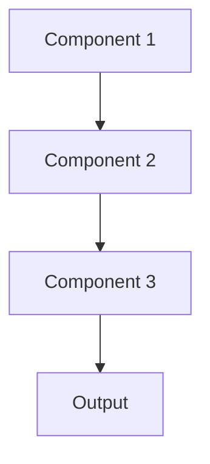

# Caching Pattern

## Overview

Caching stores frequently accessed results (embeddings, summaries, retrieval results) to avoid recomputation, dramatically reducing latency and costs for repeated queries. For healthcare AI, this caches summaries of standard protocols, common medication information, or frequently requested patient record sections.

## When to Use

- **Repeated queries**: Same or similar requests occur frequently
- **Expensive operations**: LLM inference, embeddings, or database queries costly to recompute
- **Static content**: Results don't change frequently (medical literature summaries)
- **Latency sensitive**: Cache hits provide instant responses
- **Cost optimization**: Reducing redundant API calls saves significant money

## When Not to Use

- **Unique queries**: Every request different; cache hit rate near zero
- **Rapidly changing data**: Cached results become stale too quickly
- **Storage constraints**: Cache storage more expensive than recomputation
- **Privacy concerns**: Caching patient data raises security/compliance issues
- **Simple operations**: Cached operations so fast recomputation negligible

## Architecture



## Implementation Examples

### Vertex AI (Google Cloud) Implementation

```python
# Implementation example using Vertex AI
```

### LangChain Implementation

```python
# Implementation example using LangChain
```

### Anthropic (Claude) Implementation

```python
# Implementation example using Anthropic
```

### Ollama Implementation

```python
# Implementation example using Ollama
```

## Performance Characteristics

### Latency
- [Latency characteristics]

### Throughput
- [Throughput characteristics]

### Resource Usage
- [Resource usage characteristics]

## Trade-offs

### Advantages
- [Advantage 1]
- [Advantage 2]

### Disadvantages
- [Disadvantage 1]
- [Disadvantage 2]

## Use Cases

### Healthcare Summarization
- [Healthcare use case 1]
- [Healthcare use case 2]

### General Use Cases
- [General use case 1]
- [General use case 2]

## Well-Architected Framework Alignment

### Operational Excellence
- [Operational excellence considerations]

### Security
- [Security considerations]

### Reliability
- [Reliability considerations]

### Cost Optimization
- [Cost optimization considerations]

### Performance
- [Performance considerations]

### Sustainability
- [Sustainability considerations]

## Deployment Considerations

### Zonal Deployment
- [Zonal deployment considerations]

### Regional Deployment
- [Regional deployment considerations]

### Multi-Regional Deployment
- [Multi-regional deployment considerations]

### Hybrid Deployment
- [Hybrid deployment considerations]

## Related Patterns
- [Related Pattern 1](./related-pattern-1.md)
- [Related Pattern 2](./related-pattern-2.md)

## References
- [Reference 1]
- [Reference 2]

## Version History
- **v1.0** (YYYY-MM-DD): Initial version

