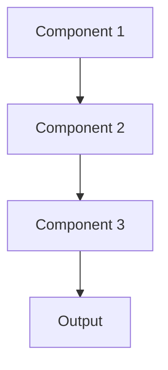

# Knowledge distillation Pattern

## Overview

Knowledge Distillation trains a smaller 'student' model to mimic a larger 'teacher' model's behavior, achieving similar accuracy with lower computational cost. For healthcare, this creates efficient clinical summarization models that match GPT-4/Claude performance but run faster and cheaper for production deployment.

## When to Use

- **Large teacher model**: Have high-quality model that's too expensive to deploy
- **Latency requirements**: Need faster inference than teacher provides
- **Cost reduction**: Teacher model API costs too high for scale
- **Edge deployment**: Teacher too large for edge devices
- **Better student**: Student model can learn from teacher's knowledge more than from raw data

## When Not to Use

- **No teacher**: Don't have larger model to distill from
- **Small accuracy gap**: Teacher and student perform similarly anyway
- **Teacher not better**: Teacher doesn't outperform student trained directly
- **Training costs**: Distillation training more expensive than benefits
- **Simple task**: Direct training on task data sufficient

## Architecture



## Implementation Examples

### Vertex AI (Google Cloud) Implementation

```python
# Implementation example using Vertex AI
```

### LangChain Implementation

```python
# Implementation example using LangChain
```

### Anthropic (Claude) Implementation

```python
# Implementation example using Anthropic
```

### Ollama Implementation

```python
# Implementation example using Ollama
```

## Performance Characteristics

### Latency
- [Latency characteristics]

### Throughput
- [Throughput characteristics]

### Resource Usage
- [Resource usage characteristics]

## Trade-offs

### Advantages
- [Advantage 1]
- [Advantage 2]

### Disadvantages
- [Disadvantage 1]
- [Disadvantage 2]

## Use Cases

### Healthcare Summarization
- [Healthcare use case 1]
- [Healthcare use case 2]

### General Use Cases
- [General use case 1]
- [General use case 2]

## Well-Architected Framework Alignment

### Operational Excellence
- [Operational excellence considerations]

### Security
- [Security considerations]

### Reliability
- [Reliability considerations]

### Cost Optimization
- [Cost optimization considerations]

### Performance
- [Performance considerations]

### Sustainability
- [Sustainability considerations]

## Deployment Considerations

### Zonal Deployment
- [Zonal deployment considerations]

### Regional Deployment
- [Regional deployment considerations]

### Multi-Regional Deployment
- [Multi-regional deployment considerations]

### Hybrid Deployment
- [Hybrid deployment considerations]

## Related Patterns
- [Related Pattern 1](./related-pattern-1.md)
- [Related Pattern 2](./related-pattern-2.md)

## References
- [Reference 1]
- [Reference 2]

## Version History
- **v1.0** (YYYY-MM-DD): Initial version

