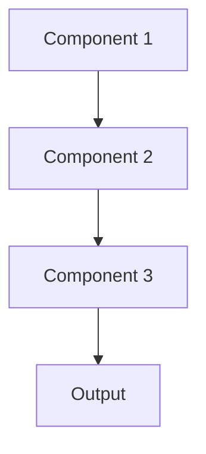

# Quantization Pattern

## Overview

Quantization reduces model precision from 32-bit floating point to 16-bit, 8-bit, or even 4-bit integers, decreasing memory usage and speeding up inference with minimal accuracy loss. Enables running large healthcare LLMs on consumer GPUs or faster API responses at lower cost.

## When to Use

- **Memory constraints**: Model too large for available GPU memory
- **Inference speed**: Need faster predictions
- **Cost reduction**: Lower precision reduces cloud API costs
- **Edge deployment**: Deploy large models on limited hardware
- **Minimal accuracy loss**: Quantization doesn't significantly hurt clinical accuracy

## When Not to Use

- **Accuracy degradation**: Precision reduction hurts clinical performance
- **Already optimized**: Model already quantized or highly efficient
- **Hardware limitations**: Target hardware doesn't support quantized operations efficiently
- **Training**: Quantization-aware training required but not feasible
- **Numerical instability**: Model sensitive to precision reduction

## Architecture



## Implementation Examples

### Vertex AI (Google Cloud) Implementation

```python
# Implementation example using Vertex AI
```

### LangChain Implementation

```python
# Implementation example using LangChain
```

### Anthropic (Claude) Implementation

```python
# Implementation example using Anthropic
```

### Ollama Implementation

```python
# Implementation example using Ollama
```

## Performance Characteristics

### Latency
- [Latency characteristics]

### Throughput
- [Throughput characteristics]

### Resource Usage
- [Resource usage characteristics]

## Trade-offs

### Advantages
- [Advantage 1]
- [Advantage 2]

### Disadvantages
- [Disadvantage 1]
- [Disadvantage 2]

## Use Cases

### Healthcare Summarization
- [Healthcare use case 1]
- [Healthcare use case 2]

### General Use Cases
- [General use case 1]
- [General use case 2]

## Well-Architected Framework Alignment

### Operational Excellence
- [Operational excellence considerations]

### Security
- [Security considerations]

### Reliability
- [Reliability considerations]

### Cost Optimization
- [Cost optimization considerations]

### Performance
- [Performance considerations]

### Sustainability
- [Sustainability considerations]

## Deployment Considerations

### Zonal Deployment
- [Zonal deployment considerations]

### Regional Deployment
- [Regional deployment considerations]

### Multi-Regional Deployment
- [Multi-regional deployment considerations]

### Hybrid Deployment
- [Hybrid deployment considerations]

## Related Patterns
- [Related Pattern 1](./related-pattern-1.md)
- [Related Pattern 2](./related-pattern-2.md)

## References
- [Reference 1]
- [Reference 2]

## Version History
- **v1.0** (YYYY-MM-DD): Initial version

