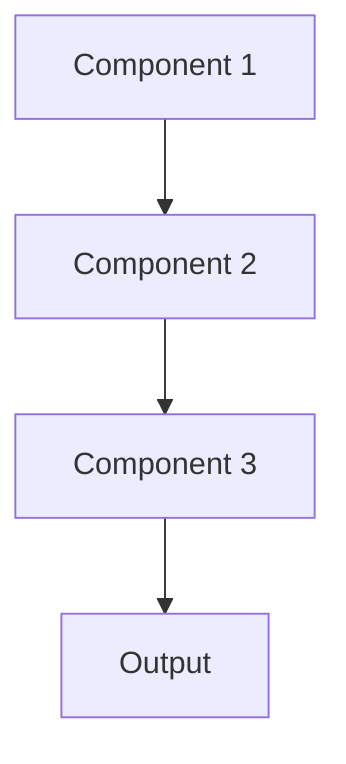

# Differential privacy Pattern

## Overview

Differential Privacy adds calibrated noise to training or outputs, providing mathematical privacy guarantees that individual patient records cannot be inferred from model behavior. This enables publishing healthcare AI models or aggregated statistics while provably protecting individual privacy.

## When to Use

- **Privacy guarantees**: Need mathematical proof of privacy protection
- **Releasing models**: Publishing models trained on sensitive data
- **Aggregated statistics**: Sharing population-level insights from PHI
- **Regulatory compliance**: Meeting strong privacy requirements (GDPR)
- **Research data sharing**: Enabling research while protecting subjects

## When Not to Use

- **Accuracy critical**: Noise reduces model accuracy unacceptably
- **Small datasets**: Privacy-utility tradeoff poor for small samples
- **Data doesn't leave**: Model and predictions stay within secure environment
- **Weaker guarantees sufficient**: Other privacy techniques adequate
- **Complex implementation**: Lack expertise to implement correctly

## Architecture



## Implementation Examples

### Vertex AI (Google Cloud) Implementation

```python
# Implementation example using Vertex AI
```

### LangChain Implementation

```python
# Implementation example using LangChain
```

### Anthropic (Claude) Implementation

```python
# Implementation example using Anthropic
```

### Ollama Implementation

```python
# Implementation example using Ollama
```

## Performance Characteristics

### Latency
- [Latency characteristics]

### Throughput
- [Throughput characteristics]

### Resource Usage
- [Resource usage characteristics]

## Trade-offs

### Advantages
- [Advantage 1]
- [Advantage 2]

### Disadvantages
- [Disadvantage 1]
- [Disadvantage 2]

## Use Cases

### Healthcare Summarization
- [Healthcare use case 1]
- [Healthcare use case 2]

### General Use Cases
- [General use case 1]
- [General use case 2]

## Well-Architected Framework Alignment

### Operational Excellence
- [Operational excellence considerations]

### Security
- [Security considerations]

### Reliability
- [Reliability considerations]

### Cost Optimization
- [Cost optimization considerations]

### Performance
- [Performance considerations]

### Sustainability
- [Sustainability considerations]

## Deployment Considerations

### Zonal Deployment
- [Zonal deployment considerations]

### Regional Deployment
- [Regional deployment considerations]

### Multi-Regional Deployment
- [Multi-regional deployment considerations]

### Hybrid Deployment
- [Hybrid deployment considerations]

## Related Patterns
- [Related Pattern 1](./related-pattern-1.md)
- [Related Pattern 2](./related-pattern-2.md)

## References
- [Reference 1]
- [Reference 2]

## Version History
- **v1.0** (YYYY-MM-DD): Initial version

