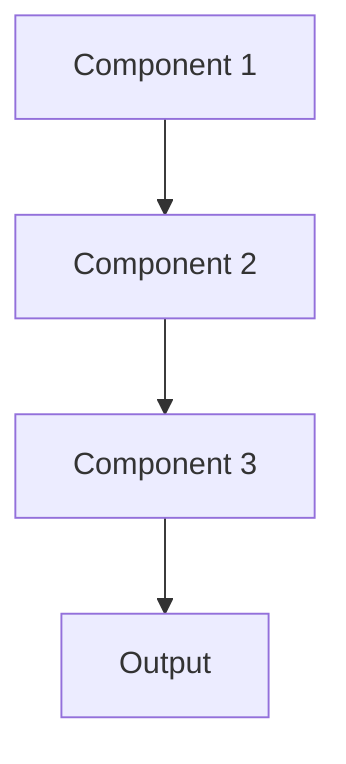

# Secure mpc Pattern

## Overview

Secure Multi-Party Computation (MPC) enables multiple parties to jointly compute functions over their private data without revealing inputs to each other. Multiple hospitals can collaboratively train healthcare AI models with each institution's data remaining private and never leaving their premises.

## When to Use

- **Multi-party collaboration**: Multiple institutions want to pool data without sharing
- **Privacy regulations**: HIPAA prohibits centralizing data
- **Mutual distrust**: Parties want benefits of collaboration but don't fully trust each other
- **Data cannot move**: Legal or technical constraints prevent data centralization
- **Regulatory compliance**: Required to demonstrate data never exposed

## When Not to Use

- **Two parties**: Simpler techniques like federated learning sufficient
- **Trust exists**: Parties willing to share data with trusted third party
- **Performance critical**: MPC adds significant computational overhead
- **Complex models**: Cryptographic protocols may not support needed operations
- **Implementation complexity**: Require specialized expertise

## Architecture



## Implementation Examples

### Vertex AI (Google Cloud) Implementation

```python
# Implementation example using Vertex AI
```

### LangChain Implementation

```python
# Implementation example using LangChain
```

### Anthropic (Claude) Implementation

```python
# Implementation example using Anthropic
```

### Ollama Implementation

```python
# Implementation example using Ollama
```

## Performance Characteristics

### Latency
- [Latency characteristics]

### Throughput
- [Throughput characteristics]

### Resource Usage
- [Resource usage characteristics]

## Trade-offs

### Advantages
- [Advantage 1]
- [Advantage 2]

### Disadvantages
- [Disadvantage 1]
- [Disadvantage 2]

## Use Cases

### Healthcare Summarization
- [Healthcare use case 1]
- [Healthcare use case 2]

### General Use Cases
- [General use case 1]
- [General use case 2]

## Well-Architected Framework Alignment

### Operational Excellence
- [Operational excellence considerations]

### Security
- [Security considerations]

### Reliability
- [Reliability considerations]

### Cost Optimization
- [Cost optimization considerations]

### Performance
- [Performance considerations]

### Sustainability
- [Sustainability considerations]

## Deployment Considerations

### Zonal Deployment
- [Zonal deployment considerations]

### Regional Deployment
- [Regional deployment considerations]

### Multi-Regional Deployment
- [Multi-regional deployment considerations]

### Hybrid Deployment
- [Hybrid deployment considerations]

## Related Patterns
- [Related Pattern 1](./related-pattern-1.md)
- [Related Pattern 2](./related-pattern-2.md)

## References
- [Reference 1]
- [Reference 2]

## Version History
- **v1.0** (YYYY-MM-DD): Initial version

