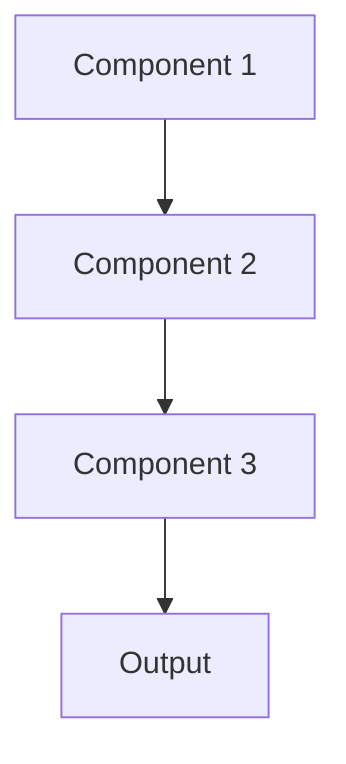

# Continual learning Pattern

## Overview

Continual Learning enables models to learn from new data over time without forgetting previously learned knowledge (catastrophic forgetting). As medical knowledge evolves and new treatments emerge, models must update while preserving existing capabilities. Critical for production healthcare AI systems that must stay current.

## When to Use

- **Evolving knowledge**: Medical guidelines and best practices change regularly
- **Streaming data**: Continuous flow of new clinical cases and outcomes
- **Model longevity**: System must remain accurate over months/years
- **Can't retrain from scratch**: Retraining on all historical data impractical
- **Preserve existing knowledge**: Must maintain performance on existing tasks while learning new ones

## When Not to Use

- **Static domain**: Medical knowledge doesn't change significantly
- **Periodic retraining**: Can retrain from scratch regularly
- **Short lifecycle**: Model replaced frequently rather than updated
- **No forgetting concern**: New data doesn't interfere with old knowledge
- **Batch updates**: Can accumulate data and retrain periodically

## Architecture



## Implementation Examples

### Vertex AI (Google Cloud) Implementation

```python
# Implementation example using Vertex AI
```

### LangChain Implementation

```python
# Implementation example using LangChain
```

### Anthropic (Claude) Implementation

```python
# Implementation example using Anthropic
```

### Ollama Implementation

```python
# Implementation example using Ollama
```

## Performance Characteristics

### Latency
- [Latency characteristics]

### Throughput
- [Throughput characteristics]

### Resource Usage
- [Resource usage characteristics]

## Trade-offs

### Advantages
- [Advantage 1]
- [Advantage 2]

### Disadvantages
- [Disadvantage 1]
- [Disadvantage 2]

## Use Cases

### Healthcare Summarization
- [Healthcare use case 1]
- [Healthcare use case 2]

### General Use Cases
- [General use case 1]
- [General use case 2]

## Well-Architected Framework Alignment

### Operational Excellence
- [Operational excellence considerations]

### Security
- [Security considerations]

### Reliability
- [Reliability considerations]

### Cost Optimization
- [Cost optimization considerations]

### Performance
- [Performance considerations]

### Sustainability
- [Sustainability considerations]

## Deployment Considerations

### Zonal Deployment
- [Zonal deployment considerations]

### Regional Deployment
- [Regional deployment considerations]

### Multi-Regional Deployment
- [Multi-regional deployment considerations]

### Hybrid Deployment
- [Hybrid deployment considerations]

## Related Patterns
- [Related Pattern 1](./related-pattern-1.md)
- [Related Pattern 2](./related-pattern-2.md)

## References
- [Reference 1]
- [Reference 2]

## Version History
- **v1.0** (YYYY-MM-DD): Initial version

