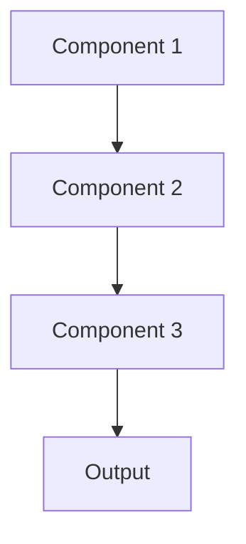

# Curriculum learning Pattern

## Overview

Curriculum Learning trains models on progressively more difficult examples, similar to human education. Starting with simple cases and gradually introducing complexity helps models learn more effectively and generalize better. In healthcare, this might mean training first on straightforward discharge summaries before tackling complex multi-morbidity cases.

## When to Use

- **Complex domains**: Healthcare terminology and clinical reasoning have steep learning curves
- **Data with natural difficulty progression**: Cases range from simple to complex
- **Improved convergence**: Standard training struggles to learn effectively
- **Sample efficiency**: Need to learn from limited labeled examples
- **Transfer learning**: Pre-training on simpler tasks before target task

## When Not to Use

- **Uniform difficulty**: All examples have similar complexity
- **No clear curriculum**: Difficult to define what makes an example 'easy' or 'hard'
- **Time constraints**: Designing curriculum adds development overhead
- **Random sampling works**: Standard training already achieves good results
- **Simple tasks**: Task doesn't benefit from progressive learning

## Architecture



## Implementation Examples

### Vertex AI (Google Cloud) Implementation

```python
# Implementation example using Vertex AI
```

### LangChain Implementation

```python
# Implementation example using LangChain
```

### Anthropic (Claude) Implementation

```python
# Implementation example using Anthropic
```

### Ollama Implementation

```python
# Implementation example using Ollama
```

## Performance Characteristics

### Latency
- [Latency characteristics]

### Throughput
- [Throughput characteristics]

### Resource Usage
- [Resource usage characteristics]

## Trade-offs

### Advantages
- [Advantage 1]
- [Advantage 2]

### Disadvantages
- [Disadvantage 1]
- [Disadvantage 2]

## Use Cases

### Healthcare Summarization
- [Healthcare use case 1]
- [Healthcare use case 2]

### General Use Cases
- [General use case 1]
- [General use case 2]

## Well-Architected Framework Alignment

### Operational Excellence
- [Operational excellence considerations]

### Security
- [Security considerations]

### Reliability
- [Reliability considerations]

### Cost Optimization
- [Cost optimization considerations]

### Performance
- [Performance considerations]

### Sustainability
- [Sustainability considerations]

## Deployment Considerations

### Zonal Deployment
- [Zonal deployment considerations]

### Regional Deployment
- [Regional deployment considerations]

### Multi-Regional Deployment
- [Multi-regional deployment considerations]

### Hybrid Deployment
- [Hybrid deployment considerations]

## Related Patterns
- [Related Pattern 1](./related-pattern-1.md)
- [Related Pattern 2](./related-pattern-2.md)

## References
- [Reference 1]
- [Reference 2]

## Version History
- **v1.0** (YYYY-MM-DD): Initial version

