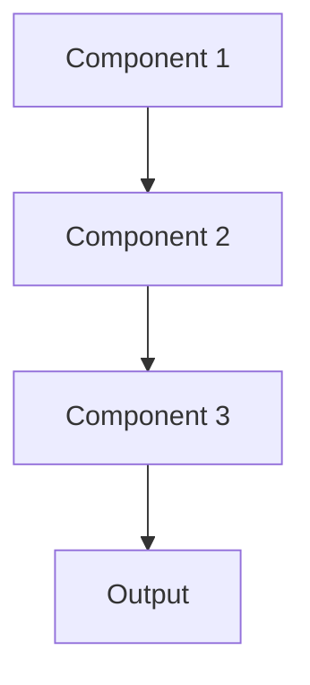

# Meta learning Pattern

## Overview

Meta-Learning (learning to learn) trains models to quickly adapt to new tasks by learning from experience with many related tasks. The model learns general learning strategies rather than task-specific solutions. Useful for healthcare AI that must adapt to different hospitals, specialties, or clinical workflows.

## When to Use

- **Many related tasks**: Multiple similar tasks (different specialties, institutions)
- **Fast adaptation**: Need to quickly customize to new clinical contexts
- **Few examples per task**: Limited data for each new task but many tasks overall
- **Task distribution**: New tasks come from same distribution as training tasks
- **Personalization at scale**: Adapt to individual users or institutions efficiently

## When Not to Use

- **Single task**: Only solving one specific problem
- **Unrelated tasks**: Tasks too different for shared meta-learning
- **Abundant data per task**: Each task has sufficient data for standard training
- **Simple transfer learning**: Basic fine-tuning suffices
- **Computational constraints**: Meta-learning requires training on many tasks

## Architecture



## Implementation Examples

### Vertex AI (Google Cloud) Implementation

```python
# Implementation example using Vertex AI
```

### LangChain Implementation

```python
# Implementation example using LangChain
```

### Anthropic (Claude) Implementation

```python
# Implementation example using Anthropic
```

### Ollama Implementation

```python
# Implementation example using Ollama
```

## Performance Characteristics

### Latency
- [Latency characteristics]

### Throughput
- [Throughput characteristics]

### Resource Usage
- [Resource usage characteristics]

## Trade-offs

### Advantages
- [Advantage 1]
- [Advantage 2]

### Disadvantages
- [Disadvantage 1]
- [Disadvantage 2]

## Use Cases

### Healthcare Summarization
- [Healthcare use case 1]
- [Healthcare use case 2]

### General Use Cases
- [General use case 1]
- [General use case 2]

## Well-Architected Framework Alignment

### Operational Excellence
- [Operational excellence considerations]

### Security
- [Security considerations]

### Reliability
- [Reliability considerations]

### Cost Optimization
- [Cost optimization considerations]

### Performance
- [Performance considerations]

### Sustainability
- [Sustainability considerations]

## Deployment Considerations

### Zonal Deployment
- [Zonal deployment considerations]

### Regional Deployment
- [Regional deployment considerations]

### Multi-Regional Deployment
- [Multi-regional deployment considerations]

### Hybrid Deployment
- [Hybrid deployment considerations]

## Related Patterns
- [Related Pattern 1](./related-pattern-1.md)
- [Related Pattern 2](./related-pattern-2.md)

## References
- [Reference 1]
- [Reference 2]

## Version History
- **v1.0** (YYYY-MM-DD): Initial version

