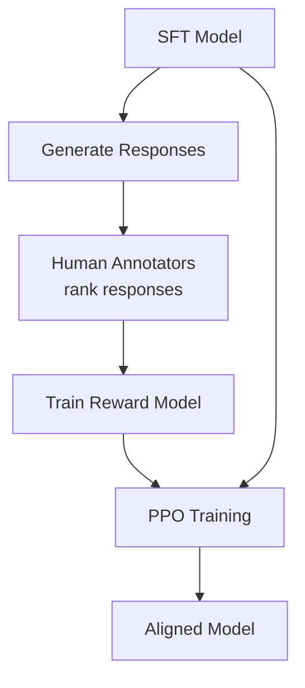

# RLHF (Reinforcement Learning from Human Feedback) Pattern

## Overview
RLHF aligns LLM outputs with human preferences by training a **reward model** on human judgments, then using reinforcement learning (PPO) to optimize the LLM to maximize that reward. This is the technique that transformed GPT-3 into ChatGPT and is used by Anthropic, OpenAI, and Google to align their models. For healthcare, RLHF enables alignment with clinical expert preferences.

## Training Phase
**Post-Training (Alignment)** — applied after SFT to align with human preferences

## Architecture

### Three-Step Process
1. **SFT**: Fine-tune base model on instruction-response pairs
2. **Reward Model Training**: Train a model to predict human preference from ranked response pairs
3. **PPO Optimization**: Use the reward model to optimize the SFT model via reinforcement learning

## When to Use
- Model produces correct but poorly calibrated outputs (too verbose, wrong tone, not cautious enough)
- You need the model to refuse harmful or unsafe requests
- Clinical experts can judge "which response is better" but can't write perfect responses
- Aligning model behavior with institutional or regulatory standards

## When NOT to Use
- You can achieve alignment through prompt engineering or SFT alone
- You don't have access to human annotators/domain experts
- The task has a clear right/wrong answer (use SFT with correct answers instead)
- Budget and infrastructure constraints (RLHF is expensive)

## Healthcare RLHF
- **Annotators**: Physicians, nurses, pharmacists rank clinical responses
- **Preference criteria**: Clinical accuracy, safety, completeness, appropriate hedging
- **Safety alignment**: Train model to refuse dangerous medical advice, recommend physician consultation for serious conditions

## Related Patterns
- [SFT Pattern](./sft-pattern.md) — Step 1 before RLHF
- [DPO Pattern](./dpo-pattern.md) — Simpler alternative to RLHF
- [Agent Guardrails](../../agents/agent-guardrails-pattern.md) — Runtime safety complements RLHF alignment

## References
- [Training Language Models to Follow Instructions with Human Feedback (InstructGPT, 2022)](https://arxiv.org/abs/2203.02155)
- [Constitutional AI: Harmlessness from AI Feedback (Anthropic, 2022)](https://arxiv.org/abs/2212.08073)

## Version History
- **v1.0** (2026-02-05): Initial version
