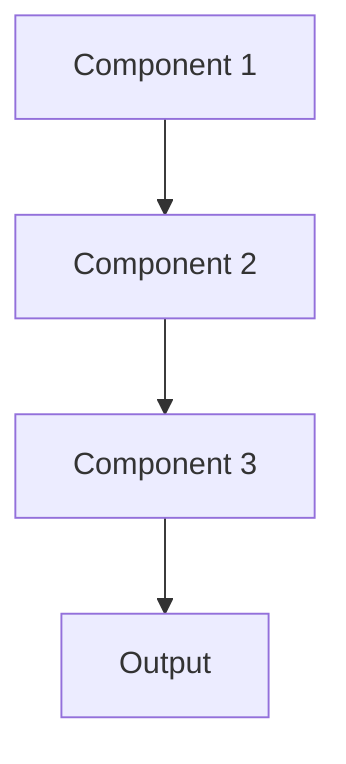

# Self supervised learning Pattern

## Overview

Self-Supervised Learning creates supervisory signals from unlabeled data itself, learning representations without manual annotations. Models predict masked portions of text, next sentences, or other self-created tasks. Foundation models like Claude and GPT use self-supervised pre-training on massive corpora before fine-tuning for specific tasks.

## When to Use

- **Massive unlabeled data**: Abundant medical literature, clinical notes without labels
- **Pre-training foundation models**: Building general medical language understanding
- **Limited labeled data**: Labels scarce but raw text plentiful
- **Representation learning**: Need general-purpose features for downstream tasks
- **Transfer learning**: Pre-train on unlabeled data, fine-tune on small labeled set

## When Not to Use

- **Abundant labels**: Supervised learning more direct when labels available
- **Specific task**: Self-supervision may not learn task-relevant features
- **Computational constraints**: Self-supervised pre-training requires significant compute
- **Small datasets**: Benefits diminish with limited unlabeled data
- **Time-to-market**: Pre-training adds development time

## Architecture



## Implementation Examples

### Vertex AI (Google Cloud) Implementation

```python
# Implementation example using Vertex AI
```

### LangChain Implementation

```python
# Implementation example using LangChain
```

### Anthropic (Claude) Implementation

```python
# Implementation example using Anthropic
```

### Ollama Implementation

```python
# Implementation example using Ollama
```

## Performance Characteristics

### Latency
- [Latency characteristics]

### Throughput
- [Throughput characteristics]

### Resource Usage
- [Resource usage characteristics]

## Trade-offs

### Advantages
- [Advantage 1]
- [Advantage 2]

### Disadvantages
- [Disadvantage 1]
- [Disadvantage 2]

## Use Cases

### Healthcare Summarization
- [Healthcare use case 1]
- [Healthcare use case 2]

### General Use Cases
- [General use case 1]
- [General use case 2]

## Well-Architected Framework Alignment

### Operational Excellence
- [Operational excellence considerations]

### Security
- [Security considerations]

### Reliability
- [Reliability considerations]

### Cost Optimization
- [Cost optimization considerations]

### Performance
- [Performance considerations]

### Sustainability
- [Sustainability considerations]

## Deployment Considerations

### Zonal Deployment
- [Zonal deployment considerations]

### Regional Deployment
- [Regional deployment considerations]

### Multi-Regional Deployment
- [Multi-regional deployment considerations]

### Hybrid Deployment
- [Hybrid deployment considerations]

## Related Patterns
- [Related Pattern 1](./related-pattern-1.md)
- [Related Pattern 2](./related-pattern-2.md)

## References
- [Reference 1]
- [Reference 2]

## Version History
- **v1.0** (YYYY-MM-DD): Initial version

