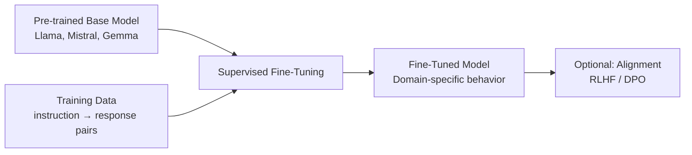

# Supervised Fine-Tuning (SFT) Pattern

## Overview
Supervised Fine-Tuning (SFT) adapts a pre-trained LLM to a specific task or domain by training it on curated instruction-response pairs. This is the most common way to customize LLMs — you show the model examples of the behavior you want, and it learns to produce similar outputs. SFT is the **first step** in most LLM customization workflows, often followed by alignment (RLHF/DPO).

## Training Phase
**Fine-Tuning (Mid-Training)** — applied to a pre-trained base model

## Architecture



### When to Use
- Model needs to follow a specific output format (SOAP notes, structured reports)
- Domain adaptation (medical terminology, clinical reasoning patterns)
- Task-specific behavior (summarization, extraction, classification)
- Base model understands the domain but doesn't produce the right format/style

### When NOT to Use
- Prompt engineering alone achieves acceptable results (try this first)
- You have fewer than ~100 high-quality examples (use few-shot or LoRA instead)
- You need to change the model's factual knowledge (use RAG instead)

## Key Concepts

### Training Data Format
```json
[
  {
    "instruction": "Summarize this discharge note in SOAP format",
    "input": "Patient is a 65yo male admitted for chest pain...",
    "output": "**Subjective**: 65yo male presents with chest pain...\n**Objective**: BP 140/90, HR 88...\n**Assessment**: Acute coronary syndrome...\n**Plan**: 1. Cardiology consult..."
  }
]
```

### Key Parameters
| Parameter | Typical Range | Impact |
|-----------|--------------|--------|
| Learning rate | 1e-5 to 5e-5 | Too high = catastrophic forgetting; too low = slow learning |
| Epochs | 1-5 | More epochs = better task fit but risk of overfitting |
| Batch size | 4-32 | Larger = more stable gradients but more memory |
| Max sequence length | 512-4096 | Must accommodate longest training example |
| Warmup ratio | 0.03-0.1 | Gradual learning rate increase to stabilize early training |

## Implementation Examples

### Hugging Face / Transformers
```python
from transformers import AutoModelForCausalLM, AutoTokenizer, TrainingArguments, Trainer
from datasets import load_dataset

model = AutoModelForCausalLM.from_pretrained("meta-llama/Llama-3.1-8B")
tokenizer = AutoTokenizer.from_pretrained("meta-llama/Llama-3.1-8B")

dataset = load_dataset("json", data_files="clinical_sft_data.jsonl")

training_args = TrainingArguments(
    output_dir="./clinical-llama-sft",
    num_train_epochs=3,
    per_device_train_batch_size=4,
    learning_rate=2e-5,
    warmup_ratio=0.05,
    logging_steps=10,
    save_strategy="epoch",
    bf16=True,
)

trainer = Trainer(model=model, args=training_args, train_dataset=dataset["train"])
trainer.train()
```

### Google Vertex AI Fine-Tuning
```python
from google.cloud import aiplatform

aiplatform.init(project="healthcare-ai", location="us-central1")

sft_job = aiplatform.CustomTrainingJob(
    display_name="clinical-summarization-sft",
    script_path="train_sft.py",
    container_uri="us-docker.pkg.dev/vertex-ai/training/pytorch-gpu:latest",
    model_serving_container_image_uri="us-docker.pkg.dev/vertex-ai/prediction/pytorch-gpu:latest",
)

model = sft_job.run(
    dataset=training_dataset,
    model_display_name="clinical-summarizer-v1",
    machine_type="a2-highgpu-1g",
)
```

## Performance Characteristics

### Resource Requirements
| Model Size | GPU Memory | Training Time (10K examples) | Cost Estimate |
|------------|-----------|------------------------------|---------------|
| 7-8B params | 1x A100 (40GB) | 2-6 hours | $10-30 |
| 13B params | 1x A100 (80GB) | 4-12 hours | $20-60 |
| 70B params | 4x A100 (80GB) | 24-72 hours | $200-600 |

### Quality vs. Data Size
| Training Examples | Expected Quality |
|------------------|-----------------|
| 100-500 | Learns format/style but limited generalization |
| 500-5K | Good domain adaptation for focused tasks |
| 5K-50K | Strong task performance, broad coverage |
| 50K+ | Diminishing returns; focus on data quality over quantity |

## Healthcare Considerations

### Training Data
- Use de-identified clinical data for SFT training examples
- Expert physician annotation for instruction-response pairs
- Include diverse clinical scenarios (inpatient, outpatient, emergency, pediatric, geriatric)
- Balance across specialties to avoid bias

### Compliance
- Document all training data sources and annotation procedures
- Maintain data lineage for regulatory audits
- Evaluate for bias across patient demographics

## Related Patterns
- [LoRA & PEFT](./lora-peft-pattern.md) — Parameter-efficient alternative to full SFT
- [Instruction Tuning](./instruction-tuning-pattern.md) — Multi-task variant of SFT
- [RLHF](./rlhf-pattern.md) — Post-SFT alignment step
- [DPO](./dpo-pattern.md) — Simpler post-SFT alignment
- [Synthetic Data Generation](./synthetic-data-pattern.md) — Generate training data for SFT

## References
- [Fine-Tuning LLMs: A Comprehensive Guide (2024)](https://arxiv.org/abs/2408.13296)
- [Hugging Face Fine-Tuning Tutorial](https://huggingface.co/docs/transformers/training)

## Version History
- **v1.0** (2026-02-05): Initial version
