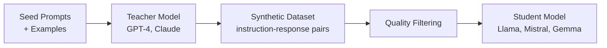

# Synthetic Data Generation Pattern

## Overview
Synthetic data generation uses LLMs to create training data for fine-tuning other models. When real labeled data is scarce or expensive (common in healthcare), you can use a strong model (GPT-4, Claude) to generate instruction-response pairs, then use that synthetic data to fine-tune a smaller, cheaper, or on-premises model.

## Training Phase
**Fine-Tuning (Mid-Training)** — generates data that enables SFT and instruction tuning

## Architecture

## Key Techniques

| Technique | Description | Best For |
|-----------|-------------|----------|
| **Self-Instruct** | Generate instructions from seed tasks, then generate responses | Diverse task coverage |
| **Evol-Instruct** | Iteratively evolve simple instructions into complex ones | Increasing difficulty |
| **Distillation** | Generate responses from a strong model on your specific queries | Domain adaptation |
| **Backtranslation** | Generate instructions for existing responses | Leveraging unlabeled outputs |

## Healthcare Applications
- Generate clinical summarization examples from de-identified notes
- Create diverse instruction-response pairs for medical Q&A
- Generate preference pairs for DPO alignment (safe vs. unsafe responses)
- Augment rare clinical scenarios (pediatric, rare diseases)

## Quality Control
- **Deduplication**: Remove near-duplicate generations
- **Factual verification**: Cross-check medical facts against knowledge bases
- **Expert review**: Sample-based physician review of generated data
- **Diversity scoring**: Ensure coverage across clinical domains

## Related Patterns
- [SFT Pattern](./sft-pattern.md) — Primary consumer of synthetic data
- [Instruction Tuning](./instruction-tuning-pattern.md) — Multi-task training using synthetic instructions
- [Data Curation](./data-curation-pattern.md) — Quality standards for training data

## References
- [Self-Instruct (Wang et al., 2023)](https://arxiv.org/abs/2212.10560)
- [WizardLM: Empowering Large Language Models to Follow Complex Instructions (2023)](https://arxiv.org/abs/2304.12244)

## Version History
- **v1.0** (2026-02-05): Initial version
