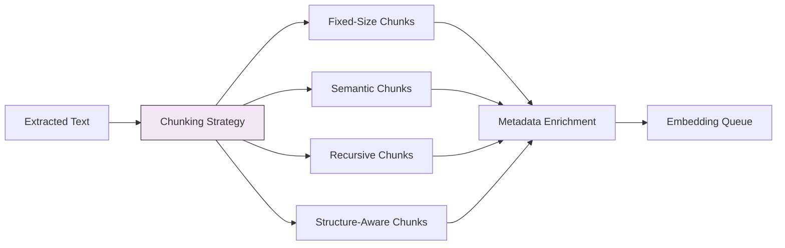

# Chunking Strategies

## Overview
Chunking strategies define how extracted document text is split into retrieval-friendly segments before embedding. Chunking is arguably the **most impactful stage** in a RAG pipeline — the right chunking strategy can dramatically improve retrieval accuracy, while poor chunking leads to irrelevant or incomplete results regardless of how good the embedding model or retrieval pattern is.

## Pipeline Stage
- [ ] Data Ingestion
- [ ] Document Processing & Extraction
- [x] Chunking & Splitting
- [ ] Embedding & Vectorization
- [ ] Vector Store & Indexing
- [ ] Index Maintenance & Freshness
- [ ] Pipeline Orchestration
- [ ] Evaluation & Quality Assurance

## Architecture

### Pipeline Architecture


### Components
- **Text Splitter**: Core engine that applies the chosen chunking strategy
- **Overlap Manager**: Controls overlap between adjacent chunks for context continuity
- **Metadata Enricher**: Attaches chunk-level metadata (position, parent doc, section heading)
- **Chunk Validator**: Ensures chunks meet size constraints and quality thresholds

### Data Flow
1. **Input**: Clean extracted text + document structure metadata from extraction stage
2. **Transformation**: Strategy selection → text splitting → overlap application → metadata attachment → size validation
3. **Output**: List of text chunks with metadata, ready for embedding

## When to Use

### Ideal Use Cases
- Any RAG pipeline — chunking is required for all retrieval-based systems
- Documents longer than the embedding model's context window
- Documents with mixed content types (narrative, tables, code, lists)
- Collections with variable document lengths

### Data Characteristics
- Long-form text (> 500 tokens)
- Documents with natural structural boundaries (sections, paragraphs, headings)
- Mixed content requiring different chunking strategies for different sections

## When NOT to Use

### Anti-Patterns
- Very short documents (< 500 tokens) that fit entirely in the embedding context — embed whole
- Structured data (JSON, CSV) — use schema-aware parsing, not text chunking
- Pre-chunked data (FAQ pairs, knowledge base entries) — already in retrieval units

## Configuration & Strategy

### Key Parameters
| Parameter | Default | Range | Impact |
|-----------|---------|-------|--------|
| chunk_size | 512 tokens | 128-2048 tokens | Larger = more context but less precision |
| chunk_overlap | 50 tokens | 0-256 tokens | Higher = better continuity but more redundancy |
| separator | `\n\n` | any string/regex | What boundary to split on |
| length_function | token count | char/word/token | How to measure chunk size |
| min_chunk_size | 100 tokens | 50-500 tokens | Filter out tiny, low-quality chunks |

### Strategy Variations

#### Variation A: Fixed-Size Chunking
- **Description**: Split text into uniform chunks of N tokens with overlap
- **Best For**: Homogeneous documents, quick prototyping, baseline comparisons
- **Trade-off**: Simple and predictable but ignores document structure — may split mid-sentence or mid-paragraph
- **Recommended chunk size**: 256-512 tokens with 50-100 token overlap

#### Variation B: Recursive Character Splitting
- **Description**: Split hierarchically — first by `\n\n`, then `\n`, then `. `, then space — until chunks are small enough
- **Best For**: General-purpose chunking that respects natural text boundaries
- **Trade-off**: Better boundary respect than fixed-size, but still unaware of semantic meaning
- **LangChain default**: `RecursiveCharacterTextSplitter`

#### Variation C: Semantic Chunking
- **Description**: Use sentence embeddings to detect topic boundaries — split where semantic similarity drops
- **Best For**: Documents with topic shifts, research papers, clinical notes with distinct sections
- **Trade-off**: Highest quality chunks but computationally expensive (requires embedding during chunking)

#### Variation D: Sentence-Based Chunking
- **Description**: Split on sentence boundaries, group sentences until reaching chunk size
- **Best For**: Narrative text, clinical notes, report summaries
- **Trade-off**: Preserves sentence integrity but doesn't understand higher-level structure

#### Variation E: Document Structure-Aware Chunking
- **Description**: Split on document structure (headings, sections, paragraphs) extracted during processing
- **Best For**: Well-structured documents (clinical reports, research papers, technical docs with H1/H2/H3)
- **Trade-off**: Best for structured documents but requires layout-preserving extraction upstream

#### Variation F: Agentic Chunking
- **Description**: Use an LLM to determine optimal chunk boundaries based on content understanding
- **Best For**: High-value, complex documents where chunking quality is critical
- **Trade-off**: Highest quality but extremely expensive and slow (LLM call per document)

## Implementation Examples

### Python Implementation
```python
# Fixed-size chunking
def fixed_size_chunk(text: str, chunk_size: int = 512, overlap: int = 50) -> list[str]:
    tokens = text.split()  # Simplified; use tiktoken for accurate token counts
    chunks = []
    start = 0
    while start < len(tokens):
        end = start + chunk_size
        chunk = " ".join(tokens[start:end])
        chunks.append(chunk)
        start = end - overlap
    return chunks
```

### LangChain Implementation
```python
from langchain.text_splitter import (
    RecursiveCharacterTextSplitter,
    TokenTextSplitter,
    SentenceTransformersTokenTextSplitter,
)
from langchain_experimental.text_splitter import SemanticChunker
from langchain_openai import OpenAIEmbeddings

# Recursive character splitting (recommended default)
recursive_splitter = RecursiveCharacterTextSplitter(
    chunk_size=512,
    chunk_overlap=50,
    separators=["\n\n", "\n", ". ", " ", ""],
    length_function=len,
)
chunks = recursive_splitter.split_text(document_text)

# Token-based splitting (precise token control)
token_splitter = TokenTextSplitter(
    chunk_size=512,
    chunk_overlap=50,
    encoding_name="cl100k_base",  # GPT-4 tokenizer
)
chunks = token_splitter.split_text(document_text)

# Semantic chunking (highest quality)
semantic_splitter = SemanticChunker(
    embeddings=OpenAIEmbeddings(),
    breakpoint_threshold_type="percentile",
    breakpoint_threshold_amount=95,
)
chunks = semantic_splitter.split_text(document_text)
```

### Spring AI Implementation
```java
import org.springframework.ai.document.Document;
import org.springframework.ai.transformer.splitter.TokenTextSplitter;

TokenTextSplitter splitter = new TokenTextSplitter(
    512,   // defaultChunkSize
    50,    // minChunkSizeChars
    200,   // minChunkLengthToSplit
    50,    // maxNumChunks
    true   // keepSeparator
);

List<Document> chunks = splitter.apply(List.of(document));
```

## Performance Characteristics

### Pipeline Throughput
- Fixed-size: 10,000+ chunks/sec (CPU only)
- Recursive character: 5,000-10,000 chunks/sec
- Sentence-based: 1,000-5,000 chunks/sec (NLP model dependent)
- Semantic chunking: 10-100 chunks/sec (embedding model bottleneck)
- Agentic chunking: 1-10 chunks/sec (LLM call per document)

### Resource Requirements
- Memory: 1-2GB (text processing)
- CPU: 1-2 cores (most strategies are CPU-bound)
- GPU: Optional, helps with semantic chunking embeddings
- Storage: ~1.5-3x input text size (overlap increases total chunk volume)

### Cost Per Document
| Strategy | Cost | Notes |
|----------|------|-------|
| Fixed-size | ~$0 | CPU only |
| Recursive | ~$0 | CPU only |
| Sentence-based | ~$0.0001 | NLP model inference |
| Semantic | ~$0.001-0.01 | Embedding API calls |
| Agentic | ~$0.05-0.50 | LLM API calls per document |

## Quality & Evaluation

### Metrics to Track
| Metric | Description | Target |
|--------|-------------|--------|
| Chunk coherence | Does each chunk contain a complete thought? | > 80% |
| Boundary quality | Are chunks split at natural boundaries? | > 90% |
| Size distribution | Are chunk sizes within the target range? | 90% within ±20% of target |
| Retrieval Recall@k | Does chunking strategy improve retrieval? | Compare across strategies |
| Context completeness | Does retrieved chunk provide enough context to answer? | > 75% |

### Evaluation Approach
- A/B test chunking strategies on the same document corpus
- Measure downstream retrieval accuracy (Recall@k, MRR, NDCG)
- Use RAGAS faithfulness and context relevance scores
- Manual review of chunk quality on a sample set

## Trade-offs

### Comparison Matrix
| Strategy | Quality | Speed | Cost | Complexity | Best For |
|----------|---------|-------|------|------------|----------|
| Fixed-size | Low | Fastest | Free | Lowest | Prototyping, baselines |
| Recursive | Medium | Fast | Free | Low | General-purpose default |
| Sentence | Medium-High | Medium | Very Low | Medium | Narrative text |
| Semantic | High | Slow | Low-Medium | High | Topic-diverse documents |
| Structure-aware | High | Medium | Free | Medium | Well-structured documents |
| Agentic | Highest | Slowest | High | Highest | High-value documents |

## Healthcare Considerations

### HIPAA Compliance
- Chunks may contain PHI — maintain same security posture as full documents
- Chunk metadata should not expose PHI in index fields
- De-identification should happen before chunking, not after

### Clinical Data Specifics
- **SOAP notes**: Structure-aware chunking by section (Subjective, Objective, Assessment, Plan)
- **Discharge summaries**: Section-based splitting (Diagnoses, Procedures, Medications, Follow-up)
- **Lab reports**: Table-aware chunking to keep result + reference range together
- **Radiology reports**: Split by Findings, Impression, Technique — keep Impression intact
- **Clinical guidelines**: Heading-based chunking (recommendations as individual chunks)

## Related Patterns
- [Document Extraction Patterns](./document-extraction-patterns.md) — Previous stage: extracting clean text
- [Embedding Model Selection](./embedding-model-selection.md) — Next stage: choosing how to embed chunks
- [Parent-Child RAG](../rag/parent-child-rag.md) — RAG pattern that depends on hierarchical chunking
- [Small-to-Big RAG](../rag/small-to-big-rag.md) — RAG pattern using multi-granularity chunks

## References
- [Chunking Strategies for LLM Applications](https://www.pinecone.io/learn/chunking-strategies/)
- [LangChain Text Splitters](https://python.langchain.com/docs/how_to/#text-splitters)
- [Evaluating Chunking Strategies for Retrieval (2024)](https://arxiv.org/abs/2406.10801)

## Version History
- **v1.0** (2026-02-05): Initial version
