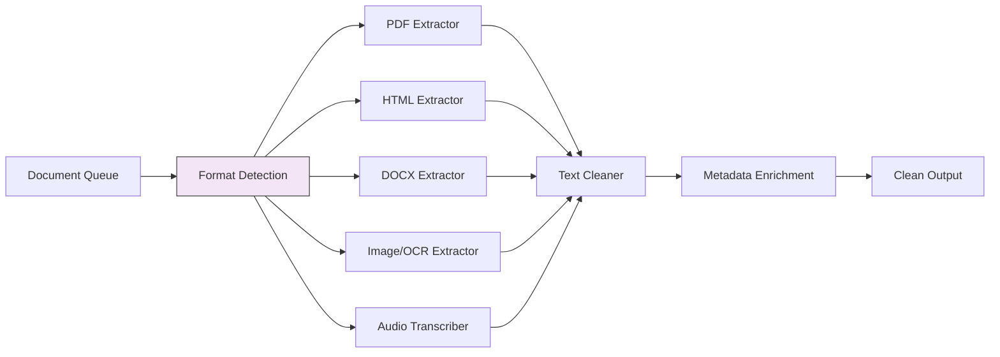

# Document Extraction Patterns

## Overview
Document extraction patterns define how raw files (PDFs, HTML, DOCX, images, audio) are processed to extract clean, structured text content that can be chunked and embedded. Extraction quality directly determines retrieval quality — garbage in, garbage out.

## Pipeline Stage
- [ ] Data Ingestion
- [x] Document Processing & Extraction
- [ ] Chunking & Splitting
- [ ] Embedding & Vectorization
- [ ] Vector Store & Indexing
- [ ] Index Maintenance & Freshness
- [ ] Pipeline Orchestration
- [ ] Evaluation & Quality Assurance

## Architecture

### Pipeline Architecture


### Components
- **Format Detector**: Identifies document type (MIME type, file extension, magic bytes)
- **Format-Specific Extractors**: Specialized parsers for each document type (PDF, HTML, DOCX, image, audio)
- **OCR Engine**: Optical character recognition for scanned documents and images
- **Text Cleaner**: Normalizes whitespace, removes artifacts, handles encoding issues
- **Metadata Enricher**: Extracts and attaches document-level metadata (title, author, dates, headings)
- **Layout Analyzer**: Preserves document structure (tables, headers, lists, sections)

### Data Flow
1. **Input**: Raw document bytes + metadata from ingestion stage
2. **Transformation**: Format detection → format-specific parsing → OCR (if needed) → text cleaning → metadata extraction → layout preservation
3. **Output**: Clean text content + structural metadata + document-level metadata ready for chunking

## When to Use

### Ideal Use Cases
- Knowledge bases with mixed document formats (PDF + HTML + DOCX)
- Scanned or image-based documents requiring OCR
- Complex documents with tables, charts, and mixed layouts
- Clinical documents (discharge summaries, lab reports, radiology reports)
- Multi-language document collections

### Data Characteristics
- PDFs with embedded text, scanned images, or mixed content
- HTML pages with navigation, ads, and boilerplate to strip
- Documents with tables, headers, footers, and page numbers to handle
- Medical documents with structured sections (SOAP notes, H&P, operative reports)

## When NOT to Use

### Anti-Patterns
- Already-clean plain text files — direct chunking is sufficient
- Structured data (CSV, JSON, database rows) — use schema-aware parsing instead
- Real-time chat or streaming text — no extraction needed

### Data Characteristics That Don't Fit
- Binary data (executables, compressed archives)
- Extremely large files (multi-GB) without streaming extraction support

## Configuration & Strategy

### Key Parameters
| Parameter | Default | Range | Impact |
|-----------|---------|-------|--------|
| ocr_enabled | true | true/false | Whether to OCR scanned pages |
| ocr_language | eng | ISO 639 codes | Language(s) for OCR engine |
| preserve_tables | true | true/false | Extract tables as structured data |
| preserve_layout | false | true/false | Maintain spatial layout information |
| max_pages | None | 1-10,000 | Limit pages processed per document |
| image_resolution_dpi | 300 | 72-600 | DPI for image extraction/OCR |

### Strategy Variations

#### Variation A: Text-First Extraction
- **Description**: Extract embedded text directly, fall back to OCR only when no text is found
- **Best For**: Digital-native PDFs, HTML, DOCX
- **Trade-off**: Fast and cheap, but misses scanned content

#### Variation B: OCR-First Extraction
- **Description**: OCR every page regardless of embedded text
- **Best For**: Scanned documents, faxed medical records, image-heavy documents
- **Trade-off**: Higher accuracy for scanned docs but slower and more expensive

#### Variation C: Layout-Preserving Extraction
- **Description**: Extract text while preserving spatial layout, tables, and document structure
- **Best For**: Complex documents with tables (lab results, financial reports, clinical summaries)
- **Trade-off**: Most accurate representation but most complex and resource-intensive

## Implementation Examples

### Python Implementation
```python
from unstructured.partition.auto import partition
from unstructured.documents.elements import Table, Title, NarrativeText

# Auto-detect format and extract
elements = partition(
    filename="clinical-summary.pdf",
    strategy="hi_res",  # Use layout analysis
    languages=["eng"],
    extract_image_block_types=["Image", "Table"],
)

# Separate by element type
text_content = []
tables = []
for element in elements:
    if isinstance(element, Table):
        tables.append(element.metadata.text_as_html)
    elif isinstance(element, (Title, NarrativeText)):
        text_content.append(str(element))

clean_text = "\n\n".join(text_content)
```

### LangChain Implementation
```python
from langchain_community.document_loaders import (
    PyPDFLoader,
    UnstructuredHTMLLoader,
    Docx2txtLoader,
    UnstructuredFileLoader,
)

# PDF extraction
pdf_loader = PyPDFLoader("patient-record.pdf")
pdf_docs = pdf_loader.load()

# HTML extraction
html_loader = UnstructuredHTMLLoader("clinical-guideline.html")
html_docs = html_loader.load()

# Universal extraction (auto-detect format)
universal_loader = UnstructuredFileLoader(
    "document.pdf",
    mode="elements",  # Preserve document structure
    strategy="fast",  # or "hi_res" for layout analysis
)
docs = universal_loader.load()
```

### Cloud-Native Implementation
```python
# Google Document AI for high-quality extraction
from google.cloud import documentai_v1

def extract_with_document_ai(file_path: str, processor_id: str):
    client = documentai_v1.DocumentProcessorServiceClient()

    with open(file_path, "rb") as f:
        content = f.read()

    request = documentai_v1.ProcessRequest(
        name=f"projects/{project}/locations/us/processors/{processor_id}",
        raw_document=documentai_v1.RawDocument(
            content=content,
            mime_type="application/pdf",
        ),
    )

    result = client.process_document(request=request)
    document = result.document

    return {
        "text": document.text,
        "pages": len(document.pages),
        "tables": [table for page in document.pages for table in page.tables],
        "entities": document.entities,
    }
```

## Supported Data Sources & Connectors

| Format | Extractor | Notes |
|--------|-----------|-------|
| PDF (digital) | PyPDF2, pdfplumber, Unstructured | Embedded text extraction |
| PDF (scanned) | Tesseract, Document AI, Textract | OCR required |
| HTML | BeautifulSoup, Unstructured | Boilerplate removal needed |
| DOCX | python-docx, docx2txt | Preserves formatting |
| Images (PNG/JPG) | Tesseract, Vision APIs | OCR + image description |
| Audio (MP3/WAV) | Whisper, Speech-to-Text | Transcription |
| FHIR JSON | fhirclient | Structured clinical data |
| HL7v2 | hl7apy | Clinical message parsing |
| DICOM | pydicom | Medical imaging metadata |

## Performance Characteristics

### Pipeline Throughput
- Text PDFs: 50-200 pages/sec
- OCR PDFs: 1-5 pages/sec (GPU-accelerated: 10-50 pages/sec)
- HTML: 100-500 pages/sec
- Audio transcription: 0.1-0.5x real-time (CPU), 5-10x real-time (GPU)

### Resource Requirements
- Memory: 2-8GB (OCR and layout analysis are memory-intensive)
- CPU: 2-8 cores (OCR benefits from multi-core)
- GPU: Optional but 10x speedup for OCR and layout analysis
- Storage: 2-5x document size for intermediate processing

### Cost Per Document
| Component | Cost | Notes |
|-----------|------|-------|
| Text extraction (digital PDF) | ~$0.0001 per doc | CPU only |
| OCR extraction (scanned PDF) | ~$0.01-0.05 per page | GPU or cloud API |
| Document AI (Google) | $0.01-0.065 per page | Managed service |
| Textract (AWS) | $0.0015 per page | Text detection |
| **Total pipeline cost** | **$0.001-$0.10 per doc** | Varies by type and pages |

## Quality & Evaluation

### Metrics to Track
| Metric | Description | Target |
|--------|-------------|--------|
| Extraction accuracy | Character-level accuracy vs. ground truth | > 95% (digital), > 90% (scanned) |
| Table extraction accuracy | Tables correctly parsed | > 85% |
| Processing success rate | Documents successfully extracted | > 99% |
| Metadata completeness | Documents with complete metadata | > 90% |

## Trade-offs

### Advantages
- Handles diverse document formats in a unified pipeline
- Layout-preserving extraction maintains document structure for better chunking
- OCR enables processing of scanned and image-based documents

### Disadvantages
- OCR is slow and expensive compared to text extraction
- Complex layouts (multi-column, nested tables) are hard to parse accurately
- Quality varies significantly across document types and formats

## Healthcare Considerations

### HIPAA Compliance
- Process PHI-containing documents in HIPAA-compliant environments
- Cloud extraction APIs (Document AI, Textract) must be covered under BAAs
- Log document access for audit trails

### Clinical Data Specifics
- FHIR resource extraction with resource type filtering (Patient, Encounter, Observation)
- HL7v2 message segment parsing (PID, OBX, OBR)
- CDA section extraction (Assessment, Plan, History of Present Illness)
- De-identification integration: run NER-based PHI detection post-extraction
- Medical abbreviation expansion during text cleaning

## Related Patterns
- [Source Connector Patterns](./source-connector-patterns.md) — Previous stage: ingesting documents from sources
- [Chunking Strategies](./chunking-strategies.md) — Next stage: splitting extracted text into chunks
- [Multi-Modal RAG](../rag/multi-modal-rag.md) — Architecture pattern for handling images, audio, video

## References
- [Unstructured.io Documentation](https://docs.unstructured.io/)
- [Google Document AI](https://cloud.google.com/document-ai)
- [AWS Textract](https://aws.amazon.com/textract/)
- [Tesseract OCR](https://github.com/tesseract-ocr/tesseract)

## Version History
- **v1.0** (2026-02-05): Initial version
