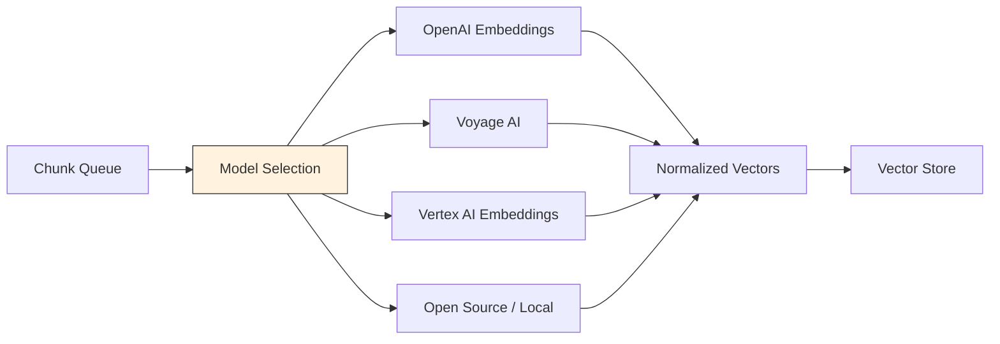

# Embedding Model Selection

## Overview
Embedding model selection determines how text chunks are converted into vector representations that capture semantic meaning. The embedding model is the **bridge between human-readable text and machine-searchable vectors** — the right model ensures that semantically similar content is close in vector space, enabling accurate retrieval.

## Pipeline Stage
- [ ] Data Ingestion
- [ ] Document Processing & Extraction
- [ ] Chunking & Splitting
- [x] Embedding & Vectorization
- [ ] Vector Store & Indexing
- [ ] Index Maintenance & Freshness
- [ ] Pipeline Orchestration
- [ ] Evaluation & Quality Assurance

## Architecture

### Pipeline Architecture


### Components
- **Model Selector**: Chooses the appropriate embedding model based on data type, requirements, and budget
- **Embedding Engine**: Runs inference to generate vector representations
- **Batch Processor**: Groups chunks for efficient batch embedding
- **Normalization Layer**: Normalizes vectors for consistent similarity computation
- **Dimension Reducer**: Optional PCA/UMAP reduction for storage optimization

### Data Flow
1. **Input**: Text chunks + metadata from chunking stage
2. **Transformation**: Batching → tokenization → model inference → vector normalization → optional dimension reduction
3. **Output**: Fixed-dimension vector embeddings + chunk metadata ready for indexing

## When to Use
Every RAG pipeline needs an embedding model. This pattern helps you **choose the right one** based on your requirements.

### Decision Factors
- **Accuracy vs. cost**: Higher-quality models cost more per embedding
- **Latency vs. throughput**: Larger models are slower but more accurate
- **Domain specificity**: General-purpose vs. domain-fine-tuned models
- **Deployment model**: Cloud API vs. self-hosted vs. local
- **Dimension size**: Higher dimensions = more accurate but more storage/compute

## Configuration & Strategy

### Key Parameters
| Parameter | Default | Range | Impact |
|-----------|---------|-------|--------|
| model_name | text-embedding-3-small | varies by provider | Quality, cost, and speed |
| dimensions | model default | 256-3072 | Higher = more accurate, more storage |
| batch_size | 100 | 1-2048 | Throughput vs. memory trade-off |
| normalize | true | true/false | Required for cosine similarity |
| truncation | true | true/false | Handle chunks exceeding max tokens |

### Model Comparison

#### Cloud API Models

| Model | Provider | Dimensions | Max Tokens | Cost (per 1M tokens) | MTEB Score | Notes |
|-------|----------|------------|------------|----------------------|------------|-------|
| text-embedding-3-large | OpenAI | 3072 | 8,191 | $0.13 | ~64.6 | Best OpenAI quality |
| text-embedding-3-small | OpenAI | 1536 | 8,191 | $0.02 | ~62.3 | Best value |
| voyage-3 | Voyage AI | 1024 | 32,000 | $0.06 | ~67.5 | Long context, high quality |
| voyage-3-lite | Voyage AI | 512 | 32,000 | $0.02 | ~62.0 | Cost-effective |
| text-embedding-005 | Google Vertex AI | 768 | 2,048 | $0.025 | ~66.0 | Native GCP integration |
| embed-v4.0 | Cohere | 1024 | 512 | $0.10 | ~66.0 | Search-optimized |
| amazon.titan-embed-text-v2 | AWS Bedrock | 1024 | 8,192 | $0.02 | ~62.0 | Native AWS integration |

#### Open Source / Self-Hosted Models

| Model | Dimensions | Max Tokens | MTEB Score | Notes |
|-------|-----------|------------|------------|-------|
| all-MiniLM-L6-v2 | 384 | 512 | ~49.5 | Fast, lightweight, good baseline |
| all-mpnet-base-v2 | 768 | 512 | ~57.8 | Higher quality, moderate speed |
| bge-large-en-v1.5 | 1024 | 512 | ~63.5 | SOTA open source |
| e5-large-v2 | 1024 | 512 | ~62.0 | Good general purpose |
| nomic-embed-text-v1.5 | 768 | 8,192 | ~62.0 | Long context, open source |
| mxbai-embed-large-v1 | 1024 | 512 | ~64.7 | Competitive with commercial |

### Strategy Variations

#### Variation A: Single Cloud API Model
- **Description**: Use one managed embedding API for all content
- **Best For**: Getting started quickly, moderate scale, consistent quality
- **Trade-off**: Simplest to manage but vendor lock-in and API cost at scale

#### Variation B: Self-Hosted Open Source
- **Description**: Deploy open-source models on your infrastructure
- **Best For**: Cost optimization at scale, data privacy requirements, air-gapped environments
- **Trade-off**: Lower cost at scale but requires GPU infrastructure and model management

#### Variation C: Domain Fine-Tuned Model
- **Description**: Fine-tune an embedding model on your specific domain data
- **Best For**: Specialized domains (medical, legal, financial) where general models underperform
- **Trade-off**: Highest domain accuracy but requires training data, compute, and expertise

#### Variation D: Multi-Model Strategy
- **Description**: Different models for different content types (documents vs. queries, text vs. code)
- **Best For**: Heterogeneous content collections
- **Trade-off**: Best accuracy per content type but adds complexity to the pipeline

## Implementation Examples

### Python Implementation
```python
# OpenAI embeddings
from openai import OpenAI

client = OpenAI()

def embed_chunks(chunks: list[str], model: str = "text-embedding-3-small") -> list[list[float]]:
    response = client.embeddings.create(
        input=chunks,
        model=model,
    )
    return [item.embedding for item in response.data]
```

### LangChain Implementation
```python
from langchain_openai import OpenAIEmbeddings
from langchain_google_vertexai import VertexAIEmbeddings
from langchain_community.embeddings import HuggingFaceEmbeddings

# OpenAI
openai_embeddings = OpenAIEmbeddings(model="text-embedding-3-small")

# Vertex AI
vertex_embeddings = VertexAIEmbeddings(model_name="text-embedding-005")

# Local / self-hosted
local_embeddings = HuggingFaceEmbeddings(
    model_name="BAAI/bge-large-en-v1.5",
    model_kwargs={"device": "cuda"},
    encode_kwargs={"normalize_embeddings": True},
)

# Generate embeddings
vectors = openai_embeddings.embed_documents(chunks)
query_vector = openai_embeddings.embed_query("search query")
```

### Spring AI Implementation
```java
import org.springframework.ai.embedding.EmbeddingModel;
import org.springframework.ai.openai.OpenAiEmbeddingModel;

@Autowired
private EmbeddingModel embeddingModel;

List<Double> vector = embeddingModel.embed("text chunk");
```

## Performance Characteristics

### Pipeline Throughput
- Cloud APIs: 100-1,000 chunks/sec (rate-limit dependent)
- Self-hosted GPU: 500-5,000 chunks/sec (model and GPU dependent)
- Self-hosted CPU: 10-100 chunks/sec

### Resource Requirements
- Cloud API: No local resources needed (network latency)
- Self-hosted GPU: 4-16GB VRAM per model instance
- Self-hosted CPU: 2-8GB RAM, significantly slower

### Cost Per Document
| Model | Cost per 1K chunks (~500 tokens each) | Notes |
|-------|---------------------------------------|-------|
| text-embedding-3-small (OpenAI) | $0.01 | Best value cloud |
| text-embedding-3-large (OpenAI) | $0.065 | Best quality cloud |
| voyage-3 (Voyage AI) | $0.03 | Long context |
| Self-hosted (GPU) | ~$0.001-0.005 | Amortized GPU cost |
| Self-hosted (CPU) | ~$0.0005-0.002 | Slow but cheapest |

## Quality & Evaluation

### Metrics to Track
| Metric | Description | Target |
|--------|-------------|--------|
| MTEB benchmark score | Standardized embedding quality | > 60 (general), > 65 (high quality) |
| Retrieval Recall@10 | Correct docs in top 10 results | > 85% |
| Embedding latency | Time to embed a single chunk | < 50ms (API), < 10ms (local GPU) |
| Cost per query | Total embedding cost per search | < $0.001 |

### Evaluation Approach
- Run MTEB benchmarks on your target task (retrieval, classification, clustering)
- Measure Recall@k on a golden test set with known relevant documents
- A/B test models on live traffic with evaluation metrics

## Trade-offs

### Advantages
- Cloud APIs are easy to integrate and scale
- Open-source models offer cost savings and data privacy
- Fine-tuned models deliver best domain-specific accuracy

### Disadvantages
- Cloud API costs scale linearly with volume
- Self-hosted models require GPU infrastructure
- Fine-tuning requires labeled training data
- Changing embedding models requires full re-indexing

## Healthcare Considerations

### HIPAA Compliance
- Cloud embedding APIs process PHI — ensure BAA coverage
- Self-hosted models keep PHI on-premises (preferred for sensitive data)
- Ollama + local models for air-gapped environments

### Clinical Data Specifics
- Medical embedding models (PubMedBERT, BioGPT) may outperform general models on clinical text
- Consider models trained on medical literature for clinical decision support
- Test embedding quality on medical terminology (ICD codes, drug names, procedure names)

## Related Patterns
- [Chunking Strategies](./chunking-strategies.md) — Previous stage: how chunks are sized affects embedding quality
- [Vectorization Strategies](./vectorization-strategies.md) — Batch vs. real-time embedding approaches
- [Vector Database Selection](./vector-database-selection.md) — Next stage: storing embeddings
- [Hybrid RAG](../rag/hybrid-rag.md) — May use multiple embedding models for different retrieval strategies

## References
- [MTEB Leaderboard](https://huggingface.co/spaces/mteb/leaderboard)
- [OpenAI Embeddings Guide](https://platform.openai.com/docs/guides/embeddings)
- [Voyage AI Documentation](https://docs.voyageai.com/)
- [Sentence Transformers](https://www.sbert.net/)

## Version History
- **v1.0** (2026-02-05): Initial version
