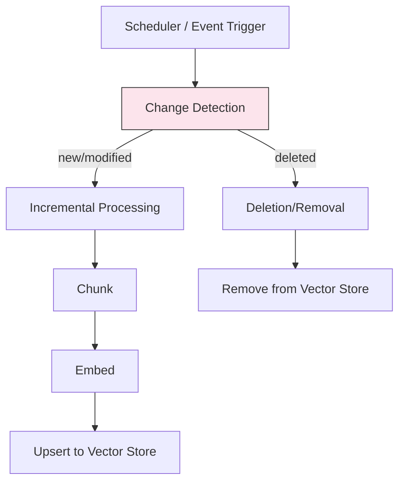

# Index Freshness Patterns

## Overview
Index freshness patterns ensure that vector search indexes stay current with the latest source data. Stale indexes are the **leading cause of hallucinations in production RAG systems** — when the index doesn't reflect the latest information, the LLM generates answers based on outdated or missing data, leading to incorrect or irrelevant responses.

## Pipeline Stage
- [ ] Data Ingestion
- [ ] Document Processing & Extraction
- [ ] Chunking & Splitting
- [ ] Embedding & Vectorization
- [ ] Vector Store & Indexing
- [x] Index Maintenance & Freshness
- [ ] Pipeline Orchestration
- [ ] Evaluation & Quality Assurance

## Architecture

### Pipeline Architecture


### Components
- **Change Detector**: Identifies new, modified, and deleted documents since last sync
- **Incremental Processor**: Processes only changed documents through the full pipeline
- **Index Updater**: Upserts new/modified vectors, removes deleted vectors
- **Staleness Monitor**: Tracks index age and alerts when freshness thresholds are breached
- **Full Rebuild Trigger**: Initiates complete re-indexing when incremental sync is insufficient

### Strategy Variations

#### Variation A: Scheduled Full Rebuild
- **Description**: Periodically re-index the entire corpus from scratch
- **Best For**: Small-to-medium corpora (< 100K docs), weekly update cycles
- **Trade-off**: Simplest to implement but wasteful for large corpora

#### Variation B: Incremental Sync (Delta Processing)
- **Description**: Detect changes since last sync, process only new/modified/deleted documents
- **Best For**: Large corpora with frequent updates
- **Trade-off**: Efficient but requires reliable change detection

#### Variation C: Event-Driven Updates
- **Description**: React to source change events (S3 notifications, webhooks, CDC) in near real-time
- **Best For**: Real-time freshness requirements (clinical alerts, live dashboards)
- **Trade-off**: Lowest staleness but highest operational complexity

#### Variation D: Hybrid (Scheduled + Event-Driven)
- **Description**: Event-driven for high-priority sources, scheduled for the rest. Periodic full rebuild as safety net.
- **Best For**: Production systems with mixed freshness requirements
- **Trade-off**: Best balance but most complex to configure

## Change Detection Methods

| Method | Latency | Reliability | Complexity | Best For |
|--------|---------|-------------|------------|----------|
| File timestamp polling | Minutes-hours | Medium | Low | File systems, S3 |
| Content hashing (SHA-256) | Minutes-hours | High | Low | Any source |
| S3 Event Notifications | Seconds | High | Medium | AWS S3 |
| GCS Pub/Sub Notifications | Seconds | High | Medium | Google Cloud Storage |
| Database CDC (logical replication) | Seconds | High | High | PostgreSQL, MySQL |
| Webhook callbacks | Seconds | Medium | Medium | SaaS platforms |
| API pagination cursors | Minutes | Medium | Medium | REST APIs |

## Implementation Examples

### Incremental Sync with Content Hashing
```python
import hashlib
from datetime import datetime

class IncrementalSyncer:
    def __init__(self, vector_store, metadata_store):
        self.vector_store = vector_store
        self.metadata_store = metadata_store  # Tracks doc hashes

    def detect_changes(self, current_docs: list[dict]) -> dict:
        added, modified, deleted = [], [], []
        current_ids = set()

        for doc in current_docs:
            doc_id = doc["id"]
            content_hash = hashlib.sha256(doc["content"].encode()).hexdigest()
            current_ids.add(doc_id)

            stored_hash = self.metadata_store.get_hash(doc_id)
            if stored_hash is None:
                added.append(doc)
            elif stored_hash != content_hash:
                modified.append(doc)

        known_ids = set(self.metadata_store.get_all_ids())
        deleted = list(known_ids - current_ids)

        return {"added": added, "modified": modified, "deleted": deleted}

    def sync(self, changes: dict):
        # Process additions and modifications
        for doc in changes["added"] + changes["modified"]:
            chunks = chunk_document(doc)
            embeddings = embed_chunks(chunks)
            self.vector_store.upsert(doc["id"], embeddings, chunks)
            self.metadata_store.update_hash(doc["id"], hash_content(doc))

        # Process deletions
        for doc_id in changes["deleted"]:
            self.vector_store.delete(doc_id)
            self.metadata_store.remove(doc_id)
```

### Staleness Monitoring
```python
from datetime import datetime, timedelta

class StalenessMonitor:
    def __init__(self, max_staleness_hours: int = 24):
        self.max_staleness = timedelta(hours=max_staleness_hours)

    def check_freshness(self, last_sync_time: datetime) -> dict:
        age = datetime.utcnow() - last_sync_time
        is_stale = age > self.max_staleness
        return {
            "last_sync": last_sync_time.isoformat(),
            "age_hours": age.total_seconds() / 3600,
            "is_stale": is_stale,
            "action": "ALERT: Index stale, trigger rebuild" if is_stale else "OK",
        }
```

## Performance Characteristics

### Update Throughput
- Incremental sync: 100-1,000 docs/min (processing pipeline dependent)
- Full rebuild: Hours for 1M+ docs (parallelizable)
- Event-driven: Seconds per document

### Cost Impact
- Incremental sync reduces embedding costs by 80-95% vs. full rebuild
- Staleness monitoring has negligible cost
- Event-driven infrastructure (Pub/Sub, EventBridge) adds $10-50/month

## Quality & Evaluation

### Metrics to Track
| Metric | Description | Target |
|--------|-------------|--------|
| Index age | Time since last successful sync | < 24h (batch), < 5min (event) |
| Change detection accuracy | Changes correctly identified | > 99% |
| Sync success rate | Successful syncs / total attempted | > 99.5% |
| Orphaned vectors | Vectors with no source document | 0 |
| Hallucination rate (stale) | Wrong answers due to outdated data | < 1% |

## Healthcare Considerations

### HIPAA Compliance
- Deletion sync is critical — when source PHI is deleted, corresponding vectors must be removed
- Audit trail for all index updates (what changed, when, by which pipeline run)

### Clinical Data Specifics
- Clinical guidelines may change — stale indexes can provide dangerous outdated medical advice
- Lab results and vitals require near real-time freshness for clinical decision support
- Patient record updates (new encounters, medications) should trigger priority re-indexing

## Related Patterns
- [Source Connector Patterns](./source-connector-patterns.md) — Change detection starts at the source
- [Pipeline Orchestration Patterns](./pipeline-orchestration-patterns.md) — Scheduling and automating freshness
- [Streaming RAG](../rag/streaming-rag.md) — RAG pattern requiring real-time index freshness
- [Corrective RAG](../rag/corrective-rag.md) — RAG pattern that detects and corrects stale retrieval

## References
- [Change Data Capture Patterns](https://www.confluent.io/learn/change-data-capture/)
- [AWS S3 Event Notifications](https://docs.aws.amazon.com/AmazonS3/latest/userguide/EventNotifications.html)
- [GCS Pub/Sub Notifications](https://cloud.google.com/storage/docs/pubsub-notifications)

## Version History
- **v1.0** (2026-02-05): Initial version
