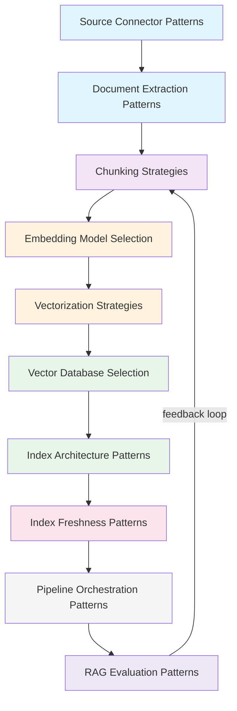

# RAG Pipeline Pattern Index

Complete index of all RAG pipeline engineering patterns documented in this reference architecture.

## Data Ingestion & Extraction

| Pattern | Description | Complexity | Pipeline Stage | Key Technologies |
|---------|-------------|------------|----------------|------------------|
| [Source Connector Patterns](./source-connector-patterns.md) | Connect to S3, GCS, databases, SaaS, file systems | Low-Medium | Ingestion | Unstructured.io, LangChain Loaders, Apache Airflow |
| [Document Extraction Patterns](./document-extraction-patterns.md) | Extract text from PDFs, HTML, DOCX, images, audio | Medium | Extraction | Unstructured, Tika, Tesseract, Document AI, Textract |

## Chunking & Splitting

| Pattern | Description | Complexity | Pipeline Stage | Key Technologies |
|---------|-------------|------------|----------------|------------------|
| [Chunking Strategies](./chunking-strategies.md) | Fixed-size, semantic, sentence, paragraph, recursive, structure-aware | Medium | Chunking | LangChain Splitters, NLTK, spaCy, Unstructured |

## Embedding & Vectorization

| Pattern | Description | Complexity | Pipeline Stage | Key Technologies |
|---------|-------------|------------|----------------|------------------|
| [Embedding Model Selection](./embedding-model-selection.md) | Choose and configure embedding models for your data type | Medium | Embedding | OpenAI, Voyage AI, Cohere, Vertex AI, Sentence Transformers |
| [Vectorization Strategies](./vectorization-strategies.md) | Batch vs. real-time, multi-modal, fine-tuned embeddings | Medium-High | Embedding | Batch APIs, GPU inference, ONNX, TensorRT |

## Vector Store & Indexing

| Pattern | Description | Complexity | Pipeline Stage | Key Technologies |
|---------|-------------|------------|----------------|------------------|
| [Vector Database Selection](./vector-database-selection.md) | Choose the right vector DB for your requirements | Medium | Indexing | Pinecone, Weaviate, ChromaDB, Qdrant, Milvus, pgvector, Astra, Elastic |
| [Index Architecture Patterns](./index-architecture-patterns.md) | HNSW, IVF, flat, hybrid (vector + keyword) index design | High | Indexing | FAISS, ScaNN, HNSW, Lucene |

## Index Maintenance & Freshness

| Pattern | Description | Complexity | Pipeline Stage | Key Technologies |
|---------|-------------|------------|----------------|------------------|
| [Index Freshness Patterns](./index-freshness-patterns.md) | Incremental ingestion, scheduled rebuilds, change detection | Medium-High | Maintenance | CDC, cron, event triggers, checksums |

## Pipeline Orchestration & Automation

| Pattern | Description | Complexity | Pipeline Stage | Key Technologies |
|---------|-------------|------------|----------------|------------------|
| [Pipeline Orchestration Patterns](./pipeline-orchestration-patterns.md) | End-to-end workflows, scheduling, error handling, CI/CD | High | Orchestration | Airflow, Prefect, Dagster, Step Functions, Cloud Workflows |

## Evaluation & Quality Assurance

| Pattern | Description | Complexity | Pipeline Stage | Key Technologies |
|---------|-------------|------------|----------------|------------------|
| [RAG Evaluation Patterns](./rag-evaluation-patterns.md) | RAGAS, retrieval metrics, generation quality, A/B testing | High | Evaluation | RAGAS, DeepEval, LangSmith, Vertex AI Evaluation |

---

## Quick Selection Guide

### Start Here
- **New to RAG pipelines?** → [Source Connector Patterns](./source-connector-patterns.md) + [Chunking Strategies](./chunking-strategies.md)
- **Poor retrieval quality?** → [Chunking Strategies](./chunking-strategies.md) + [Embedding Model Selection](./embedding-model-selection.md)
- **Choosing a vector DB?** → [Vector Database Selection](./vector-database-selection.md)
- **Stale or outdated results?** → [Index Freshness Patterns](./index-freshness-patterns.md)
- **Want to automate everything?** → [Pipeline Orchestration Patterns](./pipeline-orchestration-patterns.md)
- **Need to measure quality?** → [RAG Evaluation Patterns](./rag-evaluation-patterns.md)

### By Requirement

| Requirement | Recommended Patterns |
|-------------|---------------------|
| **High retrieval accuracy** | [Chunking Strategies](./chunking-strategies.md), [Embedding Model Selection](./embedding-model-selection.md), [Index Architecture Patterns](./index-architecture-patterns.md) |
| **Low latency** | [Vectorization Strategies](./vectorization-strategies.md), [Index Architecture Patterns](./index-architecture-patterns.md) |
| **Fresh/current data** | [Index Freshness Patterns](./index-freshness-patterns.md), [Pipeline Orchestration Patterns](./pipeline-orchestration-patterns.md) |
| **Cost optimization** | [Embedding Model Selection](./embedding-model-selection.md), [Vectorization Strategies](./vectorization-strategies.md) |
| **Multi-source data** | [Source Connector Patterns](./source-connector-patterns.md), [Document Extraction Patterns](./document-extraction-patterns.md) |
| **Healthcare/clinical** | [Document Extraction Patterns](./document-extraction-patterns.md), [Chunking Strategies](./chunking-strategies.md) |
| **Production reliability** | [Pipeline Orchestration Patterns](./pipeline-orchestration-patterns.md), [RAG Evaluation Patterns](./rag-evaluation-patterns.md) |

### By Scale

| Scale | Recommended Approach |
|-------|---------------------|
| **Prototype** (< 1K docs) | ChromaDB + fixed-size chunking + OpenAI embeddings |
| **Small** (1K-100K docs) | Managed vector DB + semantic chunking + batch embedding |
| **Medium** (100K-1M docs) | Distributed vector DB + pipeline orchestration + incremental updates |
| **Large** (1M+ docs) | Sharded vector DB + streaming ingestion + real-time evaluation |

---

## Pipeline Pattern Relationships

---

## How Pipeline Patterns Connect to RAG Architecture Patterns

| Pipeline Pattern | Pairs Well With (from `patterns/rag/`) |
|-----------------|---------------------------------------|
| [Chunking Strategies](./chunking-strategies.md) | [Parent-Child RAG](../rag/parent-child-rag.md), [Small-to-Big RAG](../rag/small-to-big-rag.md) |
| [Embedding Model Selection](./embedding-model-selection.md) | [Hybrid RAG](../rag/hybrid-rag.md), [Multi-Modal RAG](../rag/multi-modal-rag.md) |
| [Vector Database Selection](./vector-database-selection.md) | [Graph RAG](../rag/graph-rag.md), [Basic RAG](../rag/basic-rag.md) |
| [Index Freshness Patterns](./index-freshness-patterns.md) | [Streaming RAG](../rag/streaming-rag.md), [Corrective RAG](../rag/corrective-rag.md) |
| [Pipeline Orchestration Patterns](./pipeline-orchestration-patterns.md) | [Agentic RAG](../rag/agentic-rag.md), [Adaptive RAG](../rag/adaptive-rag.md) |
| [RAG Evaluation Patterns](./rag-evaluation-patterns.md) | [Self-RAG](../rag/self-rag.md), [Reranking RAG](../rag/reranking-rag.md) |

---

## Contributing

When adding new pipeline patterns:
1. Use the [RAG pipeline template](../../templates/rag-pipeline-template.md)
2. Add to this index table under the appropriate section
3. Update the [README](./README.md)
4. Include pipeline stage indicators
5. Provide cost-per-document estimates
6. Include healthcare-specific considerations
