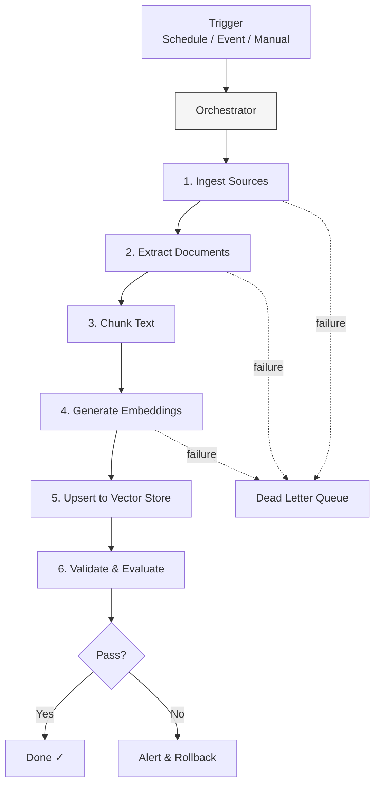

# Pipeline Orchestration Patterns

## Overview
Pipeline orchestration patterns define how the end-to-end RAG pipeline is automated, scheduled, monitored, and maintained. Orchestration ties together all pipeline stages — ingestion, extraction, chunking, embedding, indexing, and freshness management — into a reliable, observable, and repeatable workflow.

## Pipeline Stage
- [ ] Data Ingestion
- [ ] Document Processing & Extraction
- [ ] Chunking & Splitting
- [ ] Embedding & Vectorization
- [ ] Vector Store & Indexing
- [ ] Index Maintenance & Freshness
- [x] Pipeline Orchestration
- [ ] Evaluation & Quality Assurance

## Architecture

### Pipeline Architecture


### Strategy Variations

#### Variation A: Scheduled Batch Pipeline
- **Description**: Cron-triggered full or incremental pipeline runs
- **Best For**: Knowledge bases with daily/weekly update cycles
- **Tools**: Apache Airflow, Prefect, Dagster, Cloud Scheduler + Cloud Functions

#### Variation B: Event-Driven Pipeline
- **Description**: Source change events trigger pipeline execution per document
- **Best For**: Near real-time freshness, streaming data
- **Tools**: AWS Step Functions + EventBridge, GCP Workflows + Pub/Sub, Azure Logic Apps

#### Variation C: Hybrid Orchestration
- **Description**: Event-driven for priority sources, scheduled for bulk, manual for ad-hoc
- **Best For**: Production systems with mixed requirements
- **Tools**: Airflow (scheduled) + Step Functions (event-driven)

#### Variation D: CI/CD for RAG Pipelines
- **Description**: Treat pipeline configuration as code — version, test, and deploy pipeline changes like software
- **Best For**: Teams iterating on chunking strategies, embedding models, or pipeline stages
- **Tools**: GitHub Actions, GitLab CI, Terraform, Pulumi

## Implementation Examples

### Apache Airflow DAG
```python
from airflow import DAG
from airflow.operators.python import PythonOperator
from datetime import datetime, timedelta

default_args = {
    "retries": 3,
    "retry_delay": timedelta(minutes=5),
}

with DAG(
    "rag_pipeline",
    default_args=default_args,
    schedule_interval="0 2 * * *",  # Daily at 2 AM
    start_date=datetime(2026, 2, 5),
    catchup=False,
) as dag:

    ingest = PythonOperator(task_id="ingest_sources", python_callable=ingest_from_sources)
    extract = PythonOperator(task_id="extract_documents", python_callable=extract_documents)
    chunk = PythonOperator(task_id="chunk_text", python_callable=chunk_documents)
    embed = PythonOperator(task_id="generate_embeddings", python_callable=generate_embeddings)
    index = PythonOperator(task_id="upsert_vectors", python_callable=upsert_to_vector_store)
    evaluate = PythonOperator(task_id="evaluate_quality", python_callable=run_evaluation)

    ingest >> extract >> chunk >> embed >> index >> evaluate
```

### AWS Step Functions
```json
{
  "StartAt": "IngestSources",
  "States": {
    "IngestSources": {
      "Type": "Task",
      "Resource": "arn:aws:lambda:us-east-1:123456:function:ingest",
      "Next": "ExtractDocuments",
      "Retry": [{"ErrorEquals": ["States.ALL"], "MaxAttempts": 3}],
      "Catch": [{"ErrorEquals": ["States.ALL"], "Next": "HandleFailure"}]
    },
    "ExtractDocuments": {
      "Type": "Task",
      "Resource": "arn:aws:lambda:us-east-1:123456:function:extract",
      "Next": "ChunkAndEmbed"
    },
    "ChunkAndEmbed": {
      "Type": "Parallel",
      "Branches": [
        {"StartAt": "ChunkText", "States": {"ChunkText": {"Type": "Task", "Resource": "...", "End": true}}}
      ],
      "Next": "UpsertVectors"
    },
    "UpsertVectors": {"Type": "Task", "Resource": "...", "Next": "Evaluate"},
    "Evaluate": {"Type": "Task", "Resource": "...", "End": true},
    "HandleFailure": {"Type": "Task", "Resource": "...", "End": true}
  }
}
```

## Observability

### Pipeline Health Dashboard
| Metric | Description | Alert Threshold |
|--------|-------------|-----------------|
| Pipeline success rate | Successful runs / total runs | < 95% |
| End-to-end latency | Time from trigger to completion | > 2x baseline |
| Documents processed | Count per run | Unexpected drop > 20% |
| Error rate by stage | Failures per pipeline stage | > 5% at any stage |
| Dead letter queue depth | Failed documents pending retry | > 100 |

## Healthcare Considerations

### HIPAA Compliance
- Pipeline logs must not contain PHI — use document IDs, not content
- Audit trail for every pipeline run (what was processed, when, outcome)
- Access control for pipeline trigger and configuration

### Clinical Data Specifics
- Priority processing for clinical alerts and critical lab results
- Separate pipelines for different data sensitivity levels
- Rollback capability when pipeline introduces data quality issues

## Related Patterns
- [Source Connector Patterns](./source-connector-patterns.md) — First stage in the orchestrated pipeline
- [Index Freshness Patterns](./index-freshness-patterns.md) — Scheduling freshness updates
- [RAG Evaluation Patterns](./rag-evaluation-patterns.md) — Quality gate at pipeline end
- [Agentic RAG](../rag/agentic-rag.md) — Agent-based systems that depend on reliable pipelines

## References
- [Apache Airflow](https://airflow.apache.org/)
- [Prefect](https://www.prefect.io/)
- [Dagster](https://dagster.io/)
- [AWS Step Functions](https://aws.amazon.com/step-functions/)

## Version History
- **v1.0** (2026-02-05): Initial version
