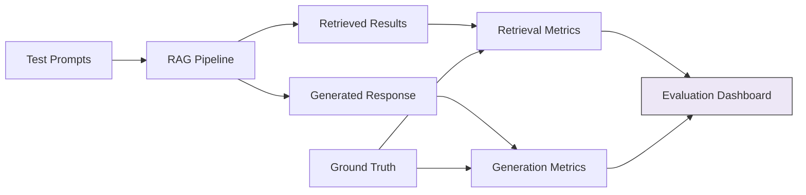

# RAG Evaluation Patterns

## Overview
RAG evaluation patterns define how to measure, benchmark, and continuously improve the quality of your RAG pipeline. Evaluation is the **feedback loop** that tells you whether your chunking strategy, embedding model, vector index, and retrieval pattern are actually working — without systematic evaluation, you're flying blind.

## Pipeline Stage
- [ ] Data Ingestion
- [ ] Document Processing & Extraction
- [ ] Chunking & Splitting
- [ ] Embedding & Vectorization
- [ ] Vector Store & Indexing
- [ ] Index Maintenance & Freshness
- [ ] Pipeline Orchestration
- [x] Evaluation & Quality Assurance

## Architecture

### Pipeline Architecture


### Evaluation Dimensions

| Dimension | What It Measures | Key Metrics |
|-----------|-----------------|-------------|
| **Retrieval Quality** | Are the right documents being retrieved? | Recall@k, MRR, NDCG, Hit Rate |
| **Generation Quality** | Is the LLM response accurate and relevant? | Faithfulness, Answer Relevance, Correctness |
| **Context Quality** | Is the retrieved context useful for generation? | Context Precision, Context Recall, Context Relevance |
| **Pipeline Health** | Is the pipeline operating correctly? | Latency, Error Rate, Throughput |
| **End-to-End Quality** | Does the system answer correctly? | Answer Correctness, Hallucination Rate |

## Retrieval Metrics

### Recall@k
- **Definition**: Proportion of relevant documents found in the top-k results
- **Formula**: `|relevant ∩ retrieved_top_k| / |relevant|`
- **Target**: > 85% at k=10

### Mean Reciprocal Rank (MRR)
- **Definition**: Average of 1/rank of the first relevant result
- **Target**: > 0.7

### Normalized Discounted Cumulative Gain (NDCG)
- **Definition**: Measures ranking quality, rewarding relevant results at higher positions
- **Target**: > 0.8

### Hit Rate
- **Definition**: Proportion of queries where at least one relevant document is in top-k
- **Target**: > 95%

## Generation Metrics

### Faithfulness (Groundedness)
- **Definition**: Is the response grounded in the retrieved context (not hallucinated)?
- **Evaluation**: LLM-as-judge or NLI model checks claims against context
- **Target**: > 90%

### Answer Relevance
- **Definition**: Does the response actually answer the question?
- **Evaluation**: Semantic similarity between question and answer
- **Target**: > 85%

### Answer Correctness
- **Definition**: Is the response factually correct vs. ground truth?
- **Evaluation**: Comparison against golden answer set
- **Target**: > 80%

## Evaluation Frameworks

### Framework Comparison

| Framework | Metrics | LLM-as-Judge | Custom Metrics | Integration | Notes |
|-----------|---------|-------------|----------------|-------------|-------|
| **RAGAS** | Faithfulness, Relevance, Context | Yes | Yes | LangChain, LlamaIndex | Most popular |
| **DeepEval** | 14+ metrics | Yes | Yes | pytest integration | Testing-focused |
| **LangSmith** | Custom traces + evals | Yes | Yes | LangChain native | Tracing + eval |
| **Vertex AI Evaluation** | Groundedness, Safety | Yes | Limited | Google Cloud native | Managed service |
| **TruLens** | Groundedness, Relevance | Yes | Yes | Framework agnostic | Feedback functions |

## Implementation Examples

### RAGAS Evaluation
```python
from ragas import evaluate
from ragas.metrics import (
    faithfulness,
    answer_relevancy,
    context_precision,
    context_recall,
)
from datasets import Dataset

# Prepare evaluation dataset
eval_data = {
    "question": ["What are the side effects of metformin?"],
    "answer": ["Common side effects include nausea, diarrhea, and stomach pain."],
    "contexts": [["Metformin side effects: nausea, diarrhea, stomach pain, metallic taste..."]],
    "ground_truth": ["Common side effects of metformin include GI issues such as nausea, diarrhea, stomach pain, and metallic taste."],
}

dataset = Dataset.from_dict(eval_data)

results = evaluate(
    dataset=dataset,
    metrics=[faithfulness, answer_relevancy, context_precision, context_recall],
)

print(results)
# {'faithfulness': 0.95, 'answer_relevancy': 0.88, 'context_precision': 0.90, 'context_recall': 0.85}
```

### DeepEval (pytest-style)
```python
from deepeval import assert_test
from deepeval.metrics import FaithfulnessMetric, AnswerRelevancyMetric
from deepeval.test_case import LLMTestCase

def test_rag_quality():
    test_case = LLMTestCase(
        input="What are the side effects of metformin?",
        actual_output="Common side effects include nausea and diarrhea.",
        retrieval_context=["Metformin side effects: nausea, diarrhea, stomach pain..."],
    )

    faithfulness = FaithfulnessMetric(threshold=0.9)
    relevancy = AnswerRelevancyMetric(threshold=0.8)

    assert_test(test_case, [faithfulness, relevancy])
```

### A/B Testing Pipeline Variations
```python
def ab_test_chunking_strategies(test_queries: list[dict]):
    """Compare chunking strategies on the same query set."""
    strategies = {
        "fixed_512": {"chunk_size": 512, "strategy": "fixed"},
        "recursive_512": {"chunk_size": 512, "strategy": "recursive"},
        "semantic": {"strategy": "semantic"},
    }

    results = {}
    for name, config in strategies.items():
        pipeline = build_pipeline(chunking_config=config)
        metrics = evaluate_pipeline(pipeline, test_queries)
        results[name] = metrics

    # Compare
    for name, metrics in results.items():
        print(f"{name}: Recall@10={metrics['recall_at_10']:.3f}, "
              f"Faithfulness={metrics['faithfulness']:.3f}, "
              f"Cost=${metrics['cost_per_query']:.4f}")
```

## Quality & Evaluation

### Evaluation Cadence
| Evaluation Type | Frequency | Purpose |
|-----------------|-----------|---------|
| Automated regression | Every pipeline run | Catch quality regressions |
| A/B testing | When changing pipeline config | Compare strategies |
| Golden set evaluation | Weekly | Track quality trends |
| Human evaluation | Monthly | Validate automated metrics |

### Building a Golden Test Set
1. Curate 50-200 representative queries with known correct answers
2. Include edge cases (ambiguous queries, multi-hop, no-answer scenarios)
3. Have domain experts validate ground truth answers
4. Version and maintain the golden set alongside the pipeline

## Healthcare Considerations

### HIPAA Compliance
- Evaluation datasets should use de-identified data or synthetic data
- LLM-as-judge evaluations may send PHI to external APIs — use self-hosted models or de-identify first

### Clinical Data Specifics
- Clinical accuracy metrics: Does the system correctly identify contraindications, dosages, diagnoses?
- Safety-critical evaluation: Test for harmful or dangerous medical advice
- Terminology accuracy: Correct use of medical terminology (ICD-10, SNOMED CT, LOINC)
- Source citation: Can the user trace answers back to source clinical documents?

## Related Patterns
- [Pipeline Orchestration Patterns](./pipeline-orchestration-patterns.md) — Evaluation as a quality gate in the pipeline
- [Chunking Strategies](./chunking-strategies.md) — A/B test different chunking approaches
- [Embedding Model Selection](./embedding-model-selection.md) — Compare embedding models via evaluation
- [Self-RAG](../rag/self-rag.md) — RAG pattern with built-in self-evaluation
- [Corrective RAG](../rag/corrective-rag.md) — RAG pattern that uses evaluation to correct retrieval

## References
- [RAGAS Documentation](https://docs.ragas.io/)
- [DeepEval Documentation](https://docs.confident-ai.com/)
- [LangSmith Evaluation](https://docs.smith.langchain.com/)
- [Vertex AI Evaluation](https://cloud.google.com/vertex-ai/docs/generative-ai/models/evaluate-models)
- [RAG Evaluation Survey (2024)](https://arxiv.org/abs/2405.07437)

## Version History
- **v1.0** (2026-02-05): Initial version
