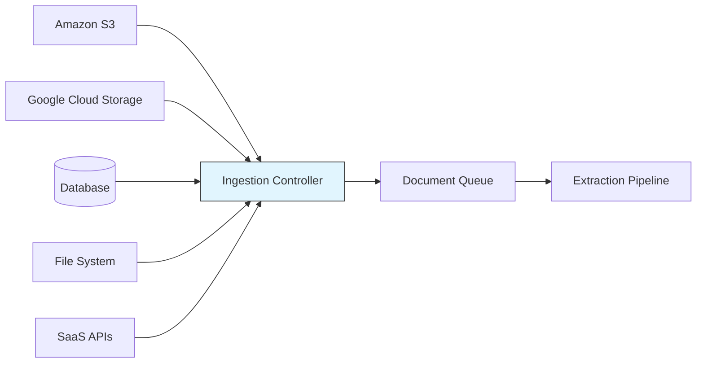

# Source Connector Patterns

## Overview
Source connector patterns define how RAG pipelines ingest data from diverse external sources into the processing pipeline. Connectors are the entry point of any RAG pipeline — they determine what data is available for retrieval and how reliably it flows into the system.

## Pipeline Stage
- [x] Data Ingestion
- [ ] Document Processing & Extraction
- [ ] Chunking & Splitting
- [ ] Embedding & Vectorization
- [ ] Vector Store & Indexing
- [ ] Index Maintenance & Freshness
- [ ] Pipeline Orchestration
- [ ] Evaluation & Quality Assurance

## Architecture

### Pipeline Architecture


### Components
- **Source Adapters**: Platform-specific connectors (S3, GCS, Azure Blob, SFTP, database, API)
- **Ingestion Controller**: Orchestrates connector execution, manages rate limiting, handles authentication
- **Change Detection**: Identifies new, modified, or deleted documents since last ingestion run
- **Document Queue**: Buffers ingested documents for downstream processing
- **Schema Registry**: Tracks metadata schemas per source for consistent downstream processing

### Data Flow
1. **Input**: Raw files and data from external sources (PDF, DOCX, HTML, JSON, FHIR bundles, etc.)
2. **Transformation**: Authentication → listing → filtering → downloading → metadata extraction → queueing
3. **Output**: Raw document bytes + metadata (source, timestamp, content type, size) queued for extraction

## When to Use

### Ideal Use Cases
- Multi-source knowledge bases (documents spread across S3, GCS, databases, and SaaS platforms)
- Enterprise RAG systems that need to unify data from multiple departments or systems
- Healthcare systems pulling from EHR exports, FHIR servers, clinical document repositories
- Scheduled ingestion from frequently updated data sources

### Data Characteristics
- Mixed file formats across sources
- Data behind authentication (IAM, OAuth, API keys)
- Sources with different update frequencies (real-time APIs vs. nightly database dumps)

## When NOT to Use

### Anti-Patterns
- Single static document collection that never changes — a simple file read suffices
- Real-time event streaming (use event-driven patterns instead of batch connectors)
- Data already available in a unified format in a single location

### Data Characteristics That Don't Fit
- Streaming data (use Kafka/Pub-Sub connectors instead of batch file connectors)
- Extremely small datasets where manual loading is simpler

## Configuration & Strategy

### Key Parameters
| Parameter | Default | Range | Impact |
|-----------|---------|-------|--------|
| batch_size | 100 | 10-10,000 | Number of documents per ingestion batch |
| poll_interval | 1h | 5min-24h | How often to check for new documents |
| max_retries | 3 | 1-10 | Retry attempts for failed downloads |
| concurrent_downloads | 5 | 1-50 | Parallel download threads |
| file_filter | `*` | glob pattern | Which files to include/exclude |

### Strategy Variations

#### Variation A: Batch Pull Connectors
- **Description**: Periodically scan sources and pull new/modified documents
- **Best For**: Nightly knowledge base syncs, scheduled data refreshes
- **Trade-off**: Simple to implement but data can be stale between polls

#### Variation B: Event-Driven Connectors
- **Description**: React to source change events (S3 notifications, webhooks, CDC)
- **Best For**: Near real-time freshness requirements
- **Trade-off**: Lower latency but more complex to set up and monitor

#### Variation C: Hybrid Push-Pull
- **Description**: Event-driven for high-priority sources, scheduled pull for the rest
- **Best For**: Mixed criticality requirements
- **Trade-off**: Best of both worlds but higher operational complexity

## Implementation Examples

### Python Implementation
```python
# Generic connector interface
from abc import ABC, abstractmethod
from dataclasses import dataclass
from typing import Iterator

@dataclass
class IngestedDocument:
    content: bytes
    metadata: dict  # source, timestamp, content_type, size
    source_id: str

class SourceConnector(ABC):
    @abstractmethod
    def list_documents(self, since: str = None) -> Iterator[str]:
        """List document IDs, optionally since a timestamp."""
        pass

    @abstractmethod
    def fetch_document(self, doc_id: str) -> IngestedDocument:
        """Fetch a single document by ID."""
        pass

    @abstractmethod
    def detect_changes(self, last_sync: str) -> dict:
        """Return {added: [], modified: [], deleted: []} since last sync."""
        pass
```

### LangChain Implementation
```python
from langchain_community.document_loaders import (
    S3DirectoryLoader,
    GCSDirectoryLoader,
    DirectoryLoader,
    UnstructuredAPIFileLoader,
)

# S3 connector
s3_loader = S3DirectoryLoader(
    bucket="my-knowledge-base",
    prefix="clinical-docs/",
    region_name="us-east-1",
)

# GCS connector
gcs_loader = GCSDirectoryLoader(
    project_name="healthcare-project",
    bucket="clinical-documents",
    prefix="fhir-exports/",
)

# Local filesystem connector
local_loader = DirectoryLoader(
    "/data/medical-records",
    glob="**/*.pdf",
    show_progress=True,
)

# Load from all sources
all_docs = s3_loader.load() + gcs_loader.load() + local_loader.load()
```

### Cloud-Native Implementation
```python
# AWS S3 + EventBridge for event-driven ingestion
import boto3

s3 = boto3.client('s3')

def lambda_handler(event, context):
    """Triggered by S3 PutObject event via EventBridge."""
    bucket = event['detail']['bucket']['name']
    key = event['detail']['object']['key']

    response = s3.get_object(Bucket=bucket, Key=key)
    content = response['Body'].read()
    metadata = {
        'source': f's3://{bucket}/{key}',
        'content_type': response['ContentType'],
        'last_modified': response['LastModified'].isoformat(),
        'size': response['ContentLength'],
    }

    # Queue for extraction pipeline
    queue_for_processing(content, metadata)
```

## Supported Data Sources & Connectors

| Source Type | Connector | Notes |
|-------------|-----------|-------|
| Amazon S3 | boto3, LangChain S3DirectoryLoader | Supports S3 event notifications for real-time |
| Google Cloud Storage | google-cloud-storage, LangChain GCSDirectoryLoader | Pub/Sub integration for event-driven |
| Azure Blob Storage | azure-storage-blob | Event Grid for change notifications |
| Local File System | os/pathlib, LangChain DirectoryLoader | watchdog for file change detection |
| PostgreSQL / SQL | SQLAlchemy, psycopg2 | CDC via logical replication or polling |
| FHIR Server | fhirclient, requests | RESTful API with pagination |
| SharePoint / OneDrive | Microsoft Graph API | OAuth2 authentication |
| Confluence | atlassian-python-api | REST API with space/page filtering |
| Slack | slack-sdk | Conversations and threads |

## Performance Characteristics

### Pipeline Throughput
- Documents per second: 10-100 docs/sec (depends on source latency and document size)
- Network-bound for cloud sources, I/O-bound for local
- Concurrent downloads significantly improve throughput

### Resource Requirements
- Memory: 1-4GB (buffering downloaded documents)
- CPU: 1-2 cores (mostly I/O-bound)
- Network: Bandwidth proportional to document volume
- Storage: Temporary staging area for downloaded documents

### Cost Per Document
| Component | Cost | Notes |
|-----------|------|-------|
| S3 GET requests | $0.0004 per 1K requests | Plus data transfer |
| GCS operations | $0.004 per 10K operations | Class A operations |
| Network egress | $0.09-0.12 per GB | Cross-region transfer |
| **Total pipeline cost** | **~$0.001 per document** | Varies by size and source |

## Index Freshness & Staleness Management

### Update Strategy
- **Full rebuild**: Initial ingestion or when connector schema changes
- **Incremental update**: Use `detect_changes()` to process only new/modified documents
- **Delta detection**: S3 Last-Modified headers, GCS metadata, database timestamps, API pagination cursors

### Scheduling
- **Batch sources**: Every 1-24 hours depending on freshness requirements
- **Event-driven sources**: Near real-time (seconds to minutes)
- **Hybrid**: High-priority sources event-driven, others on schedule

## Quality & Evaluation

### Metrics to Track
| Metric | Description | Target |
|--------|-------------|--------|
| Ingestion success rate | Docs successfully downloaded / total attempted | > 99% |
| Ingestion latency | Time from source update to document queued | < 1h (batch), < 5min (event) |
| Source coverage | Percentage of known sources connected | 100% |
| Duplicate detection | Duplicate documents identified and filtered | > 95% |

## Trade-offs

### Advantages
- Unified access to diverse data sources
- Change detection reduces unnecessary reprocessing
- Event-driven connectors enable near real-time freshness
- Metadata preservation supports downstream filtering

### Disadvantages
- Each source requires a specific adapter (maintenance burden)
- Authentication and credential management complexity
- Network reliability affects ingestion reliability
- Rate limiting from source APIs can throttle throughput

## Well-Architected Framework Alignment

### Operational Excellence
- Automated connector health checks and monitoring
- Standardized logging across all connectors
- Runbooks for common connector failures (auth expiry, rate limits, network issues)

### Security
- Credentials stored in secret managers (AWS Secrets Manager, GCP Secret Manager, Azure Key Vault)
- TLS for all data in transit
- IAM roles with least-privilege access to source data
- PHI audit trails for healthcare data sources

### Reliability
- Retry with exponential backoff for transient failures
- Dead letter queues for permanently failed documents
- Idempotent ingestion (safe to re-run without duplicates)

### Cost Optimization
- Incremental ingestion to avoid re-downloading unchanged documents
- Compression for large document transfers
- Right-sized batch sizes to balance throughput and memory

### Performance
- Concurrent downloads for parallel ingestion
- Connection pooling for database sources
- Streaming large files instead of buffering entirely in memory

### Sustainability
- Incremental processing reduces unnecessary compute and network usage

## Healthcare Considerations

### HIPAA Compliance
- Encrypt all PHI in transit (TLS 1.2+) and at rest
- Use BAA-covered storage services (S3, GCS, Azure Blob with HIPAA BAAs)
- Audit log every document access with timestamp, source, and user context

### Clinical Data Specifics
- FHIR Bundle ingestion with pagination and resource type filtering
- HL7v2 message parsing for ADT, ORU, and other message types
- CDA document extraction from EHR exports
- De-identification pipeline integration before downstream processing

## Related Patterns
- [Document Extraction Patterns](./document-extraction-patterns.md) — Next stage: extract content from ingested documents
- [Index Freshness Patterns](./index-freshness-patterns.md) — Change detection strategies for keeping indexes current
- [Pipeline Orchestration Patterns](./pipeline-orchestration-patterns.md) — Scheduling and automating connector execution

## References
- [LangChain Document Loaders](https://python.langchain.com/docs/integrations/document_loaders/)
- [Unstructured.io Connectors](https://docs.unstructured.io/open-source/ingest/overview)
- [Apache Airflow](https://airflow.apache.org/)

## Version History
- **v1.0** (2026-02-05): Initial version
