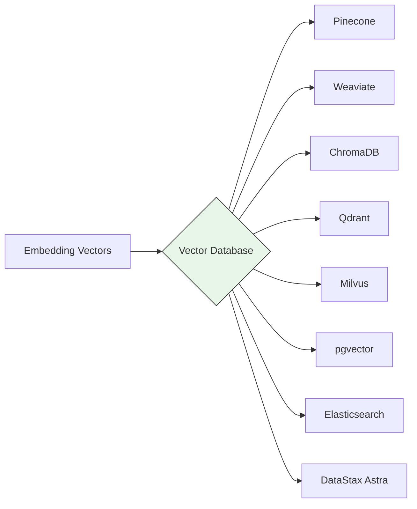

# Vector Database Selection

## Overview
Vector database selection determines where and how your embeddings are stored, indexed, and queried. The vector database is the **backbone of retrieval** — it must handle your scale, latency, filtering, and operational requirements. Choosing the wrong vector DB can bottleneck your entire RAG pipeline.

## Pipeline Stage
- [ ] Data Ingestion
- [ ] Document Processing & Extraction
- [ ] Chunking & Splitting
- [ ] Embedding & Vectorization
- [x] Vector Store & Indexing
- [ ] Index Maintenance & Freshness
- [ ] Pipeline Orchestration
- [ ] Evaluation & Quality Assurance

## Architecture

### Pipeline Architecture


### Decision Criteria
- **Scale**: Number of vectors (thousands, millions, billions)
- **Latency**: Query response time requirements
- **Filtering**: Metadata filtering needs (hybrid search)
- **Operations**: Managed vs. self-hosted preference
- **Cost**: Budget for storage and compute
- **Ecosystem**: Integration with existing infrastructure

## Database Comparison

### Managed (Cloud) Vector Databases

| Database | Max Vectors | Query Latency | Hybrid Search | Managed | Free Tier | Best For |
|----------|-------------|---------------|---------------|---------|-----------|----------|
| **Pinecone** | Billions | < 50ms | Yes (sparse-dense) | Yes | 100K vectors | Production scale, serverless |
| **Weaviate Cloud** | Billions | < 100ms | Yes (BM25 + vector) | Yes | 1M objects | Multi-modal, GraphQL API |
| **Qdrant Cloud** | Billions | < 50ms | Yes (payload filtering) | Yes | 1GB | High-performance filtering |
| **DataStax Astra** | Billions | < 100ms | Yes | Yes | 80GB | Cassandra ecosystem |
| **Elastic (ESRE)** | Billions | < 100ms | Yes (native BM25 + kNN) | Yes | 14-day trial | Existing Elastic users |

### Self-Hosted / Open Source

| Database | Max Vectors | Query Latency | Hybrid Search | Language | Best For |
|----------|-------------|---------------|---------------|----------|----------|
| **ChromaDB** | Millions | < 100ms | Limited | Python | Prototyping, development |
| **Qdrant** | Billions | < 50ms | Yes | Rust | Production self-hosted |
| **Milvus** | Billions | < 50ms | Yes | Go | Large-scale distributed |
| **Weaviate** | Billions | < 100ms | Yes | Go | Multi-modal, modules |
| **pgvector** | Millions | < 200ms | Yes (native SQL) | C/SQL | Existing PostgreSQL |
| **FAISS** | Billions | < 10ms | No | C++/Python | Research, benchmarking |

### Selection Matrix by Requirement

| Requirement | Recommended | Why |
|-------------|------------|-----|
| **Fastest to get started** | ChromaDB | In-memory, no setup, Python-native |
| **Production serverless** | Pinecone | Fully managed, auto-scaling |
| **Self-hosted production** | Qdrant or Milvus | High-performance, battle-tested |
| **Existing PostgreSQL** | pgvector | No new infrastructure |
| **Existing Elasticsearch** | Elastic kNN | Native vector search in existing stack |
| **Multi-modal data** | Weaviate | Built-in vectorizer modules |
| **Hybrid search priority** | Pinecone or Elastic | Strongest sparse-dense fusion |
| **Air-gapped / HIPAA** | Qdrant self-hosted + ChromaDB | Full data control |
| **Billions of vectors** | Pinecone or Milvus | Proven at massive scale |
| **Lowest cost** | pgvector or ChromaDB | Free, use existing infrastructure |

## Implementation Examples

### ChromaDB (Development)
```python
import chromadb

client = chromadb.PersistentClient(path="./chroma_db")
collection = client.get_or_create_collection(
    name="clinical_docs",
    metadata={"hnsw:space": "cosine"},
)

collection.add(
    ids=["doc1", "doc2"],
    embeddings=[[0.1, 0.2, ...], [0.3, 0.4, ...]],
    documents=["Clinical note text...", "Lab report text..."],
    metadatas=[{"type": "note", "date": "2026-01-15"}, {"type": "lab", "date": "2026-01-16"}],
)

results = collection.query(
    query_embeddings=[[0.15, 0.25, ...]],
    n_results=5,
    where={"type": "note"},  # Metadata filtering
)
```

### Pinecone (Production)
```python
from pinecone import Pinecone

pc = Pinecone(api_key="your-api-key")
index = pc.Index("clinical-knowledge-base")

index.upsert(
    vectors=[
        {"id": "doc1", "values": [0.1, 0.2, ...], "metadata": {"type": "note"}},
        {"id": "doc2", "values": [0.3, 0.4, ...], "metadata": {"type": "lab"}},
    ],
    namespace="healthcare",
)

results = index.query(
    vector=[0.15, 0.25, ...],
    top_k=5,
    filter={"type": {"$eq": "note"}},
    namespace="healthcare",
    include_metadata=True,
)
```

### pgvector (PostgreSQL)
```sql
CREATE EXTENSION vector;

CREATE TABLE documents (
    id SERIAL PRIMARY KEY,
    content TEXT,
    embedding vector(1536),
    metadata JSONB,
    created_at TIMESTAMP DEFAULT NOW()
);

CREATE INDEX ON documents USING hnsw (embedding vector_cosine_ops);

-- Query
SELECT id, content, 1 - (embedding <=> $1::vector) AS similarity
FROM documents
WHERE metadata->>'type' = 'note'
ORDER BY embedding <=> $1::vector
LIMIT 5;
```

## Performance Characteristics

### Query Latency (p95)
| Database | 100K vectors | 1M vectors | 10M vectors | 100M vectors |
|----------|-------------|------------|-------------|--------------|
| ChromaDB | 10ms | 50ms | 200ms+ | Not recommended |
| Pinecone | 20ms | 30ms | 50ms | 80ms |
| Qdrant | 5ms | 15ms | 40ms | 70ms |
| pgvector | 20ms | 100ms | 500ms+ | Not recommended |
| Milvus | 10ms | 20ms | 40ms | 60ms |

## Cost Comparison (Monthly)

| Database | 1M vectors | 10M vectors | 100M vectors |
|----------|-----------|-------------|--------------|
| ChromaDB | $0 (self-hosted) | $50-100 (server) | N/A |
| Pinecone (Serverless) | $8-20 | $80-200 | $800-2,000 |
| Qdrant Cloud | $10-30 | $100-300 | $1,000-3,000 |
| pgvector | $0 (existing PG) | $50-200 (larger PG) | N/A |
| Weaviate Cloud | $25-50 | $150-400 | $1,500-4,000 |

## Healthcare Considerations

### HIPAA Compliance
- **Managed services**: Verify BAA availability (Pinecone, Elastic, Astra — check current status)
- **Self-hosted**: Qdrant, Milvus, ChromaDB, pgvector — full PHI control
- **Encryption**: At-rest encryption required for all vector stores containing PHI

### Clinical Data Specifics
- Metadata filtering for patient ID, encounter type, date ranges
- Namespace/collection separation for multi-tenant clinical systems
- Audit logging for all vector store queries accessing PHI

## Related Patterns
- [Embedding Model Selection](./embedding-model-selection.md) — Previous stage: generating vectors
- [Index Architecture Patterns](./index-architecture-patterns.md) — How to structure indexes within the chosen DB
- [Index Freshness Patterns](./index-freshness-patterns.md) — Keeping the vector DB current
- [Basic RAG](../rag/basic-rag.md) — Simplest retrieval pattern using vector search

## References
- [Pinecone Documentation](https://docs.pinecone.io/)
- [Qdrant Documentation](https://qdrant.tech/documentation/)
- [ChromaDB Documentation](https://docs.trychroma.com/)
- [pgvector GitHub](https://github.com/pgvector/pgvector)
- [Milvus Documentation](https://milvus.io/docs)

## Version History
- **v1.0** (2026-02-05): Initial version
