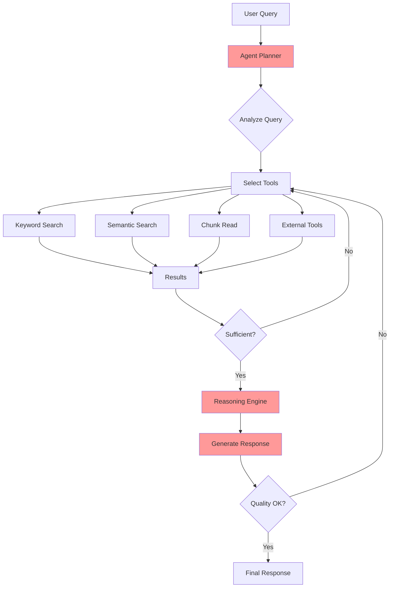

# Agentic RAG Pattern

## Overview

Agentic RAG combines LLM agents with retrieval-augmented generation, enabling autonomous decision-making about when, what, and how to retrieve information. Unlike traditional RAG where retrieval follows a fixed pipeline, Agentic RAG uses tool-calling LLMs to dynamically choose retrieval strategies, adjust query granularity, integrate external tools, and iterate until the information need is satisfied.

The pattern empowers the LLM to act as an intelligent orchestrator that can:
- Decide whether retrieval is necessary for a given query
- Choose between multiple retrieval strategies
- Iterate and refine searches based on initial results
- Combine internal knowledge with retrieved information
- Use external tools (calculators, APIs, web search) alongside retrieval

## Core Concepts

### What Makes RAG "Agentic"?

Traditional RAG follows a fixed retrieve-then-generate pattern. Agentic RAG introduces autonomy:

| Aspect | Traditional RAG | Agentic RAG |
|--------|----------------|-------------|
| Retrieval Decision | Always retrieves | Agent decides if/when to retrieve |
| Query Strategy | Fixed (usually semantic) | Agent chooses strategy per query |
| Iteration | Single pass | Multi-turn with reflection |
| Tool Use | Retrieval only | Retrieval + external tools |
| Granularity | Fixed chunk size | Adaptive (summary → detail) |
| Self-Correction | None | Agent can recognize and fix failures |

### Agent Architectures

Several architectural approaches exist for implementing Agentic RAG:

#### 1. ReAct (Reasoning + Acting)
The agent alternates between reasoning about what to do and taking actions (tool calls). Each step involves:
- **Thought**: Reasoning about the current state and next action
- **Action**: Executing a tool (search, read, calculate)
- **Observation**: Processing tool results

#### 2. Function/Tool-Calling Agents
Modern LLMs with native tool-calling capabilities can directly invoke retrieval tools without explicit ReAct prompting. The model decides which tools to call based on the query.

#### 3. Plan-and-Execute
The agent first creates a plan for answering the query, then executes each step. Better for complex queries requiring multiple retrieval operations.

#### 4. Multi-Agent Systems
Multiple specialized agents collaborate:
- **Retrieval Agent**: Handles document search
- **Reasoning Agent**: Processes and synthesizes information
- **Verification Agent**: Checks answer quality

## Architecture

### High-Level Architecture

```
User Query -> Agent Planner -> Tool Selection ->
   [Keyword Search | Semantic Search | Chunk Read | External Tools] ->
   Context Assembly -> Reasoning -> Response (or iterate)
```

### Components

- **Agent Planner**: LLM that decides retrieval strategy and tool usage
- **Retrieval Tools**: Various search capabilities (keyword, semantic, structured)
- **External Tools**: Web search, calculators, code execution, API calls
- **Memory**: Conversation history and intermediate retrieval results
- **Reasoning Engine**: Multi-step reasoning over retrieved context
- **Response Generator**: Final answer synthesis

### Data Flow

1. User submits query to agent
2. Agent analyzes query complexity and decides approach
3. Agent selects appropriate retrieval tools (may iterate)
4. Retrieved results are evaluated; agent may retrieve more if needed
5. Agent reasons over combined context
6. Response is generated; agent may self-correct
7. Final response returned to user

## When to Use

### Ideal Use Cases
- Complex multi-hop reasoning questions
- Queries requiring dynamic retrieval decisions
- Tasks needing external tool integration (web search, APIs)
- Healthcare scenarios requiring adaptive information gathering
- Research tasks with unpredictable information needs
- Multi-document synthesis with varying granularity needs
- Queries where retrieval scope is uncertain

### Characteristics of Suitable Problems
- Query complexity varies significantly
- Single retrieval pass is often insufficient
- Need to combine internal knowledge with retrieval
- External tools add value (calculators, APIs, web)
- Adaptive retrieval granularity is beneficial
- Self-correction improves accuracy

## When NOT to Use

### Anti-Patterns
- Simple Q&A with known answer locations (use Basic RAG)
- Strict latency requirements (<500ms)
- Highly controlled environments with fixed retrieval
- Cost-sensitive applications (more LLM calls)
- Deterministic, reproducible retrieval needs

### Characteristics of Unsuitable Problems
- Simple single-document lookups
- Queries always follow same retrieval pattern
- Budget constraints limit LLM API calls
- Need deterministic, traceable retrieval paths

## Agentic RAG Techniques

### A-RAG: Hierarchical Retrieval Interfaces (2026)

The A-RAG framework introduces hierarchical retrieval interfaces that expose multiple granularity levels as tools the agent can use adaptively.

**Key Innovation**: Instead of a single retrieval tool, A-RAG provides:
- **Keyword Search**: BM25-based exact matching for specific terms
- **Semantic Search**: Dense retrieval for conceptual queries
- **Chunk Read**: Direct access to specific chunks for detailed examination

**When to Use A-RAG**:
- Queries requiring different retrieval strategies
- Need for granular control over retrieval depth
- Multi-step reasoning where initial broad search narrows to specific chunks

**Advantages**:
- Reduces over-retrieval by letting agent choose appropriate granularity
- Better handling of queries requiring both keyword and semantic matching
- Efficient token usage through hierarchical access

**Limitations**:
- Requires well-indexed document store with multiple access methods
- Agent may take suboptimal retrieval paths
- More complex tool definitions

**Reference**: [A-RAG: Scaling Agentic RAG via Hierarchical Retrieval Interfaces](https://arxiv.org/abs/2602.03442) (Feb 2026)

### AU-RAG: Autonomous Updates

AU-RAG focuses on agents that can autonomously update their knowledge base when they detect outdated or missing information.

**Key Innovation**: The agent not only retrieves but also identifies knowledge gaps and triggers updates.

**When to Use**:
- Dynamic knowledge environments
- Systems that need to stay current
- Self-improving RAG systems

**Reference**: [AU-RAG: Agentic RAG for Dynamic Knowledge Environments](https://arxiv.org/html/2506.00054v1)

### Tool-Augmented Retrieval

Combines retrieval with external tools like:
- **Calculators**: For numerical queries
- **Code Execution**: For computational questions
- **Web Search**: For current information
- **API Calls**: For structured data access

**When to Use**:
- Queries requiring computation over retrieved data
- Need for real-time or external information
- Multi-modal information needs

## Implementation Examples

### Anthropic Claude with Tool Use

```python
import anthropic
from document_store.storage.vector_store import VectorStore

client = anthropic.Anthropic()
vector_store = VectorStore()

# Define retrieval tools (can be customized based on approach)
tools = [
    {
        "name": "keyword_search",
        "description": "Search documents using exact keyword matching. Use for specific terms, codes, or proper nouns.",
        "input_schema": {
            "type": "object",
            "properties": {
                "query": {"type": "string", "description": "Keywords to search for"},
                "max_results": {"type": "integer", "default": 5}
            },
            "required": ["query"]
        }
    },
    {
        "name": "semantic_search",
        "description": "Search documents using semantic similarity. Use for conceptual queries.",
        "input_schema": {
            "type": "object",
            "properties": {
                "query": {"type": "string", "description": "Semantic query"},
                "max_results": {"type": "integer", "default": 5}
            },
            "required": ["query"]
        }
    },
    {
        "name": "read_chunk",
        "description": "Read a specific chunk by ID for detailed examination.",
        "input_schema": {
            "type": "object",
            "properties": {
                "chunk_id": {"type": "string", "description": "Chunk ID to read"}
            },
            "required": ["chunk_id"]
        }
    }
]

def execute_tool(tool_name: str, tool_input: dict) -> str:
    """Execute a retrieval tool and return results."""

    if tool_name == "keyword_search":
        results = vector_store.keyword_search(
            query=tool_input["query"],
            n_results=tool_input.get("max_results", 5)
        )
        return format_results(results)

    elif tool_name == "semantic_search":
        results = vector_store.query(
            query=tool_input["query"],
            n_results=tool_input.get("max_results", 5)
        )
        return format_results(results)

    elif tool_name == "read_chunk":
        chunk = vector_store.get_chunk(tool_input["chunk_id"])
        return chunk.get("content", "Chunk not found")

    return "Unknown tool"

def agentic_rag_query(user_query: str, max_iterations: int = 5) -> str:
    """
    Execute agentic RAG with iterative tool use.

    Args:
        user_query: User's question
        max_iterations: Maximum tool use iterations

    Returns:
        Final response from agent
    """

    messages = [{
        "role": "user",
        "content": f"""You are a helpful assistant with access to retrieval tools.

Answer the following question by using the available tools to search for relevant information.
You may need to use multiple tools or iterate to find the complete answer.

Question: {user_query}

Think step by step:
1. Analyze what information you need
2. Choose appropriate search strategy (keyword vs semantic)
3. Retrieve and evaluate results
4. If needed, retrieve more or read specific chunks
5. Synthesize a complete answer"""
    }]

    for iteration in range(max_iterations):
        response = client.messages.create(
            model="claude-sonnet-4-20250514",
            max_tokens=4096,
            tools=tools,
            messages=messages
        )

        # Check if agent wants to use tools
        if response.stop_reason == "tool_use":
            tool_results = []

            for content in response.content:
                if content.type == "tool_use":
                    result = execute_tool(content.name, content.input)
                    tool_results.append({
                        "type": "tool_result",
                        "tool_use_id": content.id,
                        "content": result
                    })

            # Add assistant response and tool results
            messages.append({"role": "assistant", "content": response.content})
            messages.append({"role": "user", "content": tool_results})

        else:
            # Agent is done, return final response
            return response.content[0].text

    return "Max iterations reached without final answer"


# Example usage
answer = agentic_rag_query(
    "What is the patient's cardiac history and how does it relate to their current symptoms?"
)
print(answer)
```

### Google ADK Agent Implementation

```python
from google.adk.agents import Agent
from google.adk.tools import Tool, ToolContext

# Define retrieval tools for ADK
class RAGTools:
    """Retrieval tools for Agentic RAG."""

    @Tool
    def keyword_search(self, query: str, max_results: int = 5) -> str:
        """Search using BM25 keyword matching for exact terms."""
        results = self.vector_store.keyword_search(query, n_results=max_results)
        return self._format_results(results)

    @Tool
    def semantic_search(self, query: str, max_results: int = 5) -> str:
        """Search using semantic similarity for conceptual queries."""
        results = self.vector_store.query(query, n_results=max_results)
        return self._format_results(results)

    @Tool
    def chunk_read(self, chunk_id: str) -> str:
        """Read a specific chunk for detailed examination."""
        return self.vector_store.get_chunk(chunk_id)

    @Tool
    def web_search(self, query: str) -> str:
        """Search the web for current information."""
        # Integration with web search API
        pass

# Create ADK agent with tools
agent = Agent(
    name="agentic_rag_agent",
    model="gemini-2.0-flash",
    tools=[RAGTools()],
    system_prompt="""You are an intelligent retrieval agent.

    Use the available tools to find relevant information:
    - keyword_search: For specific terms, codes, proper nouns
    - semantic_search: For conceptual, meaning-based queries
    - chunk_read: To examine specific chunks in detail
    - web_search: For current events or external information

    Iterate as needed to gather complete information."""
)

# Run agent
response = agent.run("Compare treatment options for Type 2 diabetes in elderly patients")
```

### LangChain Agent Implementation

```python
from langchain.agents import AgentExecutor, create_openai_tools_agent
from langchain.tools import Tool
from langchain_openai import ChatOpenAI
from langchain.prompts import ChatPromptTemplate

# Define retrieval tools
tools = [
    Tool(
        name="keyword_search",
        description="Search documents using exact keyword matching",
        func=lambda q: vector_store.keyword_search(q)
    ),
    Tool(
        name="semantic_search",
        description="Search documents using semantic similarity",
        func=lambda q: vector_store.query(q)
    ),
    Tool(
        name="web_search",
        description="Search the web for current information",
        func=lambda q: web_search_api(q)
    )
]

# Create agent
llm = ChatOpenAI(model="gpt-4-turbo")

prompt = ChatPromptTemplate.from_messages([
    ("system", """You are an intelligent retrieval agent with access to multiple search tools.

    For each query:
    1. Analyze the information needs
    2. Choose appropriate search strategy
    3. Iterate if initial results are insufficient
    4. Synthesize a comprehensive answer"""),
    ("human", "{input}"),
    ("placeholder", "{agent_scratchpad}")
])

agent = create_openai_tools_agent(llm, tools, prompt)
agent_executor = AgentExecutor(agent=agent, tools=tools, verbose=True)

# Run agent
result = agent_executor.invoke({
    "input": "What are the latest RAG techniques for healthcare?"
})
```

### Spring AI Agent Implementation

```java
@Service
public class AgenticRAGService {

    private final ChatClient chatClient;
    private final VectorStore vectorStore;

    public AgenticRAGService(ChatClient.Builder builder, VectorStore vectorStore) {
        this.vectorStore = vectorStore;
        this.chatClient = builder
            .defaultFunctions(
                "keywordSearch",
                "semanticSearch",
                "readChunk"
            )
            .build();
    }

    @Bean
    @Description("Search documents using keyword matching")
    public Function<SearchRequest, String> keywordSearch() {
        return request -> {
            // BM25 keyword search implementation
            return vectorStore.keywordSearch(request.query(), request.maxResults());
        };
    }

    @Bean
    @Description("Search documents using semantic similarity")
    public Function<SearchRequest, String> semanticSearch() {
        return request -> {
            List<Document> results = vectorStore.similaritySearch(
                SearchRequest.query(request.query())
                    .withTopK(request.maxResults())
            );
            return formatResults(results);
        };
    }

    public String query(String userQuery) {
        return chatClient.prompt()
            .system("""
                You are an intelligent retrieval agent.
                Use the available tools to find relevant information.
                Iterate as needed to gather complete information.
                """)
            .user(userQuery)
            .call()
            .content();
    }
}
```

## Performance Characteristics

### Latency
- Typical latency: 2000-10000ms (multiple tool calls)
- Factors affecting latency:
  - Number of tool calls (iterations)
  - LLM response time per call
  - Retrieval tool latency
  - Query complexity

### Throughput
- Typical throughput: 2-8 requests/second
- Lower than Basic RAG due to multi-turn interactions
- Factors:
  - LLM API rate limits
  - Concurrent tool execution
  - Agent complexity

### Resource Requirements
- Memory: 4-8GB (agent state, retrieval indices)
- CPU: 4-8 cores (parallel tool execution)
- LLM API calls: 3-10x more than Basic RAG
- Storage: Same as Basic RAG

## Trade-offs

### Advantages
- **Adaptive Retrieval**: Agent decides when/what/how to retrieve
- **Multi-Hop Reasoning**: Naturally handles complex queries
- **Tool Integration**: Can use external APIs, calculators, web search
- **Self-Correction**: Agent can recognize and fix retrieval failures
- **Granularity Control**: Can adapt retrieval depth to query needs
- **Reduced Over-Retrieval**: Retrieves only what's needed

### Disadvantages
- **Higher Latency**: Multi-turn interactions take longer
- **Higher Cost**: More LLM API calls
- **Non-Deterministic**: Same query may produce different retrieval paths
- **Complexity**: Harder to debug and trace
- **Hallucination Risk**: Agent may confidently proceed without adequate retrieval

### Technique Selection Guide

| Technique | Best For | Trade-off |
|-----------|----------|-----------|
| A-RAG (Hierarchical) | Varied retrieval granularity needs | More complex tool setup |
| ReAct | Transparent reasoning chains | Verbose, slower |
| Function-Calling | Simple tool use patterns | Less explicit reasoning |
| Plan-and-Execute | Complex multi-step queries | Planning overhead |
| Multi-Agent | Specialized subtasks | Coordination complexity |

## Architecture Diagram



## Well-Architected Framework Alignment

### Operational Excellence
- **Monitoring**: Track tool calls, iteration counts, latency per step
- **Logging**: Full trace of agent decisions and tool results
- **Alerting**: High iteration count, failed retrievals, timeout alerts
- **Automation**: Auto-retry with different strategies on failure

### Security
- **Tool Authorization**: Restrict which tools agent can use
- **Input Validation**: Sanitize tool inputs
- **Output Filtering**: Filter sensitive information from responses
- **Audit Trail**: Complete log of all tool calls for compliance

### Reliability
- **Availability Target**: 99% (lower than Basic RAG due to complexity)
- **Failure Modes**: Agent loops, tool failures, timeout
- **Mitigation**:
  - Max iteration limits
  - Tool timeouts
  - Fallback to Basic RAG on agent failure
  - Circuit breakers for external tools

### Cost Optimization
- **Cost Level**: High (3-10x Basic RAG)
- **Optimization Strategies**:
  - Cache frequent tool results
  - Use smaller models for planning
  - Limit max iterations
  - Use cheaper models for intermediate steps
  - Batch similar queries

### Performance
- **Target Latency**: 3-10 seconds (acceptable for complex queries)
- **Optimization**:
  - Parallel tool execution where possible
  - Streaming responses for perceived speed
  - Warm agent pools to reduce cold start

### Sustainability
- **Resource Intensity**: Higher than Basic RAG
- **Optimization**:
  - Cache aggressively
  - Use efficient models for planning
  - Batch queries during off-peak

## Healthcare-Specific Applications

### Multi-Document Patient History

```python
def agentic_patient_summary(patient_id: str, query: str) -> str:
    """
    Agent navigates multi-year patient history across specialties.

    Example: "Summarize John Doe's cardiac history and recent
             medication changes related to his CHF management"
    """

    # Agent autonomously:
    # 1. Searches cardiology notes (semantic: "cardiac history CHF")
    # 2. Searches medication records (keyword: "lisinopril, metoprolol")
    # 3. Reads specific encounter notes for details
    # 4. Synthesizes longitudinal summary

    return agent.run(f"""
        Patient ID: {patient_id}
        Query: {query}

        Use retrieval tools to gather comprehensive information
        from the patient's medical record. Include relevant dates,
        providers, and clinical reasoning.
    """)
```

### Clinical Decision Support

```python
# Agent with clinical tools
clinical_tools = [
    semantic_search_tool,
    drug_interaction_checker,  # External API
    clinical_calculator,       # BMI, eGFR, etc.
    guideline_lookup,          # Clinical guidelines
]

agent = create_clinical_agent(tools=clinical_tools)

# Agent can:
# 1. Retrieve patient labs and vitals
# 2. Check drug interactions
# 3. Calculate clinical scores
# 4. Lookup relevant guidelines
# 5. Synthesize recommendation
```

## Related Patterns
- [Basic RAG](./basic-rag.md) - Simpler, faster alternative
- [Self-RAG](./self-rag.md) - Self-reflection without full agency
- [Corrective RAG](./corrective-rag.md) - Focuses on correction
- [Adaptive RAG](./adaptive-rag.md) - Adaptive retrieval strategies
- [Multi-Query RAG](./multi-query-rag.md) - Query expansion without agency

## References

### Foundational Papers
- [ReAct: Synergizing Reasoning and Acting in Language Models](https://arxiv.org/abs/2210.03629)
- [Toolformer: Language Models Can Teach Themselves to Use Tools](https://arxiv.org/abs/2302.04761)

### 2026 Research
- [A-RAG: Scaling Agentic RAG via Hierarchical Retrieval Interfaces](https://arxiv.org/abs/2602.03442) (Feb 2026)
- [AU-RAG: Agentic RAG for Dynamic Knowledge Environments](https://arxiv.org/html/2506.00054v1)

### Vendor Documentation
- [Anthropic Tool Use Documentation](https://docs.anthropic.com/claude/docs/tool-use)
- [Google ADK Agent Framework](https://cloud.google.com/vertex-ai/docs/agent-builder)
- [LangChain Agents](https://python.langchain.com/docs/modules/agents/)
- [Spring AI Function Calling](https://docs.spring.io/spring-ai/reference/api/functions.html)

## Version History
- **v1.1** (2026-02-04): Restructured as generic Agentic RAG concept; A-RAG presented as one technique
- **v1.0** (2026-02-04): Initial documentation focused on A-RAG
