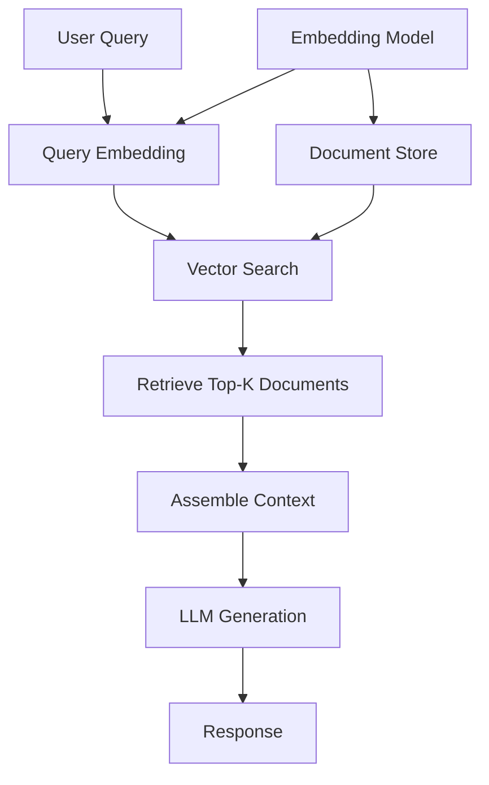

# Basic RAG Pattern

## Overview

Basic RAG (Retrieval-Augmented Generation) is the foundational pattern that combines information retrieval with language model generation. It retrieves relevant documents from a knowledge base and uses them as context for generating responses.

## Architecture

### High-Level Architecture

```
User Query → Embedding → Vector Search → Retrieved Documents → Context Assembly → LLM → Response
```

### Components

- **Query Encoder**: Converts user query to embedding vector
- **Vector Store**: Stores document embeddings (e.g., ChromaDB)
- **Retriever**: Performs similarity search to find relevant documents
- **Context Assembler**: Combines retrieved documents into prompt context
- **LLM**: Generates response based on context and query

### Data Flow

1. User submits a query
2. Query is encoded into a vector embedding
3. Vector similarity search retrieves top-k relevant documents
4. Retrieved documents are assembled into context
5. Context + query are sent to LLM
6. LLM generates response using retrieved context

## When to Use

### Ideal Use Cases
- Simple Q&A systems
- Document-based question answering
- Single-step information retrieval
- Straightforward queries with clear answers
- Prototyping and initial implementations

### Characteristics of Suitable Problems
- Queries have clear, direct answers in documents
- Single retrieval step is sufficient
- Document corpus is well-structured
- Response quality doesn't require multi-step reasoning

## When NOT to Use

### Anti-Patterns
- Complex multi-hop reasoning queries
- Queries requiring information synthesis across multiple documents
- Real-time streaming requirements
- Queries needing self-correction or validation
- Highly dynamic or frequently changing knowledge bases

### Characteristics of Unsuitable Problems
- Queries require multiple retrieval iterations
- Need for query decomposition or rewriting
- Complex relationships between entities
- Need for adaptive retrieval strategies

## Implementation Examples

### Google ADK Implementation

```python
from document_store.orchestrator import DocumentStoreOrchestrator

orchestrator = DocumentStoreOrchestrator(use_adk_agent=True)

# Basic RAG query
results = orchestrator.query_patterns(
    query="What is the basic RAG pattern?",
    n_results=5,
    use_agent=True,
)

# ADK agent handles retrieval and generation
response = results['results'][0]['content']
```

### LangChain Implementation

```python
from langchain.vectorstores import ChromaDB
from langchain.llms import OpenAI
from langchain.chains import RetrievalQA
from langchain.embeddings import OpenAIEmbeddings

# Initialize components
embeddings = OpenAIEmbeddings()
vectorstore = ChromaDB(embedding_function=embeddings)
llm = OpenAI()

# Create RAG chain
qa_chain = RetrievalQA.from_chain_type(
    llm=llm,
    chain_type="stuff",
    retriever=vectorstore.as_retriever(),
)

# Query
response = qa_chain.run("What is basic RAG?")
```

### Anthropic (Claude) Implementation

```python
import anthropic
from document_store.storage.vector_store import VectorStore

vector_store = VectorStore()
client = anthropic.Anthropic()

# Retrieve relevant documents
results = vector_store.query("What is basic RAG?", n_results=5)
context = "\n\n".join(results['documents'])

# Generate with Claude
message = client.messages.create(
    model="claude-3-5-sonnet-20241022",  # Latest Claude 3.5 Sonnet
    max_tokens=1024,
    messages=[{
        "role": "user",
        "content": f"Context:\n{context}\n\nQuestion: What is basic RAG?"
    }]
)
```

### Ollama Implementation

```python
from document_store.agents.ollama_agent import OllamaAgent

ollama_agent = OllamaAgent(
    model="llama3.2",  # or llama3.3 for larger context
    vector_store=vector_store,
)

# RAG query with Ollama
results = ollama_agent.query_with_rag(
    query="What is basic RAG?",
    n_results=5,
)
```

## Performance Characteristics

### Latency
- Typical latency: 200-500ms (depending on retrieval + generation)
- Factors affecting latency:
  - Vector search speed
  - Number of retrieved documents
  - LLM response time
  - Context size

### Throughput
- Typical throughput: 10-50 requests/second
- Factors affecting throughput:
  - Vector store performance
  - LLM API rate limits
  - Batch processing capabilities

### Resource Requirements
- Memory: 2-4GB (for embeddings and vector store)
- CPU: 2-4 cores (for embedding generation)
- Storage: Varies with document corpus size

## Trade-offs

### Advantages
- Simple to implement and understand
- Fast for straightforward queries
- Low computational overhead
- Easy to debug and maintain
- Good baseline for comparison

### Disadvantages
- Limited to single-step retrieval
- May miss relevant information requiring multi-hop reasoning
- No query optimization or rewriting
- Limited context understanding
- May retrieve irrelevant documents

### Considerations
- Embedding model quality significantly impacts results
- Chunk size and overlap affect retrieval quality
- Number of retrieved documents (k) is a key hyperparameter
- Context window limits may truncate important information

## Architecture Diagram



## Well-Architected Framework Alignment

### Operational Excellence
- **Monitoring**: Track query latency, retrieval accuracy, and generation quality
- **Automation**: Automated document ingestion and vector store updates
- **Runbooks**: Document common failures (vector store connection, embedding errors)

### Security
- **Input Validation**: Validate and sanitize user queries
- **Access Control**: Secure access to document store
- **Data Privacy**: Support local processing with Ollama for sensitive data

### Reliability
- **Availability Target**: 99.5% for production deployments
- **Failure Modes**: Vector store failures, LLM API rate limits
- **Mitigation**: Fallback to cached responses, retry with exponential backoff

### Cost Optimization
- **Cost Level**: Low-Medium (depends on vendor/model selection)
- **Production**: Enterprise cloud platforms (Vertex AI, Azure OpenAI, AWS Bedrock) recommended
- **Development**: Cost-effective options (Ollama, free tiers) suitable for testing
- **Optimization**: Embedding caching, batch processing
- **Resource Requirements**: 2-4GB memory, 2-4 CPU cores (varies by vendor)
- **Note**: Cost-effective options shown as alternatives, not constraints

### Performance
- **Target Latency**: < 500ms (p95)
- **Target Throughput**: 50 requests/second
- **Scalability**: Horizontal scaling through stateless design

### Sustainability
- **Resource Efficiency**: Use efficient embedding models (all-MiniLM-L6-v2 or cloud embedding services)
- **Cloud Efficiency**: Enterprise cloud platforms offer optimized infrastructure
- **Local Processing**: Ollama option available for local, energy-efficient processing (development/testing)

## Deployment Considerations

### Zonal Deployment
- **Suitable**: Development, testing, low-availability requirements
- **Characteristics**: Single zone, lowest cost, simplest setup
- **Use Case**: Prototyping, local development

### Regional Deployment
- **Suitable**: Production workloads, moderate availability (99.5%)
- **Characteristics**: Multi-zone redundancy, moderate cost
- **Use Case**: Most production Basic RAG applications

### Multi-Regional Deployment
- **Suitable**: Global applications, high availability (99.9%+)
- **Characteristics**: Global distribution, highest cost
- **Use Case**: Enterprise-scale, global user base

### Hybrid Deployment
- **Suitable**: Privacy-sensitive, compliance requirements
- **Characteristics**: Mix of cloud and local (Ollama)
- **Use Case**: Sensitive data processing, on-premises requirements

See [Deployment Guide](../deployment-guide.md) for detailed guidance.

## Architecture Decision Record

**Decision**: Use Basic RAG for simple Q&A use cases

**Rationale**: 
- Lowest complexity and cost
- Sufficient for straightforward queries
- Fast response times
- Easy to implement and maintain

**Alternatives Considered**:
- Advanced RAG: Overkill for simple queries, higher latency and cost
- Self-RAG: Unnecessary quality control overhead for simple use cases

See [ADR Template](../templates/adr-template.md) for full ADR format.

## Related Patterns
- [Advanced RAG](./advanced-rag.md) - For complex queries requiring multi-step retrieval
- [Self-RAG](./self-rag.md) - When quality control is needed
- [Hybrid RAG](./hybrid-rag.md) - When combining multiple retrieval strategies

## References
- [Google Cloud Well-Architected Framework](https://docs.cloud.google.com/architecture/framework/printable)
- [RAG Strategies Video](https://youtu.be/tLMViADvSNE?si=C8Zq1H0Uww_FpxZ7)
- LangChain RAG Documentation
- ChromaDB Vector Store

## Version History
- **v1.0** (2025-11-08): Initial version
- **v1.1** (2025-11-08): Added Well-Architected Framework alignment

