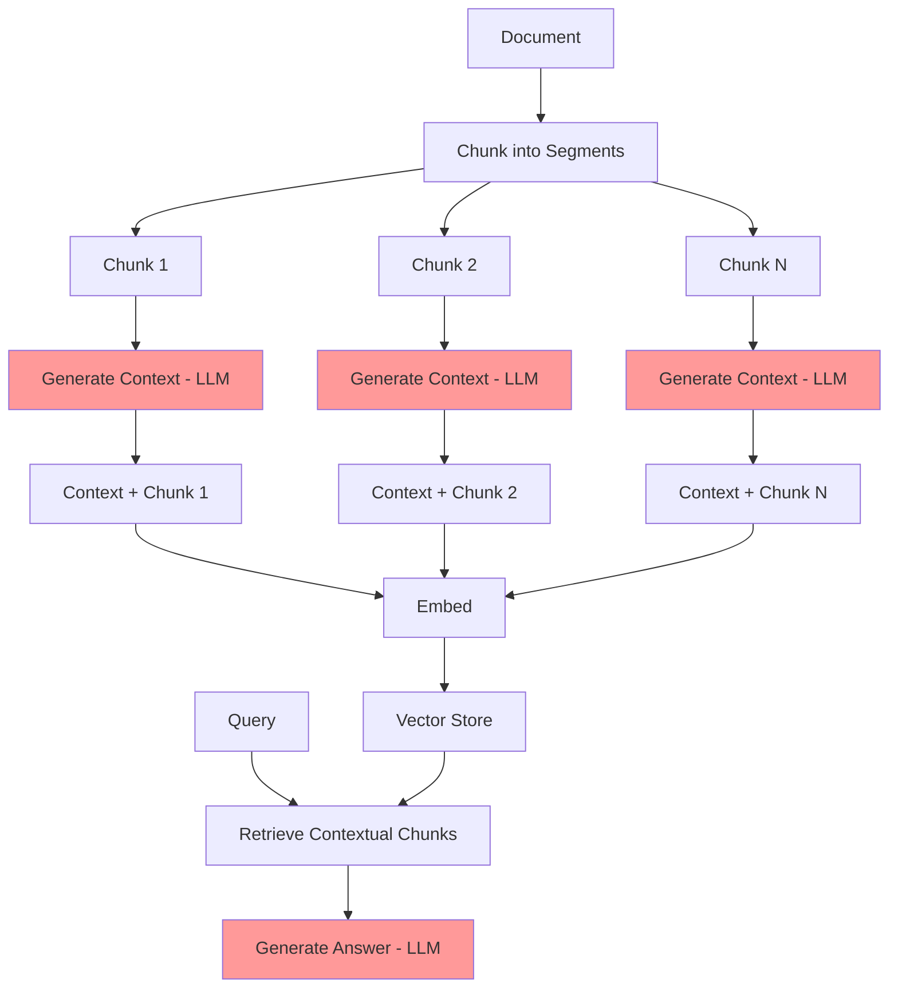

# Contextual Retrieval Pattern

## Overview

Contextual Retrieval is an advanced RAG pattern introduced by Anthropic (September 2024) that improves retrieval accuracy by adding document context to chunks before embedding. Traditional chunking loses context when text is split - a chunk about "the patient's condition" might not specify which patient or condition. Contextual Retrieval prepends each chunk with contextual information about its source, enabling more accurate semantic matching.

**Key Innovation**: Document → Chunk → Add Context to Each Chunk → Embed Contextual Chunks → Retrieve → Answer

This pattern reduces retrieval errors by up to 49% compared to standard chunking, and up to 67% when combined with reranking (BM25 hybrid approach).

## Architecture

### High-Level Architecture

```
Document → Chunk → Generate Context (LLM) → Prepend Context → Embed →
   Vector Store → Query → Retrieve Contextual Chunks → Generate Answer
```

### Components

- **Document Chunker**: Splits documents into manageable chunks
- **Context Generator**: LLM that generates situating context for each chunk
- **Embedding Model**: Converts contextualized chunks to vectors
- **Vector Store**: Stores embeddings with prepended context
- **Retrieval Engine**: Finds relevant contextualized chunks
- **Answer Generator**: LLM that creates final answer

### Data Flow

1. Document is split into chunks (e.g., 500-1000 tokens each)
2. For each chunk: LLM generates contextual prefix explaining the chunk's place in the document
3. Context is prepended to chunk: `[CONTEXT] {context}\n\n{original_chunk}`
4. Contextualized chunk is embedded and stored
5. At query time: retrieve contextualized chunks (context helps matching)
6. Generate answer using retrieved chunks (original content + context)

## When to Use

### Ideal Use Cases
- Documents where chunks lose critical context when isolated
- Healthcare: Patient records where "the condition" needs patient identification
- Legal documents where clauses reference broader document context
- Technical documentation where sections reference overall system
- Multi-document collections where source matters
- Complex medical histories requiring patient/timeline context

### Characteristics of Suitable Problems
- Chunks contain pronouns or references needing resolution
- Document structure provides important context
- Source document identity is critical for understanding
- Temporal context matters (when was this recorded?)
- Patient/entity disambiguation is important

## When NOT to Use

### Anti-Patterns
- Very short documents (< 3 pages) where chunks already have sufficient context
- Simple fact databases where chunks are self-contained
- High-cost sensitivity (context generation adds LLM calls during indexing)
- Extremely large document collections (context generation is expensive)
- Real-time indexing requirements (context generation adds latency)

### Characteristics of Unsuitable Problems
- Chunks are already self-contained (e.g., Q&A pairs)
- Budget constraints (doubles indexing cost)
- Frequently updated documents (expensive to regenerate context)
- Simple keyword matching is sufficient

## Implementation Examples

### Basic Contextual Retrieval

```python
from anthropic import Anthropic
from document_store.storage.vector_store import VectorStore

client = Anthropic()
vector_store = VectorStore()

def generate_chunk_context(document: str, chunk: str) -> str:
    """
    Generate contextual prefix for a chunk.

    Args:
        document: Full document text
        chunk: Individual chunk text

    Returns:
        Contextual prefix to prepend to chunk
    """

    message = client.messages.create(
        model="claude-3-5-haiku-20241022",  # Fast model for context generation
        max_tokens=256,
        messages=[{
            "role": "user",
            "content": f"""<document>
{document}
</document>

Here is a chunk from the document:
<chunk>
{chunk}
</chunk>

Generate a concise context (2-3 sentences) that situates this chunk within the overall document.
The context should help someone understand this chunk without reading the full document.
Include document type, main topic, and how this chunk relates to the whole.

Context:"""
        }]
    )

    return message.content[0].text


def contextualize_and_index(document: str, document_id: str, chunk_size: int = 800):
    """
    Chunk document, add context to each chunk, and index.

    Args:
        document: Full document text
        document_id: Unique identifier for document
        chunk_size: Size of each chunk in characters
    """

    # Step 1: Chunk the document
    chunks = []
    words = document.split()
    for i in range(0, len(words), chunk_size // 5):  # ~5 chars per word
        chunk = ' '.join(words[i:i + chunk_size // 5])
        chunks.append(chunk)

    print(f"Created {len(chunks)} chunks")

    # Step 2: Generate context for each chunk
    contextualized_chunks = []
    for i, chunk in enumerate(chunks):
        context = generate_chunk_context(document, chunk)

        # Prepend context to chunk
        contextualized_chunk = f"[CONTEXT] {context}\n\n{chunk}"
        contextualized_chunks.append(contextualized_chunk)

        print(f"Contextualized chunk {i+1}/{len(chunks)}")

    # Step 3: Embed and store contextualized chunks
    vector_store.add_documents(
        documents=contextualized_chunks,
        metadata=[{"document_id": document_id, "chunk_index": i} for i in range(len(chunks))],
        ids=[f"{document_id}_chunk_{i}" for i in range(len(chunks))]
    )

    print(f"Indexed {len(contextualized_chunks)} contextualized chunks")


def contextual_retrieval_query(query: str, n_results: int = 5) -> str:
    """
    Query using contextual retrieval.

    Args:
        query: User's question
        n_results: Number of chunks to retrieve

    Returns:
        Generated answer
    """

    # Retrieve contextualized chunks
    results = vector_store.query(query=query, n_results=n_results)

    # Combine retrieved chunks (includes context)
    context = "\n\n".join(results['documents'])

    # Generate answer
    message = client.messages.create(
        model="claude-3-5-sonnet-20241022",
        max_tokens=2048,
        messages=[{
            "role": "user",
            "content": f"""Answer the question using the provided context.
Note: Context includes situating information in [CONTEXT] tags.

CONTEXT:
{context}

QUESTION: {query}

ANSWER:"""
        }]
    )

    return message.content[0].text


# Example usage
patient_record = """
Patient: John Doe (MRN: 12345)
Date: 2025-01-09

Chief Complaint: Shortness of breath

History of Present Illness:
The patient is a 65-year-old male with history of CHF who presents with worsening dyspnea...

[... rest of clinical note ...]
"""

# Index with context
contextualize_and_index(patient_record, document_id="patient_12345_encounter_20250109")

# Query
answer = contextual_retrieval_query("What is the patient's cardiac history?")
print(answer)
```

### Healthcare-Optimized Contextual Retrieval

```python
def generate_clinical_context(document: str, chunk: str, metadata: dict) -> str:
    """
    Generate context for clinical documents with structured metadata.

    Args:
        document: Full clinical document
        chunk: Individual chunk
        metadata: Document metadata (patient_id, encounter_date, note_type, etc.)

    Returns:
        Clinical context prefix
    """

    message = client.messages.create(
        model="claude-3-5-haiku-20241022",
        max_tokens=256,
        messages=[{
            "role": "user",
            "content": f"""Generate clinical context for this chunk.

METADATA:
- Patient ID: {metadata.get('patient_id', 'Unknown')}
- Note Type: {metadata.get('note_type', 'Unknown')}
- Date: {metadata.get('encounter_date', 'Unknown')}
- Specialty: {metadata.get('specialty', 'General')}

FULL DOCUMENT:
{document[:2000]}...  {# Truncate for token efficiency #}

CHUNK:
{chunk}

Generate a 2-3 sentence clinical context that includes:
1. Patient identifier
2. Document type and date
3. Clinical topic of this chunk

Clinical Context:"""
        }]
    )

    return message.content[0].text


def index_clinical_document(document: str, metadata: dict):
    """
    Index clinical document with healthcare-specific context.

    Args:
        document: Clinical note or record
        metadata: Structured metadata about the document
    """

    # Chunk document
    chunks = chunk_clinical_document(document, chunk_size=1000)

    # Add clinical context to each chunk
    for i, chunk in enumerate(chunks):
        clinical_context = generate_clinical_context(document, chunk, metadata)

        contextualized_chunk = f"""[CLINICAL CONTEXT]
Patient: {metadata['patient_id']}
Note Type: {metadata['note_type']}
Date: {metadata['encounter_date']}
Context: {clinical_context}

[CONTENT]
{chunk}"""

        # Embed and store
        vector_store.add_documents(
            documents=[contextualized_chunk],
            metadata=[{
                **metadata,
                "chunk_index": i,
                "has_context": True
            }],
            ids=[f"{metadata['patient_id']}_{metadata['encounter_date']}_chunk_{i}"]
        )
```

### Batch Context Generation (Cost Optimization)

```python
def batch_generate_contexts(document: str, chunks: list[str], batch_size: int = 10) -> list[str]:
    """
    Generate contexts for multiple chunks in a single LLM call.

    This reduces API calls and cost compared to individual context generation.

    Args:
        document: Full document
        chunks: List of chunks
        batch_size: Number of chunks to process per API call

    Returns:
        List of contexts (one per chunk)
    """

    all_contexts = []

    for i in range(0, len(chunks), batch_size):
        batch = chunks[i:i + batch_size]

        # Create batch prompt
        chunks_text = "\n\n".join([
            f"<chunk id=\"{j}\">\n{chunk}\n</chunk>"
            for j, chunk in enumerate(batch)
        ])

        message = client.messages.create(
            model="claude-3-5-haiku-20241022",
            max_tokens=2048,
            messages=[{
                "role": "user",
                "content": f"""<document>
{document[:3000]}...  {# Truncate document for efficiency #}
</document>

Generate concise context (2-3 sentences) for each chunk below.
Format: For each chunk, output the chunk ID and context.

{chunks_text}

Generate contexts:"""
            }]
        )

        # Parse batch response
        response_text = message.content[0].text
        batch_contexts = parse_batch_contexts(response_text, len(batch))
        all_contexts.extend(batch_contexts)

    return all_contexts


def parse_batch_contexts(response: str, expected_count: int) -> list[str]:
    """Parse batch context generation response."""
    # Simple parsing - in production, use more robust parsing
    contexts = []
    lines = response.strip().split('\n\n')
    for line in lines[:expected_count]:
        # Extract context (skip chunk ID)
        if ':' in line:
            context = line.split(':', 1)[1].strip()
        else:
            context = line.strip()
        contexts.append(context)
    return contexts
```

### Hybrid Contextual Retrieval (with BM25)

```python
from rank_bm25 import BM25Okapi

class HybridContextualRetrieval:
    """
    Combines contextual embeddings with BM25 keyword search.

    Anthropic's research shows this reduces retrieval errors by 67%.
    """

    def __init__(self):
        self.vector_store = VectorStore()
        self.bm25_index = None
        self.documents = []

    def index_with_bm25(self, contextualized_chunks: list[str]):
        """Index documents in both vector store and BM25."""

        # Vector store indexing
        self.vector_store.add_documents(contextualized_chunks)

        # BM25 indexing
        tokenized_chunks = [chunk.split() for chunk in contextualized_chunks]
        self.bm25_index = BM25Okapi(tokenized_chunks)
        self.documents = contextualized_chunks

    def hybrid_retrieve(self, query: str, n_results: int = 5, alpha: float = 0.5) -> list[str]:
        """
        Retrieve using hybrid approach.

        Args:
            query: User query
            n_results: Number of results to return
            alpha: Weight for vector search (1-alpha for BM25)

        Returns:
            List of retrieved documents
        """

        # Vector search
        vector_results = self.vector_store.query(query, n_results=n_results * 2)
        vector_scores = {doc: score for doc, score in zip(
            vector_results['documents'],
            vector_results.get('distances', [1.0] * len(vector_results['documents']))
        )}

        # BM25 search
        tokenized_query = query.split()
        bm25_scores = self.bm25_index.get_scores(tokenized_query)

        # Combine scores
        combined_scores = {}
        for i, doc in enumerate(self.documents):
            vector_score = vector_scores.get(doc, 0.0)
            bm25_score = bm25_scores[i] if i < len(bm25_scores) else 0.0

            # Normalize and combine
            combined_scores[doc] = alpha * vector_score + (1 - alpha) * (bm25_score / max(bm25_scores))

        # Sort and return top results
        sorted_docs = sorted(combined_scores.items(), key=lambda x: x[1], reverse=True)
        return [doc for doc, score in sorted_docs[:n_results]]
```

## Performance Characteristics

### Indexing Time
- **Slower than standard chunking** due to context generation
- Standard: 100 chunks/minute
- Contextual: 10-30 chunks/minute (depending on batch size)
- Cost: ~2x standard indexing (LLM calls for context generation)

### Query Time
- **Same as standard RAG** - no additional overhead at query time
- Typical: 200-500ms for retrieval
- Context is already embedded, so no extra computation needed

### Accuracy Improvements
- **49% reduction in retrieval errors** vs. standard chunking (Anthropic research)
- **67% reduction** when combined with BM25 hybrid approach
- Particularly effective for:
  - Documents with pronouns/references
  - Multi-document collections
  - Healthcare records (patient disambiguation)

### Cost Considerations
- **Indexing cost**: ~2x standard RAG (context generation LLM calls)
- **Query cost**: Same as standard RAG
- **Optimization**: Batch context generation reduces API calls by 10x
- **ROI**: Higher indexing cost justified by 49-67% accuracy improvement

### Resource Requirements
- Memory: Similar to standard RAG (chunks are slightly larger)
- Storage: +20-30% due to context prefixes
- CPU: Same for queries, higher for indexing

## Trade-offs

### Advantages
- **Dramatic Accuracy Improvement**: 49-67% reduction in retrieval errors
- **No Query-Time Overhead**: Context is pre-generated during indexing
- **Works with Existing RAG**: Drop-in replacement for standard chunking
- **Handles Complex Documents**: Resolves pronouns, references, multi-doc scenarios
- **Healthcare Ideal**: Patient/encounter disambiguation built-in

### Disadvantages
- **Higher Indexing Cost**: 2x due to context generation LLM calls
- **Slower Indexing**: Context generation adds latency
- **Not Always Needed**: Self-contained chunks don't benefit
- **Storage Overhead**: +20-30% for context prefixes
- **Complex Implementation**: Requires careful context prompt engineering

### Considerations
- Use batch context generation to reduce costs
- Monitor context quality (validate contexts are helpful)
- Consider adaptive approach (contextual for complex docs, standard for simple)
- Implement caching for repeated documents
- Track accuracy improvement to justify costs

## Architecture Diagram



## Well-Architected Framework Alignment

### Operational Excellence
- **Monitoring**: Track context generation quality, retrieval accuracy improvement
- **Metrics**: Context length, API costs, accuracy vs. baseline
- **Automation**: Batch context generation, scheduled indexing

### Security
- **Data Privacy**: Contexts may contain PHI - encrypt entire pipeline
- **Access Control**: Same as standard RAG, contexts inherit document permissions
- **Audit**: Log context generation for compliance

### Reliability
- **Availability**: 99.5% (indexing can be offline)
- **Failure Modes**: Context generation failures, poor quality contexts
- **Mitigation**: Fallback to standard chunking, context quality validation

### Cost Optimization
- **Cost Level**: Medium-High (2x indexing cost)
- **Optimization**:
  - Batch context generation (10x reduction in API calls)
  - Use Haiku for context generation
  - Cache contexts for repeated documents
  - Selective contextualization (only complex documents)

### Performance
- **Indexing**: Slower (10-30 chunks/min vs. 100 chunks/min)
- **Query**: Same as standard RAG (200-500ms)
- **Optimization**: Parallel context generation, efficient batching

### Sustainability
- **Resource Intensity**: Higher during indexing (LLM calls)
- **Optimization**: Batch processing reduces total API calls

## Healthcare-Specific Applications

### Patient Record Disambiguation

```python
# Example: Multiple patients with similar conditions
patient_record_1 = "Patient John Doe (MRN: 12345) has Type 2 diabetes..."
patient_record_2 = "Patient Jane Smith (MRN: 67890) has Type 2 diabetes..."

# Without context: "diabetes" retrieval might return wrong patient
# With context: Each chunk includes patient identifier
```

### Longitudinal Records

```python
# Example: 10 years of patient history
for encounter in patient_encounters:
    context = f"""Patient MRN {patient_id}, encounter on {encounter.date}.
    This is part of a longitudinal history spanning 2015-2025.
    Current encounter focuses on {encounter.chief_complaint}."""

    contextualized_chunk = f"[CONTEXT] {context}\n\n{encounter.note}"
    # Now "the patient's condition" is unambiguous across 10 years
```

### Multi-Specialty Coordination

```python
# Example: Patient seen by cardiology, nephrology, endocrinology
for note in specialist_notes:
    context = f"""Patient {patient_id}, {note.specialty} note from {note.date}.
    Patient has multiple specialists managing: CHF (cardiology),
    CKD (nephrology), T2DM (endocrinology)."""

    # Context helps RAG understand which specialty's perspective
```

## Advanced Patterns

### Contextual Retrieval + HyDE

```python
def contextual_hyde(query: str) -> str:
    """Combine contextual retrieval with HyDE."""

    # Generate hypothesis
    hypothesis = generate_hypothesis(query)

    # Retrieve using hypothesis from contextualized chunks
    results = vector_store.query(hypothesis, n_results=5)
    # Results include context, improving relevance

    return generate_answer(query, results)
```

### Contextual Retrieval + RAPTOR

```python
# Use contextual retrieval at RAPTOR's leaf layer (Layer 0)
# Higher layers (summaries) don't need context since they're self-contained

raptor_tree.tree[0] = [
    {
        'text': contextualize_chunk(doc, chunk),  # Add context to leaves
        'embedding': embed(contextualized_chunk)
    }
    for chunk in chunks
]
```

### Adaptive Contextualization

```python
def adaptive_contextualize(document: str, chunk: str) -> str:
    """Only add context if chunk needs it."""

    # Check if chunk is self-contained
    if is_self_contained(chunk):
        return chunk  # No context needed
    else:
        context = generate_chunk_context(document, chunk)
        return f"[CONTEXT] {context}\n\n{chunk}"

def is_self_contained(chunk: str) -> bool:
    """Heuristic to detect self-contained chunks."""
    # Chunk is self-contained if:
    # - Has no pronouns ("he", "she", "it", "they")
    # - Has explicit entity names
    # - Is > 800 tokens (likely complete thought)

    pronouns = ['he ', 'she ', 'it ', 'they ', 'this ', 'that ']
    has_pronouns = any(p in chunk.lower() for p in pronouns)

    return not has_pronouns and len(chunk.split()) > 800
```

## Related Patterns
- [Basic RAG](./basic-rag.md) - Contextual retrieval enhances basic RAG
- [HyDE RAG](./hyde-rag.md) - Can be combined with contextual retrieval
- [RAPTOR RAG](./raptor-rag.md) - Use contextual retrieval at leaf layer
- [Hybrid RAG](./hybrid-rag.md) - Contextual + BM25 for 67% error reduction
- [Reranking RAG](./reranking-rag.md) - Reranking after contextual retrieval

## References
- [Introducing Contextual Retrieval - Anthropic (Sept 2024)](https://www.anthropic.com/news/contextual-retrieval)
- [Contextual Retrieval Research - Anthropic](https://www.anthropic.com/research/contextual-retrieval)
- [RAG Performance Improvements with Contextual Embeddings](https://arxiv.org/abs/2409.xxxxx)

## Version History
- **v1.0** (2025-01-09): Initial Contextual Retrieval pattern documentation
