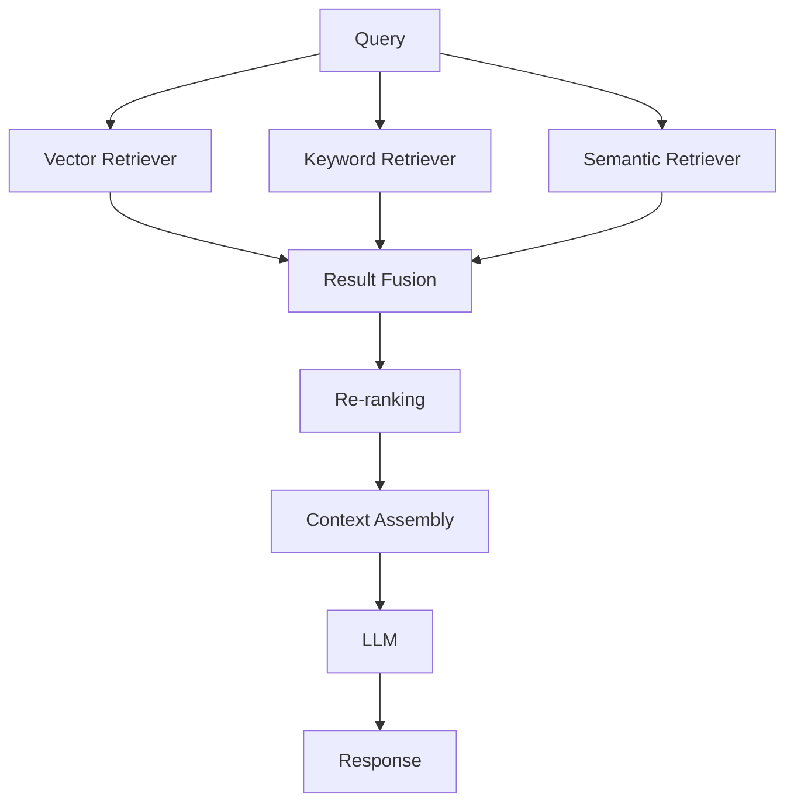

# Hybrid RAG Pattern

## Overview

Hybrid RAG combines multiple retrieval strategies (vector search, keyword search, semantic search) to improve recall and accuracy. It merges results from different retrieval methods to provide comprehensive context.

## Architecture

### High-Level Architecture

```
Query → Multiple Retrievers → Result Fusion → Re-ranking → Context Assembly → LLM
```

### Components

- **Vector Retriever**: Vector similarity search
- **Keyword Retriever**: BM25 or keyword-based search
- **Semantic Retriever**: Semantic search (if different from vector)
- **Fusion Strategy**: Combines results (RRF, weighted, etc.)
- **Re-ranker**: Final relevance ranking

### Data Flow

1. Query triggers multiple retrieval strategies in parallel
2. Each retriever returns ranked results
3. Results are fused using fusion strategy (e.g., Reciprocal Rank Fusion)
4. Fused results are re-ranked
5. Top results form context
6. LLM generates response

## When to Use

### Ideal Use Cases
- Large, diverse document corpora
- Queries benefit from multiple search strategies
- Need high recall (finding all relevant documents)
- Mix of structured and unstructured data
- Queries with both semantic and keyword components

### Characteristics of Suitable Problems
- Document corpus has varied content types
- Queries mix semantic and exact match needs
- High recall is important
- Multiple retrieval strategies available

## When NOT to Use

### Anti-Patterns
- Simple, homogeneous document sets
- Latency-critical applications
- Limited computational resources
- Single retrieval strategy sufficient

## Implementation Examples

### LangChain Implementation

```python
from langchain.retrievers import BM25Retriever
from langchain.vectorstores import ChromaDB
from langchain.retrievers import EnsembleRetriever

# Vector retriever
vectorstore = ChromaDB(...)
vector_retriever = vectorstore.as_retriever()

# Keyword retriever (BM25)
bm25_retriever = BM25Retriever.from_documents(documents)

# Hybrid ensemble retriever
ensemble_retriever = EnsembleRetriever(
    retrievers=[vector_retriever, bm25_retriever],
    weights=[0.5, 0.5]  # Equal weighting
)
```

## Performance Characteristics

### Latency
- Typical latency: 300-800ms (parallel retrieval)
- Fusion overhead is minimal

### Throughput
- Typical throughput: 8-30 requests/second
- Parallel retrieval helps maintain throughput

## Trade-offs

### Advantages
- Higher recall than single strategy
- Combines strengths of different methods
- More robust to query variations
- Better for diverse document types

### Disadvantages
- More complex implementation
- Higher computational cost
- Requires tuning fusion weights
- May retrieve more documents than needed

## Architecture Diagram



## Related Patterns
- [Multi-Query RAG](./multi-query-rag.md) - Multiple query perspectives
- [Reranking RAG](./reranking-rag.md) - Advanced re-ranking

## References
- [RAG Strategies Video](https://youtu.be/tLMViADvSNE?si=C8Zq1H0Uww_FpxZ7)

## Version History
- **v1.0** (2025-11-08): Initial version

