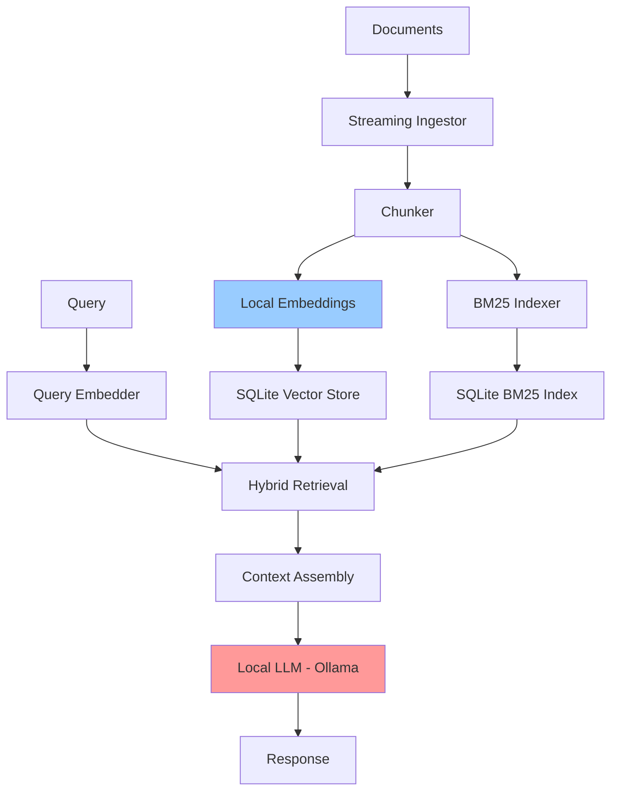

# Local/Privacy-Preserving RAG Pattern

## Overview

Local RAG enables retrieval-augmented generation entirely on consumer hardware without cloud dependencies, addressing privacy concerns for sensitive data like healthcare records, legal documents, and proprietary business information. This pattern is essential for GDPR/HIPAA compliance scenarios where data cannot leave the organization.

**Key Innovation**: The CUBO framework (arXiv:2602.03731, February 2026) demonstrates competitive RAG performance on consumer laptops with just 16GB RAM, processing 10GB corpora through streaming ingestion, tiered hybrid retrieval, and hardware-aware orchestration.

> "Organizations handling sensitive documents face a tension: cloud-based AI risks GDPR violations, while local systems typically require 18-32 GB RAM. CUBO enables competitive Recall@10 (0.48-0.97 across BEIR domains) within a hard 15.5 GB RAM ceiling."

## Architecture

### High-Level Architecture

```
Documents -> Streaming Ingestion (O(1) buffer) ->
   [Local Embeddings | BM25 Index] ->
   Tiered Hybrid Retrieval -> Local LLM -> Response
```

### Components

- **Streaming Ingestor**: O(1) memory buffer for document processing
- **Local Embedding Model**: Quantized models (e.g., all-MiniLM-L6-v2)
- **Memory-Efficient Vector Store**: SQLite-backed or memory-mapped indices
- **BM25 Index**: Keyword search for hybrid retrieval
- **Local LLM**: Ollama, llama.cpp, or similar (quantized models)
- **Hardware Orchestrator**: Manages memory/compute allocation

### Data Flow

1. Documents streamed and chunked (constant memory usage)
2. Chunks embedded with local model (batched for efficiency)
3. Embeddings stored in memory-efficient index
4. Query triggers hybrid retrieval (vector + BM25)
5. Results passed to local LLM
6. Response generated entirely on-device

## When to Use

### Ideal Use Cases
- **Healthcare**: Patient records that cannot leave premises (HIPAA)
- **Legal**: Confidential case files and contracts
- **Finance**: Proprietary trading strategies, client data
- **Government**: Classified or sensitive documents
- **Enterprise**: Internal documents with strict data governance
- **Air-gapped environments**: No internet connectivity

### Characteristics of Suitable Problems
- Data privacy is paramount
- Regulatory compliance required (GDPR, HIPAA, SOC2)
- Sensitive PII/PHI that cannot be sent to cloud
- Air-gapped or restricted network environments
- Cost-sensitive (no API costs)
- Acceptable latency (slower than cloud)

## When NOT to Use

### Anti-Patterns
- Need for frontier model capabilities (GPT-4, Claude Opus)
- Ultra-low latency requirements
- Very large corpora (>100GB) without specialized hardware
- Complex multi-modal analysis requiring cloud vision models
- Real-time streaming at scale

### Characteristics of Unsuitable Problems
- Data is already public or non-sensitive
- Cloud APIs provide necessary compliance (BAA in place)
- Hardware constraints too severe (< 8GB RAM)
- Need for highest accuracy (frontier models)

## Implementation Examples

### CUBO-Style Memory-Efficient RAG

```python
import sqlite3
from pathlib import Path
from typing import List, Dict, Generator
import numpy as np
from sentence_transformers import SentenceTransformer
import subprocess
import json

class LocalRAG:
    """
    Privacy-preserving RAG running entirely on local hardware.

    Based on CUBO (arXiv:2602.03731) principles:
    - Streaming ingestion with O(1) memory
    - Tiered hybrid retrieval
    - Hardware-aware orchestration
    """

    def __init__(
        self,
        db_path: str = "./local_rag.db",
        embedding_model: str = "all-MiniLM-L6-v2",
        llm_model: str = "llama3.2:3b",
        max_memory_mb: int = 4096
    ):
        """
        Initialize local RAG system.

        Args:
            db_path: SQLite database path for persistent storage
            embedding_model: Local embedding model (small for memory efficiency)
            llm_model: Ollama model name
            max_memory_mb: Maximum memory budget in MB
        """

        self.db_path = db_path
        self.max_memory_mb = max_memory_mb

        # Use small, efficient embedding model
        self.embedder = SentenceTransformer(embedding_model)
        self.embedding_dim = self.embedder.get_sentence_embedding_dimension()

        # Initialize SQLite for persistent, memory-mapped storage
        self._init_database()

        # Ollama for local LLM
        self.llm_model = llm_model

    def _init_database(self):
        """Initialize SQLite database with vector storage."""

        conn = sqlite3.connect(self.db_path)
        cursor = conn.cursor()

        # Create tables
        cursor.execute('''
            CREATE TABLE IF NOT EXISTS documents (
                id INTEGER PRIMARY KEY,
                content TEXT NOT NULL,
                metadata TEXT,
                embedding BLOB
            )
        ''')

        cursor.execute('''
            CREATE TABLE IF NOT EXISTS bm25_index (
                doc_id INTEGER,
                term TEXT,
                tf REAL,
                FOREIGN KEY (doc_id) REFERENCES documents(id)
            )
        ''')

        cursor.execute('CREATE INDEX IF NOT EXISTS idx_terms ON bm25_index(term)')

        conn.commit()
        conn.close()

    def streaming_ingest(
        self,
        documents: Generator[str, None, None],
        chunk_size: int = 500,
        batch_size: int = 32
    ) -> int:
        """
        Ingest documents with streaming (constant memory usage).

        CUBO key insight: O(1) buffer overhead regardless of corpus size.

        Args:
            documents: Generator yielding document strings
            chunk_size: Characters per chunk
            batch_size: Embeddings batch size

        Returns:
            Number of chunks ingested
        """

        conn = sqlite3.connect(self.db_path)
        cursor = conn.cursor()

        chunk_buffer = []
        total_chunks = 0

        for doc in documents:
            # Chunk document
            chunks = self._chunk_document(doc, chunk_size)

            for chunk in chunks:
                chunk_buffer.append(chunk)

                # Process batch when buffer full
                if len(chunk_buffer) >= batch_size:
                    self._process_batch(cursor, chunk_buffer)
                    total_chunks += len(chunk_buffer)
                    chunk_buffer = []  # Clear buffer (O(1) memory)

                    # Periodic commit
                    if total_chunks % 1000 == 0:
                        conn.commit()
                        print(f"Ingested {total_chunks} chunks...")

        # Process remaining
        if chunk_buffer:
            self._process_batch(cursor, chunk_buffer)
            total_chunks += len(chunk_buffer)

        conn.commit()
        conn.close()

        print(f"Total ingested: {total_chunks} chunks")
        return total_chunks

    def _chunk_document(self, doc: str, chunk_size: int) -> List[str]:
        """Chunk document with sentence awareness."""

        words = doc.split()
        chunks = []
        current_chunk = []
        current_length = 0

        for word in words:
            if current_length + len(word) > chunk_size and current_chunk:
                chunks.append(' '.join(current_chunk))
                # Overlap: keep last few words
                current_chunk = current_chunk[-10:]
                current_length = sum(len(w) for w in current_chunk)

            current_chunk.append(word)
            current_length += len(word) + 1

        if current_chunk:
            chunks.append(' '.join(current_chunk))

        return chunks

    def _process_batch(self, cursor, chunks: List[str]):
        """Process and store a batch of chunks."""

        # Generate embeddings in batch
        embeddings = self.embedder.encode(chunks, convert_to_numpy=True)

        for chunk, embedding in zip(chunks, embeddings):
            # Store document with embedding
            cursor.execute(
                'INSERT INTO documents (content, embedding) VALUES (?, ?)',
                (chunk, embedding.tobytes())
            )
            doc_id = cursor.lastrowid

            # Build BM25 index
            terms = self._tokenize(chunk)
            term_counts = {}
            for term in terms:
                term_counts[term] = term_counts.get(term, 0) + 1

            for term, count in term_counts.items():
                tf = count / len(terms)
                cursor.execute(
                    'INSERT INTO bm25_index (doc_id, term, tf) VALUES (?, ?, ?)',
                    (doc_id, term, tf)
                )

    def _tokenize(self, text: str) -> List[str]:
        """Simple tokenization for BM25."""
        import re
        return re.findall(r'\w+', text.lower())

    def hybrid_retrieve(
        self,
        query: str,
        n_results: int = 5,
        vector_weight: float = 0.6,
        bm25_weight: float = 0.4
    ) -> List[Dict]:
        """
        Tiered hybrid retrieval combining vector and BM25 search.

        CUBO approach: Hybrid retrieval improves recall significantly.

        Args:
            query: Search query
            n_results: Number of results
            vector_weight: Weight for vector similarity
            bm25_weight: Weight for BM25 score

        Returns:
            List of retrieved documents with scores
        """

        conn = sqlite3.connect(self.db_path)
        cursor = conn.cursor()

        # Vector search
        query_embedding = self.embedder.encode(query, convert_to_numpy=True)
        vector_results = self._vector_search(cursor, query_embedding, n_results * 2)

        # BM25 search
        bm25_results = self._bm25_search(cursor, query, n_results * 2)

        conn.close()

        # Combine with reciprocal rank fusion
        combined = self._reciprocal_rank_fusion(
            vector_results,
            bm25_results,
            vector_weight,
            bm25_weight
        )

        return combined[:n_results]

    def _vector_search(self, cursor, query_embedding: np.ndarray, n: int) -> List[Dict]:
        """Vector similarity search using SQLite."""

        cursor.execute('SELECT id, content, embedding FROM documents')
        rows = cursor.fetchall()

        results = []
        for doc_id, content, emb_bytes in rows:
            doc_embedding = np.frombuffer(emb_bytes, dtype=np.float32)
            similarity = np.dot(query_embedding, doc_embedding) / (
                np.linalg.norm(query_embedding) * np.linalg.norm(doc_embedding)
            )
            results.append({
                'id': doc_id,
                'content': content,
                'score': float(similarity),
                'source': 'vector'
            })

        results.sort(key=lambda x: x['score'], reverse=True)
        return results[:n]

    def _bm25_search(self, cursor, query: str, n: int) -> List[Dict]:
        """BM25 keyword search."""

        query_terms = self._tokenize(query)

        # Simple BM25 scoring
        cursor.execute('''
            SELECT d.id, d.content, SUM(b.tf) as score
            FROM documents d
            JOIN bm25_index b ON d.id = b.doc_id
            WHERE b.term IN ({})
            GROUP BY d.id
            ORDER BY score DESC
            LIMIT ?
        '''.format(','.join('?' * len(query_terms))), query_terms + [n])

        results = []
        for doc_id, content, score in cursor.fetchall():
            results.append({
                'id': doc_id,
                'content': content,
                'score': float(score),
                'source': 'bm25'
            })

        return results

    def _reciprocal_rank_fusion(
        self,
        vector_results: List[Dict],
        bm25_results: List[Dict],
        vector_weight: float,
        bm25_weight: float
    ) -> List[Dict]:
        """Combine results using reciprocal rank fusion."""

        k = 60  # RRF constant
        scores = {}
        contents = {}

        for rank, result in enumerate(vector_results):
            doc_id = result['id']
            scores[doc_id] = scores.get(doc_id, 0) + vector_weight / (k + rank + 1)
            contents[doc_id] = result['content']

        for rank, result in enumerate(bm25_results):
            doc_id = result['id']
            scores[doc_id] = scores.get(doc_id, 0) + bm25_weight / (k + rank + 1)
            contents[doc_id] = result['content']

        # Sort by combined score
        combined = [
            {'id': doc_id, 'content': contents[doc_id], 'score': score}
            for doc_id, score in sorted(scores.items(), key=lambda x: x[1], reverse=True)
        ]

        return combined

    def query(self, question: str, n_context: int = 5) -> str:
        """
        Full RAG query with local LLM.

        Args:
            question: User question
            n_context: Number of context documents

        Returns:
            Generated answer
        """

        # Retrieve relevant context
        results = self.hybrid_retrieve(question, n_results=n_context)
        context = "\n\n".join([r['content'] for r in results])

        # Generate with local Ollama
        prompt = f"""Answer the question using only the provided context.

Context:
{context}

Question: {question}

Answer:"""

        # Call Ollama
        response = subprocess.run(
            ['ollama', 'run', self.llm_model, prompt],
            capture_output=True,
            text=True
        )

        return response.stdout.strip()


# Example usage
def ingest_medical_records():
    """Example: Ingest medical records locally for HIPAA compliance."""

    rag = LocalRAG(
        db_path="./hipaa_compliant_rag.db",
        embedding_model="all-MiniLM-L6-v2",
        llm_model="llama3.2:3b",  # Small model for 16GB RAM
        max_memory_mb=4096
    )

    # Streaming ingest from files
    def document_generator():
        records_dir = Path("./patient_records")
        for file_path in records_dir.glob("*.txt"):
            yield file_path.read_text()

    # Ingest with constant memory
    rag.streaming_ingest(document_generator())

    # Query locally - no data leaves the machine
    answer = rag.query("What medications is patient John Doe currently taking?")
    print(answer)


if __name__ == "__main__":
    ingest_medical_records()
```

### Ollama Integration for Local LLM

```python
class OllamaLocalLLM:
    """
    Local LLM using Ollama for privacy-preserving generation.

    Recommended models for 16GB RAM:
    - llama3.2:3b (fastest, good quality)
    - llama3.2:7b (better quality, slower)
    - mistral:7b (good balance)
    - phi3:mini (very fast, smaller)
    """

    MODELS_BY_RAM = {
        8: ["phi3:mini", "llama3.2:1b"],
        16: ["llama3.2:3b", "mistral:7b-instruct-q4_0"],
        32: ["llama3.2:7b", "llama3.1:8b", "mixtral:8x7b-q4_0"],
        64: ["llama3.1:70b-q4_0", "qwen2.5:32b"]
    }

    def __init__(self, model: str = None, ram_gb: int = 16):
        """
        Initialize with appropriate model for available RAM.

        Args:
            model: Specific model name, or auto-select based on RAM
            ram_gb: Available RAM in GB
        """

        if model:
            self.model = model
        else:
            # Auto-select based on RAM
            for ram_threshold in sorted(self.MODELS_BY_RAM.keys(), reverse=True):
                if ram_gb >= ram_threshold:
                    self.model = self.MODELS_BY_RAM[ram_threshold][0]
                    break

        print(f"Using local model: {self.model}")

    def generate(self, prompt: str, max_tokens: int = 1024) -> str:
        """Generate response using local Ollama."""

        import subprocess

        result = subprocess.run(
            ['ollama', 'run', self.model, prompt],
            capture_output=True,
            text=True,
            timeout=120
        )

        if result.returncode != 0:
            raise RuntimeError(f"Ollama error: {result.stderr}")

        return result.stdout.strip()

    def generate_streaming(self, prompt: str) -> Generator[str, None, None]:
        """Stream response for better UX."""

        import subprocess

        process = subprocess.Popen(
            ['ollama', 'run', self.model, prompt],
            stdout=subprocess.PIPE,
            stderr=subprocess.PIPE,
            text=True
        )

        for line in process.stdout:
            yield line

        process.wait()
```

## Performance Characteristics

### Hardware Requirements (CUBO Benchmarks)

| Configuration | Corpus Size | RAM Usage | Recall@10 |
|--------------|-------------|-----------|-----------|
| 16GB RAM | 10GB | 15.5GB | 0.48-0.97 |
| 32GB RAM | 25GB | 28GB | 0.55-0.98 |
| 64GB RAM | 50GB+ | 55GB | 0.60-0.99 |

### Latency

- **Embedding**: 50-200ms per query (local model)
- **Vector Search**: 100-500ms (SQLite/memory-mapped)
- **BM25 Search**: 50-200ms
- **LLM Generation**: 2-10 seconds (depends on model size)
- **Total**: 3-15 seconds (acceptable for privacy-critical use cases)

### Throughput

- **Ingestion**: 100-500 documents/minute (streaming)
- **Queries**: 2-10 queries/minute (single user)
- **Concurrent**: Limited by hardware (1-2 concurrent queries on 16GB)

## Trade-offs

### Advantages
- **Complete Privacy**: Data never leaves the device
- **GDPR/HIPAA Compliant**: No data transfer to third parties
- **No API Costs**: One-time hardware investment
- **Air-Gap Compatible**: Works without internet
- **Data Sovereignty**: Full control over data location

### Disadvantages
- **Lower Quality**: Local models < frontier cloud models
- **Higher Latency**: 3-15 seconds vs. 1-3 seconds cloud
- **Hardware Dependent**: Requires adequate local resources
- **Maintenance**: Self-managed infrastructure
- **Limited Scale**: Not suitable for high-volume workloads

### Considerations
- Use quantized models (Q4, Q5) for memory efficiency
- Implement streaming ingestion for large corpora
- Hybrid retrieval significantly improves recall
- Consider dedicated GPU for better performance
- Monitor memory usage to prevent OOM

## Architecture Diagram



## Deployment Options

### Consumer Laptop (16GB RAM)
- Model: llama3.2:3b or phi3:mini
- Corpus: Up to 10GB
- Use case: Individual practitioner, small clinic

### Workstation (32-64GB RAM)
- Model: llama3.1:8b or mixtral
- Corpus: Up to 50GB
- Use case: Department-level deployment

### On-Premises Server (128GB+ RAM)
- Model: llama3.1:70b or larger
- Corpus: 100GB+
- Use case: Enterprise healthcare system

## Related Patterns
- [Basic RAG](./basic-rag.md) - Foundation pattern
- [Hybrid RAG](./hybrid-rag.md) - Hybrid retrieval approach
- [Medical RAG](./medical-rag.md) - Healthcare-specific patterns

## References
- [CUBO: Self-Contained RAG on Consumer Laptops (Feb 2026)](https://arxiv.org/abs/2602.03731)
- [Ollama - Run LLMs Locally](https://ollama.ai/)
- [llama.cpp - Efficient Local LLM Inference](https://github.com/ggerganov/llama.cpp)
- [GDPR and AI: Data Protection Requirements](https://gdpr.eu/)
- [HIPAA Compliance for AI Systems](https://www.hhs.gov/hipaa/)

## Version History
- **v1.0** (2026-02-04): Initial Local RAG pattern based on CUBO (arXiv:2602.03731)
