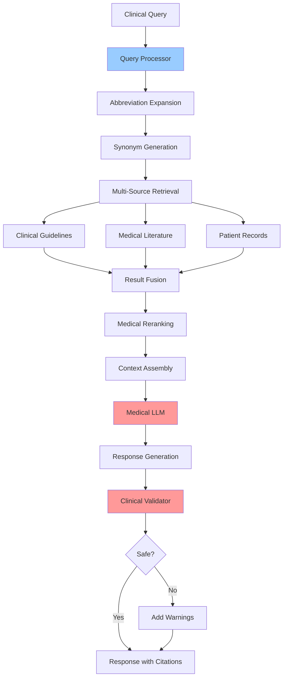

# Medical RAG Best Practices Pattern

## Overview

Medical RAG is a specialized RAG pattern optimized for the medical domain, addressing unique challenges like medical terminology, clinical accuracy requirements, and regulatory compliance. This pattern is based on industrial best practices research from February 2026.

**Key Innovation**: Unlike generic RAG, Medical RAG requires domain-specific optimizations at every component: specialized chunking for clinical notes, medical-aware retrievers, clinical validation of responses, and healthcare compliance integration.

> **Research Foundation**: This pattern is based on "Pursuing Best Industrial Practices for Retrieval-Augmented Generation in the Medical Domain" (arXiv:2602.03368, February 2026), which systematically analyzed each RAG component for healthcare applications.

## Architecture

### High-Level Architecture

```
Clinical Query -> Medical Query Processing ->
   [Medical Embeddings | Clinical Terminology Expansion] ->
   Medical Knowledge Retrieval -> Clinical Validation ->
   Medical LLM Generation -> Safety Check -> Response
```

### Components

- **Medical Query Processor**: Handles clinical terminology, abbreviations, and query normalization
- **Clinical Chunker**: Domain-aware document chunking preserving clinical context
- **Medical Retriever**: Embeddings optimized for medical vocabulary (BioMed-BERT, PubMedBERT)
- **Knowledge Sources**: Clinical guidelines, medical literature, patient records
- **Clinical Validator**: Validates retrieved content and generated responses for medical accuracy
- **Safety Filter**: Checks for contraindications, drug interactions, critical alerts

### Data Flow

1. Clinical query received (may contain medical abbreviations, terminology)
2. Query expanded with medical synonyms and related terms
3. Medical-optimized embeddings generate query vector
4. Retrieval from medical knowledge bases (guidelines, literature, EHR)
5. Retrieved documents validated for relevance and currency
6. Medical LLM generates response with citations
7. Safety checks applied (contraindications, alerts)
8. Response with confidence level and sources returned

## When to Use

### Ideal Use Cases
- Clinical decision support systems
- Medical literature search and summarization
- Patient record summarization
- Drug interaction checking
- Clinical guideline retrieval
- Medical education and training systems
- Healthcare chatbots and virtual assistants

### Characteristics of Suitable Problems
- Requires medical domain expertise
- Clinical accuracy is critical
- Regulatory compliance required (HIPAA, FDA)
- Need for traceable, citable sources
- Medical terminology is prevalent
- Patient safety considerations

## When NOT to Use

### Anti-Patterns
- General-purpose Q&A (use basic RAG)
- Non-medical domains
- Informal health advice (liability concerns)
- Replacing physician judgment

### Characteristics of Unsuitable Problems
- No regulatory oversight needed
- Medical accuracy not critical
- General health information sufficient
- No need for clinical citations

## Implementation Examples

### Medical Query Processing

```python
import anthropic
from typing import List, Dict
import re

class MedicalQueryProcessor:
    """
    Process medical queries with terminology expansion and normalization.

    Based on best practices from arXiv:2602.03368
    """

    # Common medical abbreviations
    MEDICAL_ABBREVIATIONS = {
        'CHF': 'congestive heart failure',
        'MI': 'myocardial infarction',
        'HTN': 'hypertension',
        'DM': 'diabetes mellitus',
        'T2DM': 'type 2 diabetes mellitus',
        'COPD': 'chronic obstructive pulmonary disease',
        'CKD': 'chronic kidney disease',
        'CAD': 'coronary artery disease',
        'AF': 'atrial fibrillation',
        'DVT': 'deep vein thrombosis',
        'PE': 'pulmonary embolism',
        'UTI': 'urinary tract infection',
        'GERD': 'gastroesophageal reflux disease',
        'RA': 'rheumatoid arthritis',
        'OA': 'osteoarthritis',
    }

    def __init__(self):
        self.client = anthropic.Anthropic()

    def expand_abbreviations(self, query: str) -> str:
        """Expand medical abbreviations in query."""
        expanded = query
        for abbrev, full_form in self.MEDICAL_ABBREVIATIONS.items():
            # Case-insensitive replacement, preserve original if already expanded
            pattern = r'\b' + abbrev + r'\b'
            if re.search(pattern, expanded, re.IGNORECASE):
                expanded = re.sub(pattern, f'{abbrev} ({full_form})', expanded, flags=re.IGNORECASE)
        return expanded

    def generate_medical_query_variants(self, query: str) -> List[str]:
        """
        Generate query variants with medical synonyms.

        This improves recall by searching for related medical terms.
        """

        message = self.client.messages.create(
            model="claude-3-5-haiku-20241022",
            max_tokens=512,
            messages=[{
                "role": "user",
                "content": f"""Generate 3 alternative medical search queries for:
"{query}"

Requirements:
- Use medical synonyms and related terms
- Include both lay terms and clinical terminology
- Maintain the clinical intent

Return only the 3 queries, one per line."""
            }]
        )

        variants = [query]  # Include original
        variants.extend(message.content[0].text.strip().split('\n'))

        return variants[:4]  # Limit to 4 total

    def process_query(self, query: str) -> Dict:
        """
        Full medical query processing pipeline.

        Returns processed query with expansions and variants.
        """

        # Step 1: Expand abbreviations
        expanded_query = self.expand_abbreviations(query)

        # Step 2: Generate variants with medical synonyms
        query_variants = self.generate_medical_query_variants(expanded_query)

        return {
            'original': query,
            'expanded': expanded_query,
            'variants': query_variants
        }


# Example usage
processor = MedicalQueryProcessor()
result = processor.process_query("Treatment options for T2DM with CKD stage 3")
print(f"Expanded: {result['expanded']}")
print(f"Variants: {result['variants']}")
```

### Medical-Optimized Chunking

```python
class ClinicalDocumentChunker:
    """
    Chunk clinical documents preserving medical context.

    Key insight from arXiv:2602.03368: Clinical notes have specific
    structure (SOAP notes, sections) that should inform chunking.
    """

    # Clinical note sections to preserve together
    CLINICAL_SECTIONS = [
        'Chief Complaint',
        'History of Present Illness',
        'Past Medical History',
        'Medications',
        'Allergies',
        'Social History',
        'Family History',
        'Review of Systems',
        'Physical Examination',
        'Assessment',
        'Plan',
        'Impression',
        'Recommendations'
    ]

    def __init__(self, max_chunk_size: int = 1000, overlap: int = 100):
        self.max_chunk_size = max_chunk_size
        self.overlap = overlap

    def chunk_clinical_note(self, note: str, metadata: dict = None) -> List[Dict]:
        """
        Chunk clinical note preserving section boundaries.

        Unlike generic chunking, this keeps clinical sections intact
        when possible, improving retrieval accuracy.
        """

        chunks = []

        # Try to identify sections
        sections = self._identify_sections(note)

        if sections:
            # Chunk by clinical sections
            for section_name, section_content in sections:
                if len(section_content) <= self.max_chunk_size:
                    # Section fits in one chunk
                    chunks.append({
                        'content': f"[{section_name}]\n{section_content}",
                        'section': section_name,
                        'metadata': metadata
                    })
                else:
                    # Section too large, subdivide with overlap
                    sub_chunks = self._chunk_text(section_content)
                    for i, sub_chunk in enumerate(sub_chunks):
                        chunks.append({
                            'content': f"[{section_name} - Part {i+1}]\n{sub_chunk}",
                            'section': section_name,
                            'metadata': metadata
                        })
        else:
            # Fallback to standard chunking with sentence awareness
            chunks = self._chunk_text(note, with_metadata=metadata)

        return chunks

    def _identify_sections(self, note: str) -> List[tuple]:
        """Identify clinical sections in note."""

        sections = []
        current_section = "General"
        current_content = []

        for line in note.split('\n'):
            # Check if line is a section header
            is_header = False
            for section in self.CLINICAL_SECTIONS:
                if line.strip().upper().startswith(section.upper()):
                    # Save previous section
                    if current_content:
                        sections.append((current_section, '\n'.join(current_content)))
                    current_section = section
                    current_content = []
                    is_header = True
                    break

            if not is_header:
                current_content.append(line)

        # Add final section
        if current_content:
            sections.append((current_section, '\n'.join(current_content)))

        return sections

    def _chunk_text(self, text: str, with_metadata: dict = None) -> List:
        """Standard text chunking with sentence awareness."""

        # Split by sentences
        sentences = re.split(r'(?<=[.!?])\s+', text)

        chunks = []
        current_chunk = []
        current_length = 0

        for sentence in sentences:
            if current_length + len(sentence) > self.max_chunk_size and current_chunk:
                # Save current chunk
                chunk_text = ' '.join(current_chunk)
                chunks.append(chunk_text if not with_metadata else {
                    'content': chunk_text,
                    'metadata': with_metadata
                })

                # Start new chunk with overlap
                overlap_sentences = current_chunk[-2:] if len(current_chunk) > 2 else current_chunk[-1:]
                current_chunk = overlap_sentences + [sentence]
                current_length = sum(len(s) for s in current_chunk)
            else:
                current_chunk.append(sentence)
                current_length += len(sentence)

        # Add final chunk
        if current_chunk:
            chunk_text = ' '.join(current_chunk)
            chunks.append(chunk_text if not with_metadata else {
                'content': chunk_text,
                'metadata': with_metadata
            })

        return chunks
```

### Medical RAG with Clinical Validation

```python
class MedicalRAG:
    """
    Complete Medical RAG system with clinical validation.

    Implements best practices from arXiv:2602.03368:
    - Medical-optimized query processing
    - Clinical chunking
    - Multi-source retrieval
    - Response validation
    """

    def __init__(self):
        self.client = anthropic.Anthropic()
        self.query_processor = MedicalQueryProcessor()
        self.chunker = ClinicalDocumentChunker()
        # Assume vector_store is initialized with medical embeddings

    def query(
        self,
        clinical_question: str,
        patient_context: str = None,
        include_guidelines: bool = True,
        include_literature: bool = True,
        require_citations: bool = True
    ) -> Dict:
        """
        Execute medical RAG query with full pipeline.

        Args:
            clinical_question: The clinical question
            patient_context: Optional patient-specific context
            include_guidelines: Search clinical guidelines
            include_literature: Search medical literature
            require_citations: Require source citations in response

        Returns:
            Medical response with citations and confidence
        """

        # Step 1: Process query
        processed = self.query_processor.process_query(clinical_question)

        # Step 2: Multi-source retrieval
        all_results = []

        for variant in processed['variants']:
            if include_guidelines:
                guidelines = self._search_guidelines(variant)
                all_results.extend(guidelines)

            if include_literature:
                literature = self._search_literature(variant)
                all_results.extend(literature)

        # Deduplicate and rank
        ranked_results = self._rank_and_deduplicate(all_results, clinical_question)

        # Step 3: Build context with source tracking
        context, sources = self._build_context(ranked_results[:10])

        # Step 4: Generate response
        response = self._generate_medical_response(
            question=clinical_question,
            context=context,
            patient_context=patient_context,
            require_citations=require_citations
        )

        # Step 5: Validate response
        validation = self._validate_response(response, clinical_question)

        return {
            'answer': response,
            'sources': sources,
            'confidence': validation['confidence'],
            'warnings': validation.get('warnings', []),
            'query_variants_used': processed['variants']
        }

    def _generate_medical_response(
        self,
        question: str,
        context: str,
        patient_context: str = None,
        require_citations: bool = True
    ) -> str:
        """Generate clinically-appropriate response."""

        citation_instruction = """
Include citations in format [Source: X] where X is the source number.
Every clinical claim must have a citation.""" if require_citations else ""

        patient_section = f"""
PATIENT CONTEXT:
{patient_context}
""" if patient_context else ""

        message = self.client.messages.create(
            model="claude-sonnet-4-20250514",
            max_tokens=2048,
            temperature=0.1,  # Low temperature for clinical accuracy
            messages=[{
                "role": "user",
                "content": f"""You are a clinical decision support assistant.
Answer the clinical question using ONLY the provided medical sources.

{patient_section}

MEDICAL SOURCES:
{context}

CLINICAL QUESTION: {question}

{citation_instruction}

Important:
- Be precise with medical terminology
- State limitations of evidence when applicable
- Include relevant contraindications or warnings
- Do not provide advice outside the source material

CLINICAL RESPONSE:"""
            }]
        )

        return message.content[0].text

    def _validate_response(self, response: str, question: str) -> Dict:
        """
        Validate medical response for accuracy and safety.

        This is a critical step for medical RAG - validates that
        the response is clinically appropriate.
        """

        message = self.client.messages.create(
            model="claude-3-5-haiku-20241022",
            max_tokens=512,
            messages=[{
                "role": "user",
                "content": f"""Evaluate this medical response for clinical appropriateness.

QUESTION: {question}

RESPONSE: {response}

Evaluate:
1. CONFIDENCE (0.0-1.0): How confident in accuracy?
2. WARNINGS: Any safety concerns, missing contraindications, or limitations?
3. CITATIONS: Are claims properly supported?

Return JSON:
{{"confidence": 0.X, "warnings": ["..."], "citations_adequate": true/false}}"""
            }]
        )

        # Parse validation result
        try:
            import json
            validation = json.loads(message.content[0].text)
        except:
            validation = {'confidence': 0.5, 'warnings': ['Validation parsing failed']}

        return validation

    def _search_guidelines(self, query: str) -> List[Dict]:
        """Search clinical guidelines database."""
        # Implementation depends on your guidelines database
        # Could use UpToDate, DynaMed, or custom guideline collection
        pass

    def _search_literature(self, query: str) -> List[Dict]:
        """Search medical literature (PubMed, etc.)."""
        # Implementation depends on literature source
        pass

    def _rank_and_deduplicate(self, results: List[Dict], query: str) -> List[Dict]:
        """Rank and deduplicate retrieval results."""
        # Use cross-encoder reranking for medical domain
        pass

    def _build_context(self, results: List[Dict]) -> tuple:
        """Build context string with source tracking."""
        context_parts = []
        sources = []

        for i, result in enumerate(results, 1):
            context_parts.append(f"[Source {i}]: {result['content']}")
            sources.append({
                'id': i,
                'title': result.get('title', 'Unknown'),
                'type': result.get('type', 'unknown'),
                'date': result.get('date', 'unknown')
            })

        return '\n\n'.join(context_parts), sources
```

## Performance Characteristics

### Latency
- Query processing: 200-500ms (terminology expansion)
- Medical retrieval: 300-800ms (multi-source)
- Response generation: 500-2000ms (with validation)
- Total: 1000-3500ms

### Accuracy Requirements
- **Clinical accuracy**: >95% factual correctness required
- **Citation accuracy**: 100% of claims must be traceable
- **Safety alerts**: 100% of contraindications must be flagged

### Resource Requirements
- Medical embedding models: 2-4GB
- Clinical guidelines index: Varies (10GB-100GB)
- Literature search: API-based or local index

## Trade-offs

### Advantages
- **Clinical accuracy**: Domain-optimized for medical content
- **Safety integration**: Built-in validation and alerts
- **Compliance-ready**: Designed for healthcare regulations
- **Traceable**: Full citation and source tracking
- **Multi-source**: Integrates guidelines, literature, records

### Disadvantages
- **Higher latency**: Validation adds overhead
- **Domain-specific**: Not transferable to other domains
- **Complex setup**: Requires medical knowledge sources
- **Cost**: Medical LLM calls and validation

### Considerations
- Partner with clinical informaticists for terminology
- Regular updates as guidelines change
- Human expert review for critical decisions
- Audit logging for regulatory compliance

## Architecture Diagram



## Healthcare Compliance

### HIPAA Considerations
- **PHI Handling**: Ensure all patient data is encrypted
- **Access Control**: Role-based access to medical records
- **Audit Logging**: Track all queries and responses
- **BAA Requirements**: Ensure BAAs with cloud providers

### FDA Guidance
- **Clinical Decision Support**: Follow FDA guidance on CDS software
- **Risk Classification**: Determine if system requires clearance
- **Documentation**: Maintain design and validation records

## Related Patterns
- [Basic RAG](./basic-rag.md) - Foundation pattern
- [Reranking RAG](./reranking-rag.md) - Cross-encoder reranking
- [Contextual Retrieval](./contextual-retrieval.md) - Context preservation
- [Agentic RAG](./agentic-rag.md) - For complex clinical workflows
- [Multi-Modal RAG](./multi-modal-rag.md) - Medical imaging integration

## References
- [Pursuing Best Industrial Practices for RAG in the Medical Domain (Feb 2026)](https://arxiv.org/abs/2602.03368)
- [Large Language Models in Healthcare and Medical Applications (2025)](https://pmc.ncbi.nlm.nih.gov/articles/PMC12189880/)
- [Evaluating Clinical AI Summaries with LLM-as-Judge (Nov 2025)](https://www.nature.com/articles/s41746-025-02005-2)
- [MedGemma: Google's Medical Foundation Model](https://deepmind.google/technologies/medgemma/)
- [FDA Guidance on Clinical Decision Support Software](https://www.fda.gov/regulatory-information/search-fda-guidance-documents/clinical-decision-support-software)

## Version History
- **v1.0** (2026-02-04): Initial Medical RAG pattern based on arXiv:2602.03368
