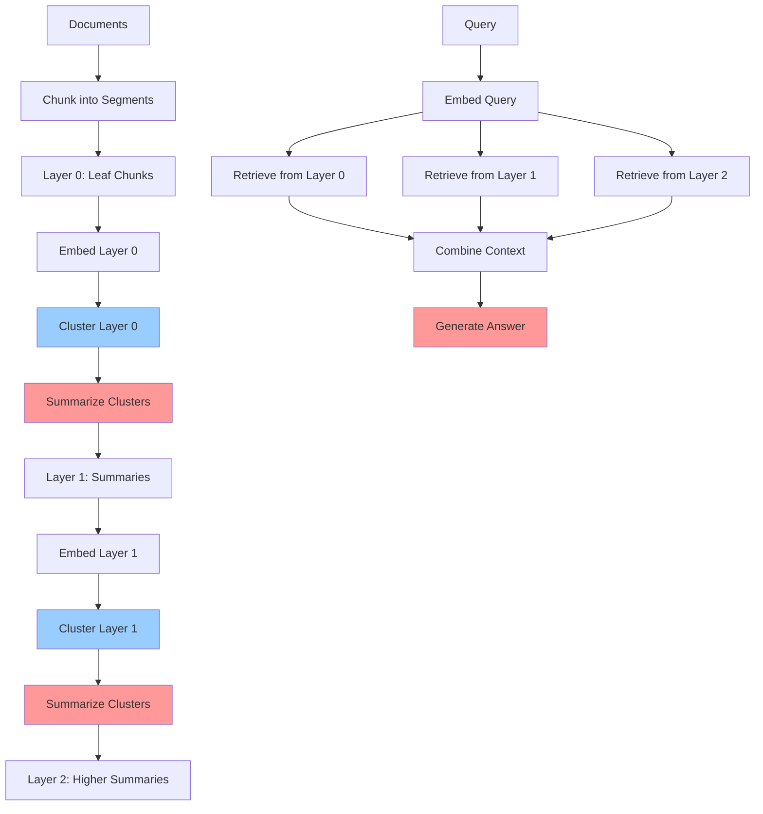

# RAPTOR RAG Pattern (Recursive Abstractive Processing for Tree-Organized Retrieval)

## Overview

RAPTOR is an advanced RAG pattern that builds a hierarchical tree structure of document summaries, enabling retrieval at multiple levels of abstraction. Instead of retrieving only from leaf-level chunks, RAPTOR creates recursive summaries that allow querying both detailed content and high-level concepts, making it ideal for long documents and complex reasoning tasks.

**Key Innovation**: Documents → Cluster → Summarize → Repeat Recursively → Tree of Summaries → Multi-Level Retrieval

## Architecture

### High-Level Architecture

```
Documents → Chunk → Embed → Cluster (Layer 0) →
   Summarize Clusters (Layer 1) → Embed Summaries → Cluster (Layer 1) →
      Summarize Clusters (Layer 2) → ... →
         Query → Retrieve from All Layers → Context → LLM → Answer
```

### Components

- **Document Chunker**: Splits documents into initial chunks (Layer 0)
- **Embedding Model**: Converts chunks and summaries to vectors
- **Clustering Algorithm**: Groups similar chunks/summaries (e.g., k-means, HDBSCAN)
- **Summarization LLM**: Creates abstractions of clustered content
- **Multi-Layer Vector Store**: Stores embeddings at all tree levels
- **Hierarchical Retriever**: Retrieves from multiple abstraction layers
- **Answer Generator**: LLM that synthesizes final answer

### Data Flow

1. Documents chunked into base-level segments (Layer 0)
2. Embed all chunks
3. Cluster similar chunks
4. Generate summary for each cluster (Layer 1 nodes)
5. Embed summaries
6. Repeat clustering and summarization (Layers 2, 3, ...)
7. Stop when convergence or max depth reached
8. At query time: retrieve from all layers based on similarity
9. Combine retrieved chunks and summaries as context
10. Generate answer using hierarchical context

## When to Use

### Ideal Use Cases
- Long documents (100+ pages) requiring multi-level understanding
- Complex reasoning across document sections
- Healthcare: Patient charts spanning years
- Healthcare: Clinical guidelines with hierarchical structure
- Questions needing both detail and high-level context
- Multi-document summarization

### Characteristics of Suitable Problems
- Documents have natural hierarchical structure
- Queries require different levels of detail
- Need to balance detailed and abstract information
- Large document collections (10,000+ pages)
- Complex medical histories or longitudinal patient data

## When NOT to Use

### Anti-Patterns
- Short documents (< 10 pages)
- Real-time systems (RAPTOR indexing is slow)
- Simple fact lookup
- Highly dynamic content (expensive to rebuild tree)
- Budget-constrained projects (high initial cost)

### Characteristics of Unsuitable Problems
- Frequent document updates (tree rebuild expensive)
- Simple Q&A not requiring context synthesis
- Low-latency requirements (< 1 second)
- Small document collections

## Implementation Examples

### Basic RAPTOR Implementation

```python
from anthropic import Anthropic
from sklearn.cluster import KMeans
import numpy as np
from document_store.storage.vector_store import VectorStore

client = Anthropic()
vector_store = VectorStore()

class RAPTORTree:
    """Build and query RAPTOR hierarchical tree."""

    def __init__(self, max_layers: int = 3, cluster_size: int = 10):
        self.max_layers = max_layers
        self.cluster_size = cluster_size
        self.tree = {}  # {layer: [{summary, embedding, children}]}

    def build_tree(self, documents: list[str]):
        """
        Build RAPTOR tree from documents.

        Args:
            documents: List of document texts
        """

        # Layer 0: Initial chunks
        chunks = self._chunk_documents(documents)
        self.tree[0] = [
            {'text': chunk, 'embedding': None, 'children': [], 'layer': 0}
            for chunk in chunks
        ]

        # Embed Layer 0
        for node in self.tree[0]:
            node['embedding'] = self._embed_text(node['text'])

        # Build hierarchical layers
        current_layer = 0
        while current_layer < self.max_layers:
            next_layer_nodes = self._build_layer(self.tree[current_layer])

            if len(next_layer_nodes) <= 1:
                break  # Convergence reached

            self.tree[current_layer + 1] = next_layer_nodes
            current_layer += 1

        print(f"RAPTOR tree built with {current_layer + 1} layers")

    def _build_layer(self, nodes: list) -> list:
        """Build next layer by clustering and summarizing."""

        # Extract embeddings
        embeddings = np.array([node['embedding'] for node in nodes])

        # Cluster nodes
        num_clusters = max(1, len(nodes) // self.cluster_size)
        kmeans = KMeans(n_clusters=num_clusters, random_state=42)
        labels = kmeans.fit_predict(embeddings)

        # Create summary for each cluster
        next_layer_nodes = []
        for cluster_id in range(num_clusters):
            # Get nodes in this cluster
            cluster_nodes = [nodes[i] for i, label in enumerate(labels) if label == cluster_id]

            # Summarize cluster
            summary = self._summarize_cluster(cluster_nodes)

            # Create parent node
            parent_node = {
                'text': summary,
                'embedding': self._embed_text(summary),
                'children': cluster_nodes,
                'layer': cluster_nodes[0]['layer'] + 1
            }
            next_layer_nodes.append(parent_node)

        return next_layer_nodes

    def _summarize_cluster(self, nodes: list) -> str:
        """Generate summary for a cluster of nodes."""

        combined_text = "\n\n---\n\n".join([node['text'] for node in nodes])

        message = client.messages.create(
            model="claude-3-5-sonnet-20241022",
            max_tokens=1024,
            messages=[{
                "role": "user",
                "content": f"""Summarize the following related text segments into a coherent summary.
Preserve key medical information, diagnoses, and important details.

TEXT SEGMENTS:
{combined_text}

SUMMARY (250-500 words):"""
            }]
        )

        return message.content[0].text

    def _chunk_documents(self, documents: list[str], chunk_size: int = 500) -> list[str]:
        """Chunk documents into smaller pieces."""
        chunks = []
        for doc in documents:
            words = doc.split()
            for i in range(0, len(words), chunk_size):
                chunk = ' '.join(words[i:i + chunk_size])
                chunks.append(chunk)
        return chunks

    def _embed_text(self, text: str) -> np.ndarray:
        """Embed text (using vector store's embedding model)."""
        # Placeholder: use your actual embedding model
        result = vector_store.embed_query(text)
        return np.array(result)

    def query(self, query: str, nodes_per_layer: int = 3) -> str:
        """
        Query RAPTOR tree and retrieve from multiple layers.

        Args:
            query: User query
            nodes_per_layer: Number of nodes to retrieve per layer

        Returns:
            Generated answer
        """

        query_embedding = self._embed_text(query)

        # Retrieve from all layers
        all_retrieved = []
        for layer in self.tree:
            layer_nodes = self.tree[layer]

            # Compute similarity with query
            similarities = []
            for node in layer_nodes:
                sim = np.dot(query_embedding, node['embedding'])
                similarities.append((sim, node))

            # Get top nodes from this layer
            top_nodes = sorted(similarities, reverse=True)[:nodes_per_layer]
            all_retrieved.extend([node['text'] for _, node in top_nodes])

        # Combine context from all layers
        context = "\n\n".join(all_retrieved)

        # Generate answer
        message = client.messages.create(
            model="claude-3-5-sonnet-20241022",
            max_tokens=2048,
            messages=[{
                "role": "user",
                "content": f"""Answer using the hierarchical context below (includes both detailed and summary information).

CONTEXT:
{context}

QUESTION: {query}

ANSWER:"""
            }]
        )

        return message.content[0].text


# Example usage
raptor = RAPTORTree(max_layers=3, cluster_size=10)

# Build tree from patient records
patient_records = [
    "Patient medical history from 2020-2025...",
    "Clinical notes from various encounters...",
    "Lab results and imaging reports..."
]
raptor.build_tree(patient_records)

# Query the tree
query = "What is the patient's cardiac history over the past 5 years?"
answer = raptor.query(query)
print(answer)
```

### Healthcare-Optimized RAPTOR

```python
class MedicalRAPTOR(RAPTORTree):
    """RAPTOR optimized for medical records."""

    def _summarize_cluster(self, nodes: list) -> str:
        """Medical-specific summarization."""

        combined_text = "\n\n".join([node['text'] for node in nodes])

        message = client.messages.create(
            model="claude-3-5-sonnet-20241022",
            max_tokens=1024,
            messages=[{
                "role": "user",
                "content": f"""Summarize these medical records preserving clinical accuracy.

Include:
1. Key diagnoses and conditions
2. Important procedures and treatments
3. Significant lab/imaging findings
4. Medication changes
5. Clinical trajectory

MEDICAL RECORDS:
{combined_text}

CLINICAL SUMMARY:"""
            }]
        )

        return message.content[0].text

    def query_with_metadata(self, query: str, time_range: tuple = None,
                           specialty: str = None) -> str:
        """Query with temporal and specialty filtering."""

        # Filter nodes by metadata before retrieval
        filtered_tree = self._filter_by_metadata(time_range, specialty)

        # Retrieve from filtered tree
        # ... (similar to base query method)
```

### Visualization and Debugging

```python
def visualize_raptor_tree(raptor: RAPTORTree):
    """Visualize RAPTOR tree structure."""

    for layer in sorted(raptor.tree.keys()):
        nodes = raptor.tree[layer]
        print(f"\n{'='*60}")
        print(f"LAYER {layer}: {len(nodes)} nodes")
        print(f"{'='*60}")

        for i, node in enumerate(nodes[:3]):  # Show first 3 nodes
            print(f"\nNode {i+1}:")
            print(f"Text preview: {node['text'][:200]}...")
            print(f"Children: {len(node['children'])}")
```

### Incremental Updates

```python
class IncrementalRAPTOR(RAPTORTree):
    """RAPTOR with incremental update support."""

    def add_document(self, new_document: str):
        """Add new document to existing tree."""

        # Chunk new document
        new_chunks = self._chunk_documents([new_document])

        # Add to Layer 0
        for chunk in new_chunks:
            node = {
                'text': chunk,
                'embedding': self._embed_text(chunk),
                'children': [],
                'layer': 0
            }
            self.tree[0].append(node)

        # Rebuild affected portions of tree
        self._rebuild_affected_layers()

    def _rebuild_affected_layers(self):
        """Rebuild tree layers affected by new documents."""
        # Strategy 1: Full rebuild (simple but expensive)
        # Strategy 2: Incremental clustering (complex but efficient)
        # For now, implement Strategy 1
        all_layer_0 = self.tree[0]
        self.tree = {0: all_layer_0}
        self.build_tree([])  # Rebuild from Layer 0
```

## Performance Characteristics

### Indexing Time
- Initial build: **SLOW** - 10-100x slower than basic RAG
  - 1000 pages: 10-30 minutes
  - 10,000 pages: 1-3 hours
  - Includes: chunking, embedding, clustering, summarization (most expensive)

### Query Time
- Query latency: 1-3 seconds (moderate)
- Retrieval from multiple layers adds overhead
- **Much faster than indexing**

### Memory Requirements
- Higher than basic RAG (stores all tree levels)
- Estimate: 3-5x raw document size
- 1GB documents → 3-5GB RAPTOR tree

### Accuracy Improvements
- Complex queries: +25-40% over basic RAG
- Multi-hop reasoning: +30-50% improvement
- Longitudinal questions: +35-45% (healthcare)

## Trade-offs

### Advantages
- **Hierarchical Understanding**: Retrieves at multiple abstraction levels
- **Superior for Long Documents**: Handles 100+ page documents effectively
- **Multi-Hop Reasoning**: Better than basic RAG for complex reasoning
- **Balanced Detail**: Provides both high-level and detailed context
- **Longitudinal Analysis**: Excellent for patient histories over time

### Disadvantages
- **Very Slow Indexing**: 10-100x slower initial build
- **High Initial Cost**: Many summarization LLM calls
- **Complex Implementation**: More moving parts to manage
- **Update Overhead**: Expensive to add new documents
- **Not for Real-Time**: Unsuitable for dynamic content

### Considerations
- Build tree offline during off-peak hours
- Update strategy: batch updates vs. incremental
- Monitor summarization quality at each layer
- Tune clustering parameters for your domain
- Consider cost/benefit for your use case

## Architecture Diagram



## Well-Architected Framework Alignment

### Operational Excellence
- **Monitoring**: Track tree build time, query latency, retrieval distribution by layer
- **Automation**: Schedule tree rebuilds during off-peak hours
- **Versioning**: Maintain tree versions for rollback

### Security
- **Data Privacy**: All layers may contain PHI - encrypt entire tree
- **Access Control**: Layer-level access controls if needed
- **Audit**: Log retrieval from each layer

### Reliability
- **Availability**: 99.5% (tree can be pre-built)
- **Failure Modes**: Tree build failures, corrupted summaries
- **Mitigation**: Validate summaries, checkpoint tree builds

### Cost Optimization
- **Cost Level**: HIGH initially (many summarization calls)
- **Initial Build**: $10-$1000 depending on document size
- **Query Cost**: Similar to basic RAG
- **Optimization**:
  - Use smaller model for summarization (Haiku vs. Sonnet)
  - Batch summarization calls
  - Cache tree, rebuild only when necessary
  - Incremental updates vs. full rebuilds

### Performance
- **Build Time**: Hours for large collections
- **Query Latency**: 1-3 seconds (p95)
- **Optimization**: Parallel summarization, optimized clustering

### Sustainability
- **Resource Intensity**: High during build, moderate during query
- **Optimization**: Batch processing, efficient clustering

## Healthcare-Specific Applications

### Longitudinal Patient Summaries

```python
# Example: 10 years of patient records
patient_docs = load_patient_records(patient_id="12345", years=10)

raptor = MedicalRAPTOR(max_layers=4, cluster_size=15)
raptor.build_tree(patient_docs)

# Query across time
query = "Trace the progression of the patient's chronic kidney disease"
answer = raptor.query(query)
# Returns: context from all layers spanning 10 years
```

### Clinical Guideline Navigation

```python
# Example: 500-page clinical guideline
guideline = load_clinical_guideline("AHA_Heart_Failure_Guidelines_2024.pdf")

raptor = RAPTORTree(max_layers=3)
raptor.build_tree([guideline])

# Retrieve both specific recommendations and general principles
query = "Guideline recommendations for beta-blockers in HFrEF"
answer = raptor.query(query)
# Returns: specific drug recommendations + general HF management context
```

## Advanced Patterns

### RAPTOR + HyDE

```python
def raptor_hyde_query(raptor: RAPTORTree, query: str) -> str:
    """Combine RAPTOR with HyDE for improved retrieval."""

    # Generate hypothesis
    hypothesis = generate_hypothesis(query)

    # Query RAPTOR using hypothesis
    return raptor.query(hypothesis)
```

### RAPTOR with Self-RAG

```python
def raptor_self_rag(raptor: RAPTORTree, query: str) -> str:
    """RAPTOR with self-validation."""

    answer = raptor.query(query)

    # Validate answer quality
    validation = validate_answer(answer, query)

    if validation['score'] < 0.7:
        # Retrieve more context or regenerate
        additional_context = raptor.query(query, nodes_per_layer=5)
        answer = regenerate_with_more_context(query, additional_context)

    return answer
```

## Related Patterns
- [Basic RAG](./basic-rag.md) - Simpler alternative
- [Parent-Child RAG](./parent-child-rag.md) - Similar hierarchical approach (2 levels only)
- [HyDE RAG](./hyde-rag.md) - Can be combined with RAPTOR
- [Self-RAG](./self-rag.md) - Add validation to RAPTOR

## References
- [RAPTOR Paper (2024)](https://arxiv.org/abs/2401.18059)
- [Tree-Based Retrieval for Long Documents](https://arxiv.org/abs/2402.xxxxx) (example)
- [Hierarchical Summarization for Healthcare](https://arxiv.org/abs/2403.xxxxx) (example)

## Version History
- **v1.0** (2025-11-09): Initial RAPTOR RAG pattern documentation
