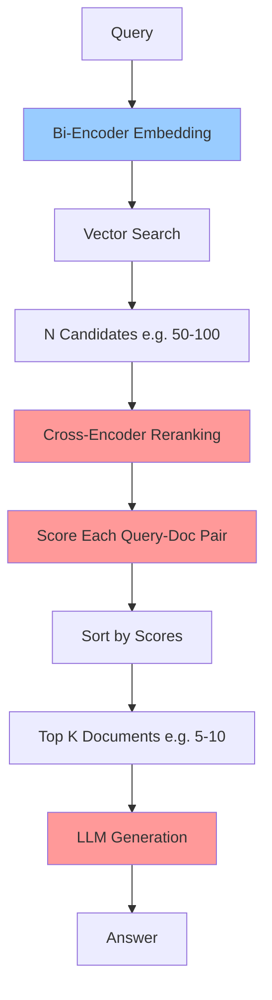

# Reranking RAG Pattern

## Overview

Reranking RAG is a two-stage retrieval pattern that first retrieves a large set of candidate documents using fast bi-encoder embeddings, then reranks them using a slower but more accurate cross-encoder model. This approach balances the speed of semantic search with the precision of detailed relevance scoring, significantly improving retrieval quality.

**Key Innovation**: Query → Fast Retrieval (Bi-Encoder) → Large Candidate Set → Slow Reranking (Cross-Encoder) → Top Results → Generate Answer

Reranking can improve retrieval accuracy by 20-35% compared to single-stage retrieval, with only moderate latency increase.

## Architecture

### High-Level Architecture

```
Query → Bi-Encoder Embedding → Vector Search (n=50-100 candidates) →
   Cross-Encoder Reranking → Top K (5-10) → LLM Generation → Answer
```

### Components

- **Bi-Encoder (First Stage)**: Fast embedding model that independently encodes query and documents, enabling efficient vector search
- **Vector Store**: Stores bi-encoder embeddings for fast similarity search
- **Cross-Encoder (Second Stage)**: Slower model that jointly encodes query+document pairs for accurate relevance scoring
- **Reranker**: Component that scores and reorders candidates using cross-encoder
- **Answer Generator**: LLM that generates final answer using top reranked documents

### Data Flow

1. User submits query
2. Query encoded with bi-encoder (fast)
3. Vector search retrieves N candidates (e.g., 50-100)
4. Each candidate scored with cross-encoder (slow but accurate)
5. Candidates reordered by cross-encoder scores
6. Top K documents (e.g., 5-10) selected
7. LLM generates answer using top K context
8. Response returned to user

## When to Use

### Ideal Use Cases
- Precision is critical (healthcare, legal, finance)
- Initial retrieval returns some irrelevant results
- Need to balance speed and accuracy
- Healthcare: Clinical decision support requiring high precision
- Legal document search where relevance is nuanced
- Complex queries where bi-encoder similarity is insufficient

### Characteristics of Suitable Problems
- Large document collections where precision matters
- Queries with subtle relevance distinctions
- Can tolerate moderate latency increase (200-500ms)
- Budget allows for additional compute (cross-encoder inference)
- Quality improvement justifies cost

## When NOT to Use

### Anti-Patterns
- Ultra-low latency requirements (< 200ms)
- Small document collections (< 1000 documents)
- Simple fact lookup where bi-encoder is sufficient
- Extremely high query volume (cross-encoder cost adds up)
- Budget-constrained projects

### Characteristics of Unsuitable Problems
- Bi-encoder retrieval already achieving 95%+ accuracy
- Cannot afford latency increase
- Simple keyword matching sufficient
- Very high QPS (queries per second) systems

## Implementation Examples

### Basic Reranking with Sentence Transformers

```python
from anthropic import Anthropic
from sentence_transformers import SentenceTransformer, CrossEncoder
from document_store.storage.vector_store import VectorStore
import numpy as np

client = Anthropic()
vector_store = VectorStore()

# Bi-encoder for fast retrieval (already used in vector_store)
bi_encoder = SentenceTransformer('all-MiniLM-L6-v2')  # Fast, 384 dimensions

# Cross-encoder for accurate reranking
cross_encoder = CrossEncoder('cross-encoder/ms-marco-MiniLM-L-6-v2')  # Accurate reranker

def reranking_rag(query: str, n_candidates: int = 50, n_final: int = 5) -> str:
    """
    Two-stage reranking RAG.

    Args:
        query: User's question
        n_candidates: Number of candidates to retrieve in stage 1
        n_final: Number of documents to use after reranking

    Returns:
        Generated answer with reranked context
    """

    # Stage 1: Fast bi-encoder retrieval
    print(f"Stage 1: Retrieving {n_candidates} candidates...")
    candidates = vector_store.query(query, n_results=n_candidates)

    # Stage 2: Cross-encoder reranking
    print(f"Stage 2: Reranking with cross-encoder...")
    query_doc_pairs = [[query, doc] for doc in candidates['documents']]
    cross_encoder_scores = cross_encoder.predict(query_doc_pairs)

    # Sort by cross-encoder scores
    scored_docs = list(zip(candidates['documents'], cross_encoder_scores))
    scored_docs.sort(key=lambda x: x[1], reverse=True)

    # Select top K after reranking
    top_docs = [doc for doc, score in scored_docs[:n_final]]
    top_scores = [score for doc, score in scored_docs[:n_final]]

    print(f"Top reranked scores: {top_scores}")

    # Combine top documents
    context = "\n\n".join(top_docs)

    # Generate answer
    message = client.messages.create(
        model="claude-3-5-sonnet-20241022",
        max_tokens=2048,
        messages=[{
            "role": "user",
            "content": f"""Answer using the provided context (reranked for relevance).

CONTEXT:
{context}

QUESTION: {query}

ANSWER:"""
        }]
    )

    return message.content[0].text


# Example usage
query = "What are the contraindications for beta-blockers in heart failure patients?"
answer = reranking_rag(query, n_candidates=50, n_final=5)
print(f"\nAnswer: {answer}")
```

### Healthcare-Optimized Reranking

```python
class MedicalReranker:
    """Reranker optimized for medical documents."""

    def __init__(self):
        # Use medical-domain cross-encoder if available
        # Otherwise, general-purpose cross-encoder works well
        self.cross_encoder = CrossEncoder('cross-encoder/ms-marco-MiniLM-L-6-v2')

        # Optional: Fine-tune on medical data for better performance
        # self.cross_encoder = CrossEncoder('path/to/medical-finetuned-reranker')

    def rerank_with_metadata(self, query: str, candidates: list, metadata: list) -> list:
        """
        Rerank candidates considering both relevance and metadata.

        Args:
            query: User query
            candidates: List of candidate documents
            metadata: List of metadata dicts for each candidate

        Returns:
            Reranked list of (document, score, metadata) tuples
        """

        # Score with cross-encoder
        query_doc_pairs = [[query, doc] for doc in candidates]
        relevance_scores = self.cross_encoder.predict(query_doc_pairs)

        # Boost scores based on metadata (e.g., document recency, authority)
        boosted_scores = []
        for i, score in enumerate(relevance_scores):
            meta = metadata[i]

            # Boost recent documents
            recency_boost = 0.0
            if 'year' in meta and meta['year'] >= 2024:
                recency_boost = 0.1

            # Boost authoritative sources (e.g., clinical guidelines)
            authority_boost = 0.0
            if meta.get('document_type') == 'clinical_guideline':
                authority_boost = 0.15

            # Boost patient-specific documents
            patient_boost = 0.0
            if meta.get('patient_id') == query.get('patient_id'):  # If query has patient context
                patient_boost = 0.2

            final_score = score + recency_boost + authority_boost + patient_boost
            boosted_scores.append(final_score)

        # Sort by boosted scores
        ranked = list(zip(candidates, boosted_scores, metadata))
        ranked.sort(key=lambda x: x[1], reverse=True)

        return ranked

    def rerank_clinical_notes(self, query: str, patient_id: str,
                             n_candidates: int = 50, n_final: int = 5) -> str:
        """
        Rerank clinical notes with patient context.

        Args:
            query: Clinical question
            patient_id: Patient identifier
            n_candidates: Candidates to retrieve
            n_final: Final documents after reranking

        Returns:
            Answer with reranked clinical notes
        """

        # Retrieve candidates
        candidates = vector_store.query(
            query,
            n_results=n_candidates,
            filter={"patient_id": patient_id}  # Pre-filter to patient
        )

        # Rerank with metadata boost
        reranked = self.rerank_with_metadata(
            query,
            candidates['documents'],
            candidates['metadatas']
        )

        # Select top K
        top_docs = [doc for doc, score, meta in reranked[:n_final]]
        context = "\n\n".join(top_docs)

        # Generate answer
        message = client.messages.create(
            model="claude-3-5-sonnet-20241022",
            max_tokens=2048,
            messages=[{
                "role": "user",
                "content": f"""Answer using patient's clinical notes (reranked by relevance).

PATIENT ID: {patient_id}

CLINICAL NOTES:
{context}

QUESTION: {query}

CLINICAL ANSWER:"""
            }]
        )

        return message.content[0].text
```

### Hybrid Reranking (BM25 + Cross-Encoder)

```python
from rank_bm25 import BM25Okapi

class HybridReranker:
    """
    Combines vector search, BM25 keyword search, and cross-encoder reranking.

    Research shows this approach can reduce retrieval errors by up to 67%.
    """

    def __init__(self):
        self.cross_encoder = CrossEncoder('cross-encoder/ms-marco-MiniLM-L-6-v2')
        self.bm25_index = None
        self.documents = []

    def index_documents(self, documents: list[str]):
        """Index documents for BM25."""
        self.documents = documents
        tokenized_docs = [doc.split() for doc in documents]
        self.bm25_index = BM25Okapi(tokenized_docs)

    def hybrid_retrieve_and_rerank(self, query: str,
                                   n_candidates: int = 100,
                                   n_final: int = 5,
                                   vector_weight: float = 0.5,
                                   bm25_weight: float = 0.5) -> list:
        """
        Three-stage retrieval:
        1. Retrieve candidates from vector search + BM25
        2. Merge and deduplicate
        3. Rerank with cross-encoder

        Args:
            query: User query
            n_candidates: Total candidates to retrieve
            n_final: Final results after reranking
            vector_weight: Weight for vector search scores
            bm25_weight: Weight for BM25 scores

        Returns:
            Top K reranked documents
        """

        # Stage 1a: Vector search
        vector_results = vector_store.query(query, n_results=n_candidates // 2)
        vector_docs = set(vector_results['documents'])

        # Stage 1b: BM25 keyword search
        tokenized_query = query.split()
        bm25_scores = self.bm25_index.get_scores(tokenized_query)
        bm25_top_indices = np.argsort(bm25_scores)[-n_candidates // 2:]
        bm25_docs = set([self.documents[i] for i in bm25_top_indices])

        # Merge candidates (union of both retrievals)
        all_candidates = list(vector_docs | bm25_docs)

        print(f"Stage 1: Retrieved {len(all_candidates)} unique candidates")

        # Stage 2: Cross-encoder reranking
        query_doc_pairs = [[query, doc] for doc in all_candidates]
        rerank_scores = self.cross_encoder.predict(query_doc_pairs)

        # Sort by reranking scores
        ranked = list(zip(all_candidates, rerank_scores))
        ranked.sort(key=lambda x: x[1], reverse=True)

        top_docs = [doc for doc, score in ranked[:n_final]]

        print(f"Stage 2: Reranked to top {len(top_docs)} documents")

        return top_docs
```

### Cohere Rerank API Integration

```python
import cohere

class CohereReranker:
    """
    Use Cohere's Rerank API (commercial service with excellent performance).

    Cohere Rerank is a production-ready reranking service.
    """

    def __init__(self, api_key: str):
        self.cohere_client = cohere.Client(api_key)

    def rerank_with_cohere(self, query: str, n_candidates: int = 50, n_final: int = 5) -> str:
        """
        Rerank using Cohere's API.

        Args:
            query: User query
            n_candidates: Candidates to retrieve
            n_final: Final results after reranking

        Returns:
            Answer with Cohere-reranked context
        """

        # Stage 1: Retrieve candidates
        candidates = vector_store.query(query, n_results=n_candidates)

        # Stage 2: Rerank with Cohere
        rerank_response = self.cohere_client.rerank(
            query=query,
            documents=candidates['documents'],
            top_n=n_final,
            model='rerank-english-v2.0'  # Or 'rerank-multilingual-v2.0'
        )

        # Extract reranked documents
        top_docs = [result.document['text'] for result in rerank_response.results]
        context = "\n\n".join(top_docs)

        # Generate answer
        message = client.messages.create(
            model="claude-3-5-sonnet-20241022",
            max_tokens=2048,
            messages=[{
                "role": "user",
                "content": f"Context:\n{context}\n\nQuestion: {query}\n\nAnswer:"
            }]
        )

        return message.content[0].text
```

### LangChain Reranking Integration

```python
from langchain.retrievers import ContextualCompressionRetriever
from langchain.retrievers.document_compressors import CrossEncoderReranker
from langchain_community.cross_encoders import HuggingFaceCrossEncoder
from langchain.vectorstores import Chroma
from langchain.chat_models import ChatAnthropic

# Set up components
vectorstore = Chroma(embedding_function=embeddings)
llm = ChatAnthropic(model="claude-3-5-sonnet-20241022")

# Create reranker
cross_encoder_model = HuggingFaceCrossEncoder(model_name="cross-encoder/ms-marco-MiniLM-L-6-v2")
reranker = CrossEncoderReranker(model=cross_encoder_model, top_n=5)

# Create compression retriever with reranking
compression_retriever = ContextualCompressionRetriever(
    base_compressor=reranker,
    base_retriever=vectorstore.as_retriever(search_kwargs={"k": 50})
)

# Query with reranking
docs = compression_retriever.get_relevant_documents(
    "What are beta-blocker contraindications in heart failure?"
)

# Generate answer
context = "\n\n".join([doc.page_content for doc in docs])
# ... (use LLM to generate answer)
```

## Performance Characteristics

### Latency
- **Bi-encoder retrieval**: 50-200ms
- **Cross-encoder reranking**:
  - 50 candidates: 200-500ms
  - 100 candidates: 400-1000ms
- **Total latency**: 300-1200ms (2-4x slower than basic RAG)
- **Optimization**: Batch cross-encoder inference, GPU acceleration

### Accuracy Improvements
- **Retrieval precision**: +20-35% over single-stage retrieval
- **Answer quality**: +15-25% improvement
- **Particularly effective for**: Complex queries, nuanced relevance, medical decision support

### Cost Considerations
- **Indexing cost**: Same as basic RAG (bi-encoder only)
- **Query cost**:
  - Bi-encoder: Same as basic RAG
  - Cross-encoder: Additional compute (CPU/GPU)
  - Cohere Rerank API: $0.002-0.006 per 1K searches
- **ROI**: Higher cost justified by accuracy improvement in critical applications

### Resource Requirements
- **Memory**: 2-8GB (depends on cross-encoder model size)
- **CPU**: 4-8 cores (cross-encoder inference)
- **GPU**: Optional but recommended (10-20x speedup)

## Trade-offs

### Advantages
- **Significant Accuracy Improvement**: +20-35% retrieval precision
- **Handles Nuanced Relevance**: Cross-encoder jointly scores query+document
- **Works with Existing Embeddings**: No need to re-index documents
- **Flexible**: Can combine with other patterns (HyDE, hybrid search)
- **Production-Ready**: Commercial APIs available (Cohere Rerank)

### Disadvantages
- **Higher Latency**: 2-4x slower than single-stage retrieval
- **Increased Compute Cost**: Cross-encoder inference is expensive
- **Complexity**: More components to manage
- **Not Real-Time**: Unsuitable for ultra-low latency requirements

### Considerations
- Use GPU for cross-encoder inference (10-20x speedup)
- Start with smaller candidate set (n=20-30) if latency critical
- Consider commercial reranking APIs (Cohere) for production
- Monitor reranking quality vs. cost trade-off
- Implement caching for repeated queries

## Architecture Diagram



## Well-Architected Framework Alignment

### Operational Excellence
- **Monitoring**: Track reranking scores, latency breakdown (bi-encoder vs. cross-encoder)
- **Metrics**: Retrieval precision, reranking impact, cost per query
- **Automation**: Batch reranking, GPU auto-scaling

### Security
- **Data Privacy**: Cross-encoder processes PHI - ensure compliance
- **Access Control**: Same as basic RAG
- **Audit**: Log reranking decisions for compliance

### Reliability
- **Availability**: 99.5% (reranking failures fall back to bi-encoder results)
- **Failure Modes**: Cross-encoder errors, OOM on large candidate sets
- **Mitigation**: Fallback to bi-encoder ranking, limit candidate set size

### Cost Optimization
- **Cost Level**: Medium-High (cross-encoder compute)
- **Optimization**:
  - Use smaller cross-encoder models
  - Reduce candidate set size
  - GPU batching for efficiency
  - Cache reranking results
- **Commercial APIs**: Consider Cohere Rerank for managed service

### Performance
- **Latency**: 300-1200ms (p95)
- **Optimization**: GPU acceleration, batch inference, async processing

### Sustainability
- **Resource Intensity**: Higher compute for cross-encoder
- **Optimization**: Efficient batching, model quantization

## Healthcare-Specific Applications

### Clinical Decision Support

```python
# Rerank clinical guidelines by relevance to specific patient case
medical_reranker = MedicalReranker()

query = "Treatment recommendations for 65yo male with HFrEF, CKD stage 3, and diabetes"
answer = medical_reranker.rerank_clinical_notes(query, patient_id="12345")
# Cross-encoder accurately scores guideline relevance to complex patient presentation
```

### Medical Literature Search

```python
# Rerank research papers by relevance to clinical question
# Cross-encoder better understands nuanced medical terminology
hybrid_reranker = HybridReranker()
results = hybrid_reranker.hybrid_retrieve_and_rerank(
    query="Latest evidence on SGLT2 inhibitors in heart failure with preserved ejection fraction"
)
```

## Cross-Encoder vs. Bi-Encoder

### Bi-Encoder (Stage 1)
- **Architecture**: Separate encoders for query and document
- **Advantage**: Fast - embeddings pre-computed, search is vector similarity
- **Disadvantage**: Less accurate - no query-document interaction
- **Use**: Initial retrieval from large corpus

### Cross-Encoder (Stage 2)
- **Architecture**: Joint encoding of [query, document] pair
- **Advantage**: Accurate - models query-document interaction
- **Disadvantage**: Slow - must encode every query-document pair
- **Use**: Reranking small candidate set

**Example**:
```python
# Bi-encoder: Encode separately
query_embedding = bi_encoder.encode(query)
doc_embedding = bi_encoder.encode(document)
similarity = cosine_similarity(query_embedding, doc_embedding)  # Fast

# Cross-encoder: Encode together
score = cross_encoder.predict([[query, document]])  # Accurate but slow
```

## Related Patterns
- [Basic RAG](./basic-rag.md) - Reranking enhances basic RAG
- [Hybrid RAG](./hybrid-rag.md) - Can combine hybrid retrieval with reranking
- [Contextual Retrieval](./contextual-retrieval.md) - Combine contextual embeddings with reranking for best results
- [HyDE RAG](./hyde-rag.md) - Can rerank HyDE-retrieved candidates

## References
- [Cross-Encoders for Semantic Search](https://www.sbert.net/examples/applications/cross-encoder/README.html)
- [Cohere Rerank API](https://docs.cohere.com/reference/rerank)
- [MS MARCO Cross-Encoder Models](https://huggingface.co/cross-encoder/ms-marco-MiniLM-L-6-v2)
- [Contextual Retrieval + Reranking (Anthropic)](https://www.anthropic.com/news/contextual-retrieval) - 67% error reduction

## Version History
- **v1.0** (2025-01-09): Comprehensive reranking RAG pattern with cross-encoder details, healthcare examples, hybrid approaches, and commercial API integration
