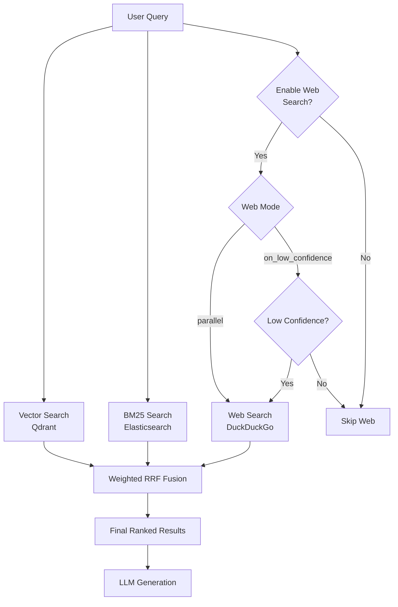

# Web Search Integration Guide

This guide explains how to use the web search functionality in the Semantic Pattern Query App. Web search augments your local pattern library with real-time information from the web.

## Table of Contents

1. [Overview](#overview)
2. [Architecture](#architecture)
3. [Configuration](#configuration)
4. [Usage](#usage)
5. [Trust Scoring](#trust-scoring)
6. [Monitoring](#monitoring)
7. [Troubleshooting](#troubleshooting)

## Overview

Web search integration provides a **3-tier retrieval architecture**:

1. **Tier 1: Local Patterns** (Weight: 1.0) - Your pattern library in Qdrant/Elasticsearch
2. **Tier 2: Persistent Web KB** (Weight: 0.9, Phase 2) - Curated web content ingested into vector DB
3. **Tier 3: Live Web Search** (Weight: 0.7, Phase 1) - Real-time web content extraction

Results from all tiers are combined using **Weighted Reciprocal Rank Fusion (RRF)**, with local patterns receiving the highest weight.

### Key Features

- **Trafilatura Primary**: Full web content extraction (not just snippets) with high accuracy
- **DuckDuckGo Fallback**: URL discovery and snippet-based search when Trafilatura unavailable
- **Hybrid Mode**: Combines both - DuckDuckGo finds URLs, Trafilatura extracts full content
- **Conditional Triggering**: Search web only when needed (low confidence, temporal queries)
- **Trust Scoring**: Domain-based heuristics prioritize trusted sources (.gov, .edu, .org)
- **Rate Limiting**: Prevents API abuse with configurable limits
- **Prometheus Metrics**: Comprehensive monitoring of web search performance
- **Privacy-Focused**: No API keys required, respects robots.txt

### Why Trafilatura?

**Trafilatura is the PRIMARY provider** because it provides:

- **Full Content Extraction**: Gets complete article text, not just 200-character snippets
- **Higher Quality**: Extracts clean, readable text with metadata (title, author, date)
- **Better Context**: More complete information for RAG generation
- **Faster Results**: Direct extraction is faster than search APIs
- **No API Key**: Free, open-source, no rate limits from external services
- **Structured Data**: Handles tables, lists, and maintains document structure

**DuckDuckGo is the FALLBACK** for:
- URL discovery when you need to search (not extract from known URLs)
- Backup when Trafilatura extraction fails
- Snippet-based results when full extraction isn't needed

## Architecture

### Provider Pattern

Web search follows the same provider pattern as embedders:

```python
from src.document_store.web.providers import (
    WebSearchProvider,
    WebSearchResult,
    DuckDuckGoProvider,
    WebSearchConfig
)

# Initialize provider
config = WebSearchConfig(
    ddg_max_results=5,
    enable_trust_scoring=True,
    trusted_domains=[".gov", ".edu", ".org"]
)
provider = DuckDuckGoProvider(config=config)

# Search
results = provider.search("RAG patterns 2025", max_results=5)
```

### 3-Tier Retrieval Flow



### Low Confidence Indicators

Web search is triggered in `on_low_confidence` mode when:

1. **Low Vector Scores**: Any vector result has score < 0.5
2. **Temporal Keywords**: Query contains "latest", "2025", "recent", "new", "update"
3. **Few Results**: Fewer than 3 local results found

### Weighted RRF Fusion

Results are fused using weighted RRF:

```
score = weight / (k + rank)
```

Where:
- Local patterns: weight = 1.0
- Web results: weight = 0.7
- k = 60 (RRF constant)

## Configuration

### Environment Variables

Add to your `.env` file (copy from `.env.example`):

```bash
# ============================================================================
# Web Search Configuration (Phase 1)
# ============================================================================
# Enable web search integration (true/false)
ENABLE_WEB_SEARCH=false

# Web search provider ("duckduckgo")
WEB_SEARCH_PROVIDER=duckduckgo

# DuckDuckGo settings
WEB_SEARCH_MAX_RESULTS=5  # Maximum web results per query
WEB_SEARCH_REGION=wt-wt  # Region code (wt-wt = worldwide)
WEB_SEARCH_SAFESEARCH=moderate  # Safety level: off, moderate, strict
WEB_SEARCH_TRUST_SCORING=true  # Enable domain-based trust scoring

# Trusted domains for trust scoring (comma-separated, no spaces)
WEB_SEARCH_TRUSTED_DOMAINS=.gov,.edu,.org

# Rate limiting
WEB_SEARCH_MAX_QUERIES_PER_MINUTE=10
```

### Configuration Options

#### `ENABLE_WEB_SEARCH`
- **Type**: Boolean (`true`/`false`)
- **Default**: `false`
- **Description**: Master switch for web search. Set to `true` to enable.

#### `WEB_SEARCH_PROVIDER`
- **Type**: String
- **Default**: `hybrid`
- **Options**:
  - `hybrid` - Trafilatura (primary) + DuckDuckGo (fallback) - **RECOMMENDED**
  - `trafilatura` - Trafilatura only (requires URLs)
  - `duckduckgo` - DuckDuckGo only (snippets, no full content)
- **Description**: Which web search provider to use.

#### `WEB_SEARCH_TRAFILATURA_TIMEOUT`
- **Type**: Integer (seconds)
- **Default**: `10`
- **Description**: Timeout for Trafilatura content extraction.

#### `WEB_SEARCH_TRAFILATURA_FAVOR_RECALL`
- **Type**: Boolean
- **Default**: `true`
- **Description**: Prioritize completeness over precision in Trafilatura extraction.

#### `WEB_SEARCH_MAX_RESULTS`
- **Type**: Integer
- **Default**: `5`
- **Description**: Maximum number of web results to retrieve per query.

#### `WEB_SEARCH_REGION`
- **Type**: String
- **Default**: `wt-wt` (worldwide)
- **Options**: `us-en`, `uk-en`, `wt-wt`, etc.
- **Description**: DuckDuckGo region code for localized results.

#### `WEB_SEARCH_SAFESEARCH`
- **Type**: String
- **Default**: `moderate`
- **Options**: `off`, `moderate`, `strict`
- **Description**: SafeSearch filtering level.

#### `WEB_SEARCH_TRUST_SCORING`
- **Type**: Boolean
- **Default**: `true`
- **Description**: Enable domain-based trust scoring.

#### `WEB_SEARCH_TRUSTED_DOMAINS`
- **Type**: Comma-separated list
- **Default**: `.gov,.edu,.org`
- **Description**: Domain suffixes that receive high trust scores (0.9).

#### `WEB_SEARCH_MAX_QUERIES_PER_MINUTE`
- **Type**: Integer
- **Default**: `10`
- **Description**: Rate limit for web searches to prevent abuse.

## Usage

### Python API

#### Basic Query with Web Search

```python
from src.document_store.orchestrator import SemanticPatternOrchestrator

# Initialize with web search enabled (hybrid mode - RECOMMENDED)
orchestrator = SemanticPatternOrchestrator(
    enable_web_search=True,
    web_search_provider_type="hybrid"  # Trafilatura + DuckDuckGo
)

# Query with parallel mode (always search web)
result = orchestrator.query(
    query="What are the latest RAG patterns in 2025?",
    top_k=10,
    enable_web_search=True,
    web_mode="parallel"
)

print(result["answer"])
for source in result["sources"]:
    print(f"- {source['title']} ({source.get('metadata', {}).get('source_type', 'local')})")
```

#### Conditional Web Search (Low Confidence)

```python
# Query with on_low_confidence mode (conditional)
result = orchestrator.query(
    query="What is Retrieval-Augmented Generation?",
    top_k=10,
    enable_web_search=True,
    web_mode="on_low_confidence"  # Only search web if low confidence
)
```

### REST API

#### Enable Web Search in Server

Start the server with web search enabled:

```bash
# Set in .env
ENABLE_WEB_SEARCH=true

# Start server
./scripts/start-server.sh
```

#### Query with Web Search (Parallel Mode)

```bash
curl -X POST "http://localhost:8000/query" \
  -H "Content-Type: application/json" \
  -d '{
    "query": "What are the latest RAG patterns in 2025?",
    "top_k": 10,
    "enable_web_search": true,
    "web_mode": "parallel"
  }'
```

#### Query with Web Search (Low Confidence Mode)

```bash
curl -X POST "http://localhost:8000/query" \
  -H "Content-Type: application/json" \
  -d '{
    "query": "What is RAG?",
    "top_k": 10,
    "enable_web_search": true,
    "web_mode": "on_low_confidence"
  }'
```

#### Query without Web Search

```bash
curl -X POST "http://localhost:8000/query" \
  -H "Content-Type: application/json" \
  -d '{
    "query": "What is RAG?",
    "top_k": 10,
    "enable_web_search": false
  }'
```

### Web Modes

#### `parallel` Mode
- **Behavior**: Always searches web in parallel with local search
- **Use Case**: Queries that likely need recent information
- **Example**: "What are the latest AI developments in 2025?"

#### `on_low_confidence` Mode (Recommended)
- **Behavior**: Only searches web when local results have low confidence
- **Use Case**: General queries that may or may not need web augmentation
- **Example**: "What is Retrieval-Augmented Generation?"
- **Triggers**:
  - Vector scores < 0.5
  - Temporal keywords ("latest", "2025", "recent")
  - Fewer than 3 local results

## Trust Scoring

Web search results receive trust scores (0.0-1.0) based on domain heuristics:

### Trust Score Levels

| Domain Type | Score | Examples |
|-------------|-------|----------|
| Trusted domains | 0.9 | `.gov`, `.edu`, `.org` |
| Blocked domains | 0.0 | User-configured blocklist |
| Default domains | 0.5 | All other domains |

### Configuring Trust Scoring

```bash
# Enable trust scoring
WEB_SEARCH_TRUST_SCORING=true

# Add trusted domains (comma-separated, no spaces)
WEB_SEARCH_TRUSTED_DOMAINS=.gov,.edu,.org,.int

# Add blocked domains (comma-separated, no spaces)
WEB_SEARCH_BLOCKED_DOMAINS=spam.com,malware.net
```

### Trust Score in Results

Trust scores are included in the result metadata:

```python
result = orchestrator.query(
    query="Healthcare AI guidelines",
    enable_web_search=True,
    web_mode="parallel"
)

for source in result["sources"]:
    metadata = source.get("metadata", {})
    if metadata.get("source_type") == "web_search":
        print(f"URL: {source['url']}")
        print(f"Trust Score: {metadata.get('trust_score', 0.5)}")
```

## Monitoring

### Prometheus Metrics

Web search exposes comprehensive Prometheus metrics:

#### `rag_web_search_queries_total`
- **Type**: Counter
- **Labels**: `mode` (parallel/on_low_confidence), `status` (success/error)
- **Description**: Total number of web search queries

#### `rag_web_search_results`
- **Type**: Histogram
- **Buckets**: 0, 1, 3, 5, 10, 20
- **Description**: Number of web results returned per query

#### `rag_web_search_duration_seconds`
- **Type**: Histogram
- **Labels**: `provider` (duckduckgo)
- **Buckets**: 0.1, 0.5, 1.0, 2.0, 5.0, 10.0
- **Description**: Web search query duration in seconds

#### `rag_web_search_trust_scores`
- **Type**: Histogram
- **Buckets**: 0.0, 0.3, 0.5, 0.7, 0.9, 1.0
- **Description**: Distribution of trust scores for web results

#### `rag_web_source_ratio`
- **Type**: Histogram
- **Buckets**: 0.0, 0.1, 0.2, 0.3, 0.5, 0.7, 1.0
- **Description**: Ratio of web results in final ranking (0.0-1.0)

### Querying Metrics

```bash
# View all web search metrics
curl http://localhost:8000/metrics | grep rag_web

# View in Grafana
# Import dashboard: grafana/dashboards/rag-quality-metrics.json
```

### Grafana Dashboard

The RAG Quality Metrics dashboard includes web search panels:

1. **Web Search Query Rate**: Queries per minute by mode
2. **Web Search Results Distribution**: Histogram of results per query
3. **Web Search Latency**: P50, P95, P99 latency by provider
4. **Trust Score Distribution**: Distribution of trust scores
5. **Web Source Ratio**: Percentage of web results in final ranking

## Troubleshooting

### Web Search Not Working

**Symptom**: Web results not appearing in query results

**Solutions**:

1. **Check environment variable**:
   ```bash
   grep ENABLE_WEB_SEARCH .env
   # Should show: ENABLE_WEB_SEARCH=true
   ```

2. **Check provider initialization**:
   ```bash
   # Server logs should show:
   # "Web search enabled with DuckDuckGo provider"
   ```

3. **Check query parameters**:
   ```python
   result = orchestrator.query(
       query="...",
       enable_web_search=True,  # Must be True
       web_mode="parallel"  # Or "on_low_confidence"
   )
   ```

4. **Check low confidence triggering** (on_low_confidence mode):
   - Use temporal keywords: "latest", "2025", "recent"
   - Or use parallel mode to always search web

### Rate Limit Errors

**Symptom**: `Exception: rate limit exceeded` errors

**Solutions**:

1. **Increase rate limit**:
   ```bash
   WEB_SEARCH_MAX_QUERIES_PER_MINUTE=20
   ```

2. **Use on_low_confidence mode** to reduce web searches:
   ```python
   result = orchestrator.query(
       query="...",
       enable_web_search=True,
       web_mode="on_low_confidence"  # Less frequent than parallel
   )
   ```

3. **Wait 60 seconds** for rate limit to reset

### DuckDuckGo Connection Errors

**Symptom**: `ConnectionError` or timeout errors

**Solutions**:

1. **Check internet connection**:
   ```bash
   curl https://duckduckgo.com
   ```

2. **Increase timeout** (in code):
   ```python
   config = WebSearchConfig(ddg_timeout=20)  # Default: 10 seconds
   ```

3. **Check firewall/proxy settings**

### Low Quality Web Results

**Symptom**: Irrelevant or low-quality web results

**Solutions**:

1. **Enable trust scoring**:
   ```bash
   WEB_SEARCH_TRUST_SCORING=true
   ```

2. **Add more trusted domains**:
   ```bash
   WEB_SEARCH_TRUSTED_DOMAINS=.gov,.edu,.org,.int,.ac.uk
   ```

3. **Block problematic domains**:
   ```bash
   WEB_SEARCH_BLOCKED_DOMAINS=spam.com,clickbait.net
   ```

4. **Adjust web weight** (in code - Phase 2):
   ```python
   # Lower weight = less influence in final ranking
   # Current: web_live weight = 0.7
   ```

### Web Results Not Ranked Highly

**Symptom**: Web results appear but ranked very low

**Explanation**: This is expected behavior. Local patterns receive higher weight (1.0) than web results (0.7) in RRF fusion. Web results serve as augmentation, not replacement.

**Solutions**:

1. **Use parallel mode** for queries needing web info:
   ```python
   web_mode="parallel"
   ```

2. **Check trust scores** - high trust domains rank higher

3. **Phase 2: Persistent Web KB** will allow higher-quality curated web content with weight 0.9

### No Web Results with on_low_confidence Mode

**Symptom**: Web search not triggered in on_low_confidence mode

**Explanation**: Low confidence indicators not met. Local results are sufficient.

**Solutions**:

1. **Use parallel mode** to always search web:
   ```python
   web_mode="parallel"
   ```

2. **Add temporal keywords** to trigger low confidence:
   - "What are the **latest** RAG patterns?"
   - "What happened in **2025**?"
   - "What are **recent** developments?"

3. **Check vector scores** in logs (scores < 0.5 trigger web search)

### Metrics Not Showing in Prometheus

**Symptom**: Web search metrics not visible in Prometheus/Grafana

**Solutions**:

1. **Trigger web searches** (metrics only appear after first search):
   ```bash
   curl -X POST http://localhost:8000/query \
     -H "Content-Type: application/json" \
     -d '{"query": "test", "enable_web_search": true, "web_mode": "parallel"}'
   ```

2. **Check metrics endpoint**:
   ```bash
   curl http://localhost:8000/metrics | grep rag_web
   ```

3. **Reload Grafana dashboard**

## Best Practices

### When to Enable Web Search

**Good Use Cases**:
- Queries about recent events or updates
- Queries with temporal keywords ("latest", "2025", "recent")
- Queries where local library may be incomplete
- Exploratory queries needing diverse sources

**Poor Use Cases**:
- Queries fully answered by local patterns
- High-frequency queries (rate limiting)
- Privacy-sensitive queries (though DuckDuckGo is privacy-focused)
- Queries needing instant response (web adds latency)

### Recommended Mode

Use **`on_low_confidence` mode** as default:
- Minimizes unnecessary web searches (cost, latency)
- Automatically triggers when local results insufficient
- Preserves rate limits
- Provides best user experience

Use **`parallel` mode** for:
- Specific queries known to need web information
- User explicitly requests recent information
- Demos or testing

### Trust Scoring Configuration

**Healthcare/Medical Apps**:
```bash
WEB_SEARCH_TRUSTED_DOMAINS=.gov,.edu,.org,.int,.who.int
WEB_SEARCH_BLOCKED_DOMAINS=healthscam.com,miracle-cure.net
```

**General RAG Apps**:
```bash
WEB_SEARCH_TRUSTED_DOMAINS=.gov,.edu,.org
WEB_SEARCH_BLOCKED_DOMAINS=
```

**Strict Quality Control**:
```bash
WEB_SEARCH_TRUST_SCORING=true
WEB_SEARCH_TRUSTED_DOMAINS=.gov,.edu,.org,.int,.ac.uk,.mil
WEB_SEARCH_MAX_RESULTS=3  # Fewer but higher quality
```

## Future Enhancements (Phase 2+)

### Phase 2: Persistent Web KB
- Ingest high-quality web content into Qdrant
- Higher weight (0.9) than live search (0.7)
- Curated sources with quality control
- Update schedule (weekly/monthly)

### Phase 3: Advanced Features
- Reranking with cross-encoder models
- Citation extraction and verification
- Multi-provider support (Tavily, Perplexity API)
- User feedback loop for trust scores
- Automatic source quality assessment

## Related Documentation

- [API Guide](../API_GUIDE.md) - REST API reference
- [Monitoring Guide](MONITORING_QUICKSTART.md) - Prometheus/Grafana setup
- [Web Enhancements Spec](../implementation/web_enhancements.md) - Design document
- [Troubleshooting Guide](../TROUBLESHOOTING.md) - General troubleshooting

## Support

For issues or questions:
1. Check this guide and troubleshooting section
2. Review server logs for error messages
3. Check Prometheus metrics for performance issues
4. Review `docs/implementation/web_enhancements.md` for design details

## Changelog

- **2025-01-19**: Initial Phase 1 implementation
  - DuckDuckGo provider
  - Parallel and on_low_confidence modes
  - Trust scoring
  - Prometheus metrics
  - 3-tier retrieval architecture
