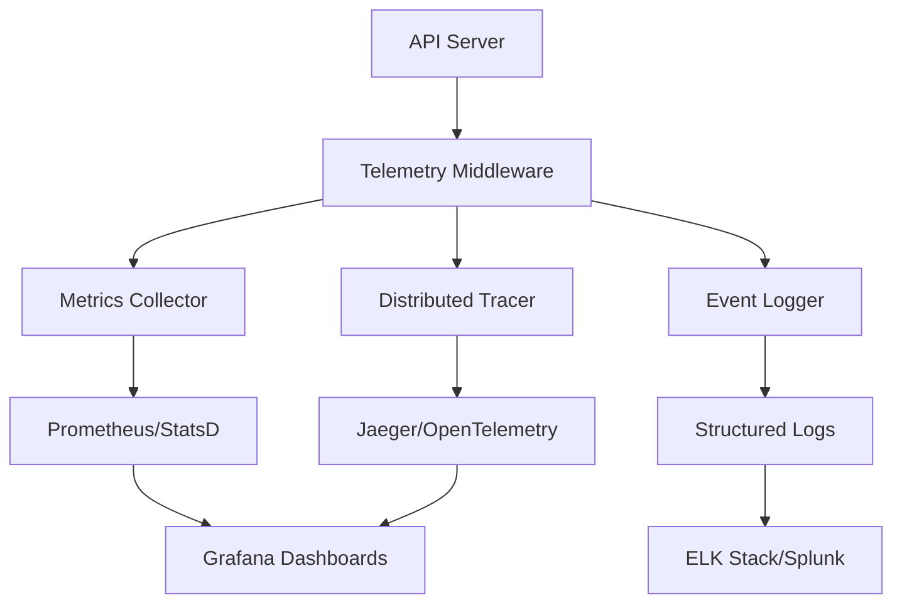

# Detailed Telemetry Implementation Guide

## Overview

This guide provides a comprehensive plan for implementing detailed telemetry in the Semantic Pattern Query App. Telemetry is critical for:
- **Performance monitoring**: Track latency, throughput, and resource usage
- **Quality assurance**: Monitor RAG accuracy, retrieval quality, and user satisfaction
- **Operational excellence**: Detect issues early, optimize costs, and ensure reliability
- **Healthcare compliance**: Audit logging for HIPAA compliance

## Architecture



## Implementation Phases

### Phase 1: Core Metrics Collection (Week 1)

#### 1.1 Metrics Framework Setup

**Technology Options:**
- **Prometheus** (recommended): Open-source, industry standard
- **StatsD**: Simple, lightweight
- **Cloud-native**: CloudWatch (AWS), Cloud Monitoring (GCP), Azure Monitor

**Implementation:**
```python
# src/document_store/monitoring/metrics.py
from prometheus_client import Counter, Histogram, Gauge, Summary
import time

# Query metrics
query_total = Counter('rag_queries_total', 'Total number of queries', ['embedder_type', 'status'])
query_duration = Histogram('rag_query_duration_seconds', 'Query duration', ['embedder_type'])
query_tokens = Histogram('rag_query_tokens', 'Tokens used per query', ['stage'])

# Retrieval metrics
retrieval_docs = Histogram('rag_retrieval_docs', 'Documents retrieved', ['retriever_type'])
retrieval_duration = Histogram('rag_retrieval_duration_seconds', 'Retrieval duration', ['retriever_type'])
retrieval_scores = Histogram('rag_retrieval_scores', 'Retrieval similarity scores')

# Generation metrics
generation_duration = Histogram('rag_generation_duration_seconds', 'Generation duration')
generation_tokens = Histogram('rag_generation_tokens', 'Tokens generated')
generation_errors = Counter('rag_generation_errors_total', 'Generation errors', ['error_type'])

# Cache metrics
cache_hits = Counter('rag_cache_hits_total', 'Cache hits')
cache_misses = Counter('rag_cache_misses_total', 'Cache misses')
cache_size = Gauge('rag_cache_size', 'Cache size in entries')

# System metrics
vector_store_size = Gauge('rag_vector_store_size', 'Vector store document count')
embedding_duration = Histogram('rag_embedding_duration_seconds', 'Embedding generation duration', ['embedder_type'])
```

#### 1.2 Instrumentation Points

**Key areas to instrument:**

1. **API Layer** (`api_server.py`):
   - Request/response times
   - Error rates
   - Request size/response size
   - User context metadata

2. **Orchestrator** (`orchestrator.py`):
   - End-to-end query latency
   - Cache hit/miss rates
   - Layer-by-layer timing
   - Document retrieval counts

3. **Retrieval Layer** (`hybrid_retriever.py`):
   - Retrieval latency
   - Documents retrieved per stage
   - Similarity scores distribution
   - Embedder type usage

4. **Generation Layer** (`rag_generator.py`):
   - Generation latency
   - Token usage (input/output)
   - Model-specific metrics
   - Error rates

5. **Embedding Layer** (`hybrid_embedder.py`):
   - Embedding generation time
   - Embedder type distribution
   - Vector dimension consistency

6. **Cache Layer** (`semantic_cache.py`):
   - Cache hit/miss rates
   - Cache size
   - Cache eviction events

### Phase 2: Distributed Tracing (Week 2)

#### 2.1 OpenTelemetry Integration

**Benefits:**
- Track requests across all layers
- Identify bottlenecks
- Debug complex issues
- Understand system dependencies

**Implementation:**
```python
# src/document_store/monitoring/tracing.py
from opentelemetry import trace
from opentelemetry.sdk.trace import TracerProvider
from opentelemetry.sdk.trace.export import BatchSpanProcessor
from opentelemetry.exporter.jaeger.thrift import JaegerExporter
from opentelemetry.instrumentation.fastapi import FastAPIInstrumentor

# Initialize tracing
trace.set_tracer_provider(TracerProvider())
tracer = trace.get_tracer(__name__)

# Add span processor
jaeger_exporter = JaegerExporter(
    agent_host_name="localhost",
    agent_port=6831,
)
span_processor = BatchSpanProcessor(jaeger_exporter)
trace.get_tracer_provider().add_span_processor(span_processor)

# Instrument FastAPI
FastAPIInstrumentor.instrument_app(app)
```

**Span Structure:**
```
rag.query (root span)
├── rag.cache.check
├── rag.embedding.generate
├── rag.retrieval.hybrid
│   ├── rag.retrieval.vector
│   ├── rag.retrieval.bm25
│   └── rag.retrieval.rerank
└── rag.generation.llm
```

### Phase 3: Structured Logging (Week 2)

#### 3.1 JSON Logging with Context

**Implementation:**
```python
# src/document_store/monitoring/logger.py
import json
import logging
from datetime import datetime
from typing import Dict, Any, Optional

class StructuredLogger:
    """Structured JSON logger for telemetry."""
    
    def __init__(self, name: str):
        self.logger = logging.getLogger(name)
        handler = logging.StreamHandler()
        formatter = logging.Formatter('%(message)s')
        handler.setFormatter(formatter)
        self.logger.addHandler(handler)
        self.logger.setLevel(logging.INFO)
    
    def log_query(
        self,
        query: str,
        query_id: str,
        user_context: Dict[str, Any],
        duration_ms: float,
        cache_hit: bool,
        retrieved_docs: int,
        embedder_type: str,
        **kwargs
    ):
        """Log query event with full context."""
        log_entry = {
            "timestamp": datetime.utcnow().isoformat(),
            "event_type": "query",
            "query_id": query_id,
            "query_length": len(query),
            "duration_ms": duration_ms,
            "cache_hit": cache_hit,
            "retrieved_docs": retrieved_docs,
            "embedder_type": embedder_type,
            "user_context": self._sanitize_context(user_context),
            **kwargs
        }
        self.logger.info(json.dumps(log_entry))
    
    def log_error(
        self,
        error_type: str,
        error_message: str,
        query_id: Optional[str] = None,
        stack_trace: Optional[str] = None,
        **kwargs
    ):
        """Log error with context."""
        log_entry = {
            "timestamp": datetime.utcnow().isoformat(),
            "event_type": "error",
            "error_type": error_type,
            "error_message": error_message,
            "query_id": query_id,
            "stack_trace": stack_trace,
            **kwargs
        }
        self.logger.error(json.dumps(log_entry))
    
    def _sanitize_context(self, context: Dict[str, Any]) -> Dict[str, Any]:
        """Remove sensitive information from context."""
        sanitized = context.copy()
        # Remove PHI and sensitive data
        for key in ['patient_id', 'ssn', 'api_key']:
            if key in sanitized:
                sanitized[key] = "[REDACTED]"
        return sanitized
```

### Phase 4: RAG-Specific Metrics (Week 3)

#### 4.1 Quality Metrics

**Retrieval Quality:**
- Average similarity scores
- Score distribution
- Top-K coverage
- Embedder comparison metrics

**Generation Quality:**
- Answer length
- Citation accuracy
- Hallucination detection (if implemented)
- User feedback scores

**Implementation:**
```python
# src/document_store/monitoring/quality_metrics.py
from prometheus_client import Histogram, Counter

# Quality metrics
retrieval_quality_score = Histogram('rag_retrieval_quality_score', 'Retrieval quality score', ['embedder_type'])
answer_length = Histogram('rag_answer_length', 'Answer length in characters')
citation_count = Histogram('rag_citation_count', 'Number of citations per answer')
user_feedback = Counter('rag_user_feedback_total', 'User feedback', ['rating'])

# Embedder comparison
embedder_performance = Histogram('rag_embedder_performance', 'Embedder performance comparison', ['embedder_type', 'metric_type'])
```

### Phase 5: Real-time Dashboards (Week 3-4)

#### 5.1 Grafana Dashboard Configuration

**Key Dashboards:**

1. **System Health Dashboard:**
   - Request rate
   - Error rate
   - Latency (P50, P95, P99)
   - Cache hit rate

2. **RAG Performance Dashboard:**
   - Query latency by layer
   - Retrieval quality metrics
   - Embedder comparison
   - Token usage

3. **Business Metrics Dashboard:**
   - Queries per hour/day
   - Popular queries
   - User satisfaction
   - Cost per query

4. **Error Tracking Dashboard:**
   - Error rate by type
   - Error trends
   - Failed queries
   - Stack traces

### Phase 6: Alerting (Week 4)

#### 6.1 Alert Rules

**Critical Alerts:**
- Error rate > 5%
- P95 latency > 2 seconds
- Cache hit rate < 50%
- Vector store unavailable

**Warning Alerts:**
- Error rate > 1%
- P95 latency > 1 second
- Retrieval quality score < 0.7

**Implementation:**
```yaml
# alerts.yml (Prometheus)
groups:
  - name: rag_alerts
    rules:
      - alert: HighErrorRate
        expr: rate(rag_queries_total{status="error"}[5m]) > 0.05
        for: 5m
        annotations:
          summary: "High error rate detected"
      
      - alert: HighLatency
        expr: histogram_quantile(0.95, rag_query_duration_seconds) > 2
        for: 5m
        annotations:
          summary: "P95 latency exceeds threshold"
```

## Implementation Steps

### Step 1: Install Dependencies

```bash
cd semantic-pattern-query-app
pip install prometheus-client opentelemetry-api opentelemetry-sdk opentelemetry-instrumentation-fastapi opentelemetry-exporter-jaeger-thrift
```

### Step 2: Create Monitoring Module

Create the monitoring infrastructure:
- `src/document_store/monitoring/metrics.py` - Prometheus metrics
- `src/document_store/monitoring/tracing.py` - OpenTelemetry tracing
- `src/document_store/monitoring/logger.py` - Structured logging
- `src/document_store/monitoring/telemetry.py` - Main telemetry coordinator

### Step 3: Instrument Code

Add telemetry to:
1. API endpoints
2. Orchestrator methods
3. Retrieval components
4. Generation components
5. Cache operations

### Step 4: Add Prometheus Endpoint

```python
# In api_server.py
from prometheus_client import make_asgi_app

# Add metrics endpoint
metrics_app = make_asgi_app()
app.mount("/metrics", metrics_app)
```

### Step 5: Configure Exporters

Set up:
- Prometheus scraping
- Jaeger/OpenTelemetry collector
- Log aggregation (ELK/Splunk)

### Step 6: Create Dashboards

Build Grafana dashboards for:
- System health
- RAG performance
- Business metrics
- Error tracking

## Metrics Catalog

### System Metrics
- `rag_queries_total` - Total queries
- `rag_query_duration_seconds` - Query latency
- `rag_errors_total` - Error count
- `rag_cache_hit_rate` - Cache efficiency

### RAG-Specific Metrics
- `rag_retrieval_docs` - Documents retrieved
- `rag_retrieval_scores` - Similarity scores
- `rag_generation_tokens` - Token usage
- `rag_embedder_usage` - Embedder distribution

### Quality Metrics
- `rag_retrieval_quality_score` - Retrieval quality
- `rag_answer_length` - Answer characteristics
- `rag_citation_count` - Citation metrics

## Healthcare Compliance

### HIPAA Considerations

1. **PHI Redaction**: All logs must redact PHI
2. **Audit Logging**: Track all data access
3. **Encryption**: Encrypt telemetry data in transit
4. **Retention**: Define log retention policies
5. **Access Control**: Restrict access to telemetry data

### Audit Log Requirements

```python
def log_audit_event(
    event_type: str,
    user_id: str,
    resource: str,
    action: str,
    result: str
):
    """Log HIPAA-compliant audit event."""
    audit_log = {
        "timestamp": datetime.utcnow().isoformat(),
        "event_type": event_type,
        "user_id": user_id,  # No PHI
        "resource": resource,
        "action": action,
        "result": result,
        "ip_address": "[REDACTED]",  # If applicable
    }
    # Send to secure audit log system
```

## Cost Optimization

### Metrics to Track
- API call costs (Gemini, Ollama)
- Token usage costs
- Storage costs (Qdrant, Elasticsearch)
- Compute costs

### Cost Alerts
- Unusual API usage spikes
- Token usage exceeding budget
- Storage growth rate

## Next Steps

1. **Review and approve** this implementation plan
2. **Set up infrastructure**: Prometheus, Grafana, Jaeger
3. **Implement Phase 1**: Core metrics collection
4. **Iterate**: Add phases incrementally
5. **Monitor and optimize**: Use telemetry to improve system

## References

- [Prometheus Documentation](https://prometheus.io/docs/)
- [OpenTelemetry Documentation](https://opentelemetry.io/docs/)
- [Grafana Dashboard Examples](https://grafana.com/grafana/dashboards/)
- [HIPAA Compliance Guide](https://www.hhs.gov/hipaa/index.html)

