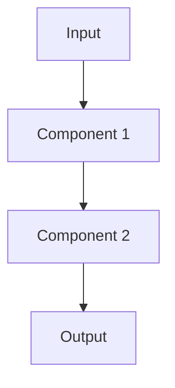

# [Pattern Name]

## Overview
Brief description of the pattern and its purpose.

## Architecture

### High-Level Architecture
[Describe the overall architecture]

### Components
- **Component 1**: Description
- **Component 2**: Description
- **Component 3**: Description

### Data Flow
[Describe how data flows through the system]

## When to Use

### Ideal Use Cases
- Use case 1
- Use case 2
- Use case 3

### Characteristics of Suitable Problems
- Characteristic 1
- Characteristic 2

## When NOT to Use

### Anti-Patterns
- Anti-pattern 1
- Anti-pattern 2

### Characteristics of Unsuitable Problems
- Characteristic 1
- Characteristic 2

## Implementation Examples

### Gemini Implementation
```python
# Code example here
```

### Anthropic Implementation
```python
# Code example here
```

### LangChain Implementation
```python
# Code example here
```

### Spring AI Implementation
```java
// Code example here
```

### Xariv Implementation
```python
# Code example here
```

### Google ADK Implementation
```python
# Code example here
```

## Performance Characteristics

### Latency
- Typical latency: [X]ms
- Factors affecting latency: [list]

### Throughput
- Typical throughput: [X] requests/second
- Factors affecting throughput: [list]

### Resource Requirements
- Memory: [X]GB
- CPU: [X] cores
- Storage: [X]GB

## Trade-offs

### Advantages
- Advantage 1
- Advantage 2

### Disadvantages
- Disadvantage 1
- Disadvantage 2

### Considerations
- Consideration 1
- Consideration 2

## Architecture Diagram



## Well-Architected Framework Alignment

### Operational Excellence
- [Monitoring and observability considerations]
- [Operational runbooks and procedures]
- [Automation opportunities]

### Security
- [Security considerations for this pattern]
- [Privacy implications]
- [Compliance requirements]

### Reliability
- [Availability targets]
- [Failure modes and mitigation]
- [Redundancy requirements]

### Cost Optimization
- [Cost characteristics and drivers]
- [Optimization opportunities]
- [Resource requirements]

### Performance
- [Performance targets and metrics]
- [Scalability considerations]
- [Bottleneck identification]

### Sustainability
- [Resource efficiency]
- [Environmental considerations]

## Deployment Considerations

### Zonal Deployment
- [Suitability and considerations]

### Regional Deployment
- [Suitability and considerations]

### Multi-Regional Deployment
- [Suitability and considerations]

### Hybrid Deployment
- [Suitability and considerations]

See [Deployment Guide](../deployment-guide.md) for detailed guidance.

## Architecture Decision Record

See [ADR Template](../templates/adr-template.md) for documenting decisions related to this pattern.

## Related Patterns
- [Related Pattern 1](./related-pattern-1.md)
- [Related Pattern 2](./related-pattern-2.md)

## References
- [Google Cloud Well-Architected Framework](https://docs.cloud.google.com/architecture/framework/printable)
- Reference 1
- Reference 2

## Version History
- **v1.0** (YYYY-MM-DD): Initial version
- **v1.1** (YYYY-MM-DD): Update description

